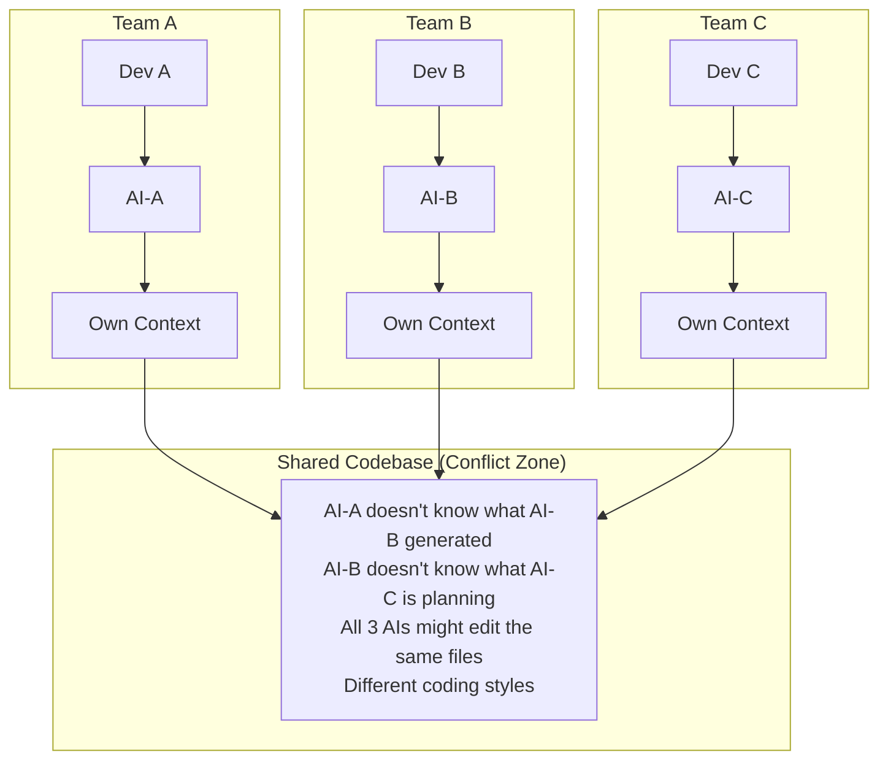
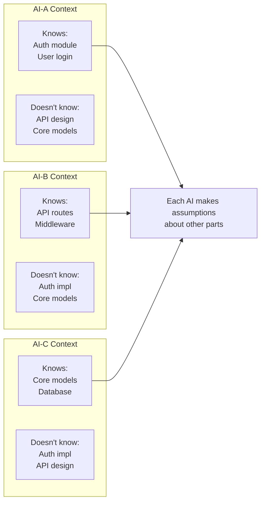
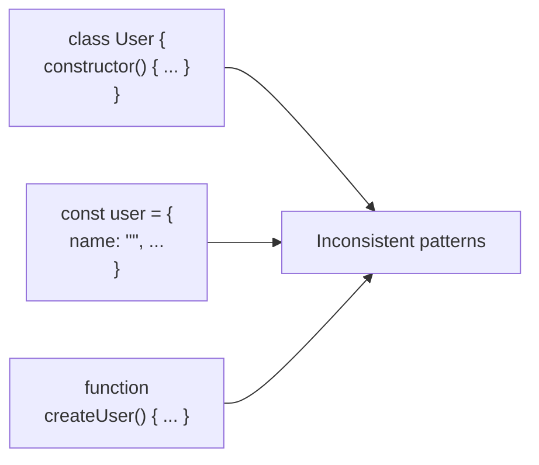
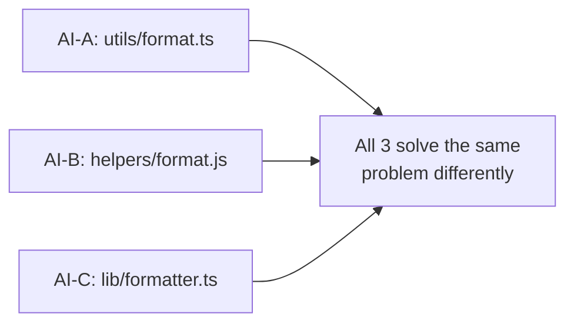
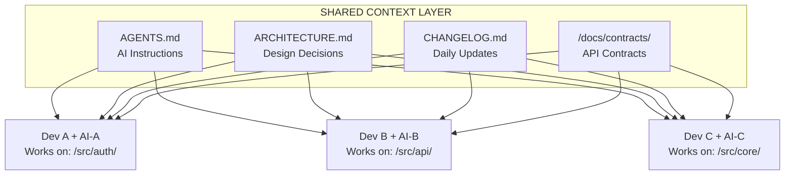
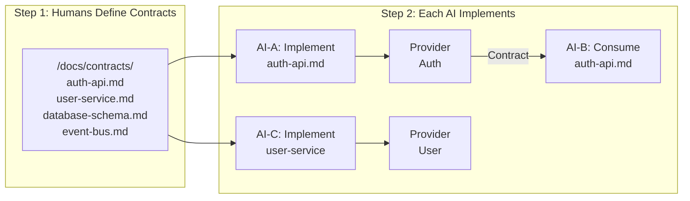
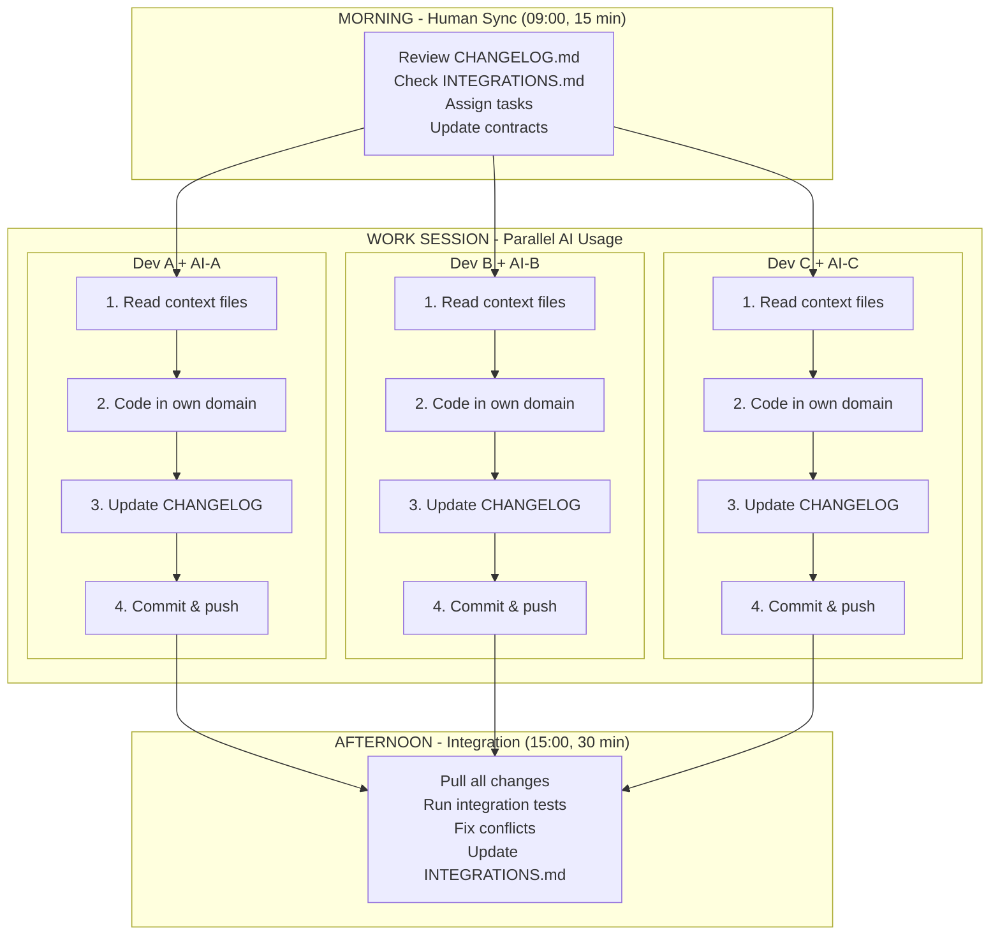

# Multi-Agent Team Cooperation

A guide for development teams where each developer has their own AI agent, addressing coordination challenges and solutions.

---

## Table of Contents

1. [The New Landscape](#the-new-landscape)
2. [Core Problems](#the-core-problems)
3. [Solution Architecture](#solution-architecture-shared-context-layer)
4. [Coordination Patterns](#coordination-patterns)
   - [Pattern 1: Contract-First Development](#pattern-1-contract-first-development)
   - [Pattern 2: Living Documentation Sync](#pattern-2-living-documentation-sync)
   - [Pattern 3: AI Prompt Standardization](#pattern-3-ai-prompt-standardization)
   - [Pattern 4: Shared Utilities Registry](#pattern-4-shared-utilities-registry)
   - [Pattern 5: Integration Points Tracking](#pattern-5-integration-points-file)
5. [Daily Workflow](#daily-workflow-with-multiple-ai-agents)
6. [Project Structure](#file-structure-for-multi-agent-coordination)
7. [AI Communication Protocol](#ai-agent-communication-protocol)
8. [Summary: Golden Rules](#summary-multi-agent-golden-rules)
9. [Templates](#templates)

---

## The New Landscape



---

## The Core Problems

### Problem 1: Context Isolation



### Problem 2: Style Drift



### Problem 3: Duplicate Work



---

## Solution Architecture: Shared Context Layer



---

## Coordination Patterns

### Pattern 1: Contract-First Development

**Concept**: Define interfaces BEFORE implementation. Each AI codes against contracts, not assumptions.



#### Contract Example: auth-api.md

```markdown
# Auth API Contract

## Interface: AuthService

All implementations MUST follow this interface.

interface AuthService {
  // Login with credentials, returns JWT token
  login(email: string, password: string): Promise<Result<AuthToken, AuthError>>
  
  // Validate token, returns user info
  validateToken(token: string): Promise<Result<User, AuthError>>
  
  // Logout and invalidate token
  logout(token: string): Promise<void>
}

interface AuthToken {
  accessToken: string
  refreshToken: string
  expiresAt: Date
}

type AuthError = 
  | { code: 'INVALID_CREDENTIALS' }
  | { code: 'TOKEN_EXPIRED' }
  | { code: 'USER_NOT_FOUND' }

## Events Published

- `user.logged_in` - When user successfully logs in
- `user.logged_out` - When user logs out
- `token.refreshed` - When token is refreshed

## Dependencies

- Requires: `UserService.findByEmail()`
- Requires: `TokenStore` (Redis)
```

---

### Pattern 2: Living Documentation Sync

**Concept**: Every AI session must READ before starting and WRITE before ending.

```
+-----------------------------------------------------------------------------+
|                     Living Documentation Pattern                             |
|                                                                              |
|   Every AI Session Must:                                                    |
|   +---------------------------------------------------------------------+   |
|   |                                                                      |   |
|   |   1. READ before starting                                           |   |
|   |   +---------------------------------------------------------------+ |   |
|   |   |  $ cat CHANGELOG.md | head -50    # Recent changes             | |   |
|   |   |  $ cat AGENTS.md                  # Coding rules               | |   |
|   |   |  $ cat docs/contracts/*.md        # Interfaces                 | |   |
|   |   +---------------------------------------------------------------+ |   |
|   |                                                                      |   |
|   |   2. WRITE after finishing                                          |   |
|   |   +---------------------------------------------------------------+ |   |
|   |   |  Update CHANGELOG.md:                                          | |   |
|   |   |                                                                | |   |
|   |   |  ## 2024-01-15 (Dev A + AI-A)                                 | |   |
|   |   |  ### Added                                                     | |   |
|   |   |  - AuthService.login() implementation                         | |   |
|   |   |  - JWT token generation with RS256                            | |   |
|   |   |  ### Changed                                                   | |   |
|   |   |  - User model now includes lastLoginAt                        | |   |
|   |   |  ### Needs Attention                                           | |   |
|   |   |  - API team: AuthService is ready for integration             | |   |
|   |   +---------------------------------------------------------------+ |   |
|   |                                                                      |   |
|   +---------------------------------------------------------------------+   |
|                                                                              |
|   This creates a "shared memory" across all AI agents                       |
|                                                                              |
+-----------------------------------------------------------------------------+
```

---

### Pattern 3: AI Prompt Standardization

**Concept**: All AI agents receive the same base instructions via AGENTS.md.

```
+-----------------------------------------------------------------------------+
|                    Standardized AI Session Start                             |
|                                                                              |
|   Every Developer Starts AI Session With Same Context:                      |
|   +---------------------------------------------------------------------+   |
|   |                                                                      |   |
|   |   SYSTEM PROMPT (in AGENTS.md or .cursorrules / .claude):           |   |
|   |   +---------------------------------------------------------------+ |   |
|   |   |                                                                | |   |
|   |   |   You are working on project X with 2 other AI agents.        | |   |
|   |   |                                                                | |   |
|   |   |   BEFORE WRITING ANY CODE:                                    | |   |
|   |   |   1. Read CHANGELOG.md for recent changes                     | |   |
|   |   |   2. Read docs/contracts/ for interfaces you must follow      | |   |
|   |   |   3. Check OWNERS.md - only modify files you own              | |   |
|   |   |                                                                | |   |
|   |   |   AFTER WRITING CODE:                                         | |   |
|   |   |   1. Update CHANGELOG.md with your changes                    | |   |
|   |   |   2. If you created new interfaces, add to docs/contracts/    | |   |
|   |   |   3. If you need something from another module, document it   | |   |
|   |   |                                                                | |   |
|   |   |   NEVER:                                                      | |   |
|   |   |   - Modify files outside your domain without asking           | |   |
|   |   |   - Create duplicate utilities (check /src/shared first)      | |   |
|   |   |   - Change interfaces without updating contracts              | |   |
|   |   |                                                                | |   |
|   |   +---------------------------------------------------------------+ |   |
|   |                                                                      |   |
|   +---------------------------------------------------------------------+   |
|                                                                              |
+-----------------------------------------------------------------------------+
```

---

### Pattern 4: Shared Utilities Registry

**Concept**: A single source of truth for shared code prevents duplicate utilities.

```
+-----------------------------------------------------------------------------+
|                      Shared Utilities Registry                               |
|                                                                              |
|   /src/shared/REGISTRY.md                                                   |
|   +---------------------------------------------------------------------+   |
|   |                                                                      |   |
|   |   # Shared Utilities Registry                                       |   |
|   |                                                                      |   |
|   |   ## Available Utilities (USE THESE, DON'T RECREATE)               |   |
|   |                                                                      |   |
|   |   | Utility       | Location              | Description          |   |   |
|   |   |---------------|-----------------------|----------------------|   |   |
|   |   | formatDate    | /shared/date.ts       | ISO date formatting  |   |   |
|   |   | hashPassword  | /shared/crypto.ts     | Argon2 hashing       |   |   |
|   |   | validateEmail | /shared/validators.ts | Email validation     |   |   |
|   |   | Result<T,E>   | /shared/result.ts     | Error handling monad |   |   |
|   |   | Logger        | /shared/logger.ts     | Structured logging   |   |   |
|   |   | HttpClient    | /shared/http.ts       | Fetch with retry     |   |   |
|   |                                                                      |   |
|   |   ## Requesting New Utilities                                       |   |
|   |                                                                      |   |
|   |   If you need a utility that doesn't exist:                        |   |
|   |   1. Add a request to /shared/REQUESTS.md                          |   |
|   |   2. Wait for human review                                         |   |
|   |   3. One AI will be assigned to implement it                       |   |
|   |                                                                      |   |
|   +---------------------------------------------------------------------+   |
|                                                                              |
|   AI agents are instructed to:                                              |
|   +---------------------------------------------------------------------+   |
|   |                                                                      |   |
|   |   Before creating any utility function:                             |   |
|   |   1. Check /src/shared/REGISTRY.md                                  |   |
|   |   2. If exists -> import and use it                                 |   |
|   |   3. If not -> add request to REQUESTS.md                           |   |
|   |                                                                      |   |
|   +---------------------------------------------------------------------+   |
|                                                                              |
+-----------------------------------------------------------------------------+
```

---

### Pattern 5: Integration Points File

**Concept**: Track where modules connect and their integration status.

```
+-----------------------------------------------------------------------------+
|                      Integration Points Tracking                             |
|                                                                              |
|   /docs/INTEGRATIONS.md                                                     |
|   +---------------------------------------------------------------------+   |
|   |                                                                      |   |
|   |   # Module Integration Points                                       |   |
|   |                                                                      |   |
|   |   ## Auth -> API                                                    |   |
|   |   | Provider (Auth)         | Consumer (API)    | Status         |   |   |
|   |   |-------------------------|-------------------|----------------|   |   |
|   |   | AuthService.validate    | authMiddleware    | Integrated     |   |   |
|   |   | AuthService.login       | POST /auth/login  | Integrated     |   |   |
|   |   | AuthService.logout      | POST /auth/logout | In Progress    |   |   |
|   |                                                                      |   |
|   |   ## Core -> Auth                                                   |   |
|   |   | Provider (Core)         | Consumer (Auth)   | Status         |   |   |
|   |   |-------------------------|-------------------|----------------|   |   |
|   |   | UserService.findByEmail | AuthService.login | Integrated     |   |   |
|   |   | UserService.create      | AuthService.reg   | Waiting        |   |   |
|   |                                                                      |   |
|   |   ## Pending Integrations                                           |   |
|   |   - [ ] API needs: AuthService.refreshToken (Auth team)            |   |
|   |   - [ ] Auth needs: UserService.updateLastLogin (Core team)        |   |
|   |                                                                      |   |
|   +---------------------------------------------------------------------+   |
|                                                                              |
|   Benefits:                                                                  |
|   - Each AI knows what's ready to integrate                                 |
|   - Clear visibility on blocking dependencies                               |
|   - Async communication between AI agents                                   |
|                                                                              |
+-----------------------------------------------------------------------------+
```

---

## Daily Workflow with Multiple AI Agents



---

## File Structure for Multi-Agent Coordination

```
project/
|
+-- .agent/                          # AI coordination files
|   +-- AGENTS.md                    # System prompt for all AIs
|   +-- CHANGELOG.md                 # Daily activity log
|   +-- OWNERS.md                    # File ownership
|   +-- REQUESTS.md                  # Cross-team requests
|
+-- docs/
|   +-- contracts/                   # Interface definitions
|   |   +-- auth-service.md
|   |   +-- user-service.md
|   |   +-- api-endpoints.md
|   +-- ARCHITECTURE.md              # System design
|   +-- INTEGRATIONS.md              # Module connections
|
+-- src/
|   +-- auth/                        # Dev A + AI-A
|   |   +-- README.md                # Domain-specific context
|   |   +-- ...
|   +-- api/                         # Dev B + AI-B
|   |   +-- README.md
|   |   +-- ...
|   +-- core/                        # Dev C + AI-C
|   |   +-- README.md
|   |   +-- ...
|   +-- shared/                      # Shared (human-managed)
|       +-- REGISTRY.md              # Available utilities
|       +-- ...
|
+-- tests/
    +-- integration/                 # Cross-module tests
    |   +-- README.md                # How to test integrations
    +-- ...
```

---

## AI Agent Communication Protocol

Since AI agents can't talk directly, they communicate via files:

```
+-----------------------------------------------------------------------------+
|                    Async Communication via Files                             |
|                                                                              |
|   AI-A needs something from AI-C:                                           |
|   +---------------------------------------------------------------------+   |
|   |                                                                      |   |
|   |   1. AI-A writes to .agent/REQUESTS.md:                             |   |
|   |   +---------------------------------------------------------------+ |   |
|   |   | ## Request #42                                                 | |   |
|   |   | - From: Auth (Dev A)                                          | |   |
|   |   | - To: Core (Dev C)                                            | |   |
|   |   | - Need: UserService.updateLastLogin(userId, timestamp)        | |   |
|   |   | - Priority: High                                               | |   |
|   |   | - Status: Pending                                              | |   |
|   |   +---------------------------------------------------------------+ |   |
|   |                                                                      |   |
|   |   2. Dev C sees request in daily sync                               |   |
|   |                                                                      |   |
|   |   3. AI-C implements and updates:                                   |   |
|   |   +---------------------------------------------------------------+ |   |
|   |   | ## Request #42                                                 | |   |
|   |   | - Status: Done                                                 | |   |
|   |   | - Location: /src/core/user-service.ts:45                      | |   |
|   |   | - Notes: Added to UserService interface                       | |   |
|   |   +---------------------------------------------------------------+ |   |
|   |                                                                      |   |
|   |   4. AI-A can now use it                                            |   |
|   |                                                                      |   |
|   +---------------------------------------------------------------------+   |
|                                                                              |
+-----------------------------------------------------------------------------+
```

---

## Summary: Multi-Agent Golden Rules

| Rule | Description |
|------|-------------|
| **1. SHARED CONTEXT** | All AIs read the same AGENTS.md, CHANGELOG.md, contracts |
| **2. CONTRACTS FIRST** | Define interfaces before implementation. AIs code to contracts |
| **3. WRITE BEFORE YOU LEAVE** | Every AI session ends with CHANGELOG update |
| **4. READ BEFORE YOU START** | Every AI session starts by reading recent changes |
| **5. NO DUPLICATE UTILITIES** | Check REGISTRY.md before creating any shared utility |
| **6. ASYNC COMMUNICATION** | Use REQUESTS.md and INTEGRATIONS.md for cross-team needs |
| **7. HUMANS INTEGRATE** | Let AIs build modules. Humans handle integration and conflicts |

---

## Templates

### Template: AGENTS.md

```markdown
# AI Agent Instructions

## Project Overview
- Project: [Project Name]
- Tech Stack: [e.g., Node.js, TypeScript, PostgreSQL]
- Architecture: [e.g., Microservices, Monolith]

## Multi-Agent Context
You are one of 3 AI agents working on this project.
Other agents are working on different modules simultaneously.

## Before Writing Code
1. Read `.agent/CHANGELOG.md` for recent changes (last 50 lines)
2. Read `docs/contracts/` for interfaces you must follow
3. Check `.agent/OWNERS.md` - only modify files in your domain
4. Check `src/shared/REGISTRY.md` before creating utilities

## After Writing Code
1. Update `.agent/CHANGELOG.md` with your changes
2. If you created new interfaces, add to `docs/contracts/`
3. If you need something from another module, add to `.agent/REQUESTS.md`
4. Commit frequently with clear messages

## Code Style
- [Your coding conventions here]

## Never Do
- Modify files outside your domain without explicit permission
- Create duplicate utilities (always check shared first)
- Change interfaces without updating contracts
- Make security-related decisions without human review
```

### Template: CHANGELOG.md

```markdown
# Changelog

All notable changes made by each developer + AI team.

## [Unreleased]

### 2024-01-15

#### Dev A + AI-A (Auth Module)
**Added**
- AuthService.login() implementation
- JWT token generation with RS256

**Changed**
- User model now includes lastLoginAt field

**Needs Attention**
- @Dev-B: AuthService is ready for API integration

#### Dev B + AI-B (API Module)
**Added**
- POST /api/users endpoint
- Request validation middleware

**Blocked By**
- Waiting for AuthService.refreshToken from Auth team

#### Dev C + AI-C (Core Module)
**Added**
- UserService.findByEmail() implementation
- Database migration for users table

**Completed Requests**
- Request #41: UserService.findByEmail for Auth team
```

### Template: REQUESTS.md

```markdown
# Cross-Team Requests

## Open Requests

### Request #42
- **From**: Auth (Dev A)
- **To**: Core (Dev C)
- **Need**: UserService.updateLastLogin(userId: string, timestamp: Date)
- **Priority**: High
- **Status**: Pending
- **Created**: 2024-01-15

### Request #43
- **From**: API (Dev B)
- **To**: Auth (Dev A)
- **Need**: AuthService.refreshToken(refreshToken: string)
- **Priority**: Medium
- **Status**: In Progress
- **Created**: 2024-01-15

## Completed Requests

### Request #41 [DONE]
- **From**: Auth (Dev A)
- **To**: Core (Dev C)
- **Need**: UserService.findByEmail(email: string)
- **Completed**: 2024-01-14
- **Location**: /src/core/services/user-service.ts:23
```

### Template: INTEGRATIONS.md

```markdown
# Module Integrations

## Integration Matrix

### Auth Module Provides:
| Interface | Consumers | Status |
|-----------|-----------|--------|
| AuthService.login | API Module | Integrated |
| AuthService.validateToken | API Middleware | Integrated |
| AuthService.logout | API Module | Pending |
| AuthService.refreshToken | API Module | Not Started |

### Core Module Provides:
| Interface | Consumers | Status |
|-----------|-----------|--------|
| UserService.findByEmail | Auth Module | Integrated |
| UserService.create | Auth Module | Pending |
| UserService.update | API Module | Not Started |

## Blocking Issues
- [ ] API cannot implement refresh endpoint until Auth provides refreshToken
- [ ] Auth registration blocked until Core provides UserService.create

## Integration Tests
- [ ] Auth + Core: User login flow
- [ ] API + Auth: Protected endpoint access
- [ ] Full flow: Registration to protected resource
```

---

## Quick Reference

| Situation | Action |
|-----------|--------|
| Starting AI session | Read CHANGELOG, AGENTS.md, relevant contracts |
| Ending AI session | Update CHANGELOG, commit all changes |
| Need code from another module | Add request to REQUESTS.md |
| Creating a utility function | Check REGISTRY.md first |
| Changing an interface | Update contract in docs/contracts/ |
| Integration ready | Update INTEGRATIONS.md status |
| Blocked by another team | Document in CHANGELOG "Blocked By" section |
| Completed a request | Update REQUESTS.md, notify in CHANGELOG |
