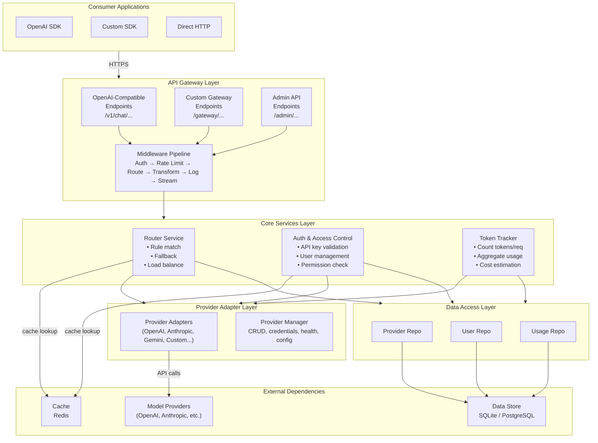
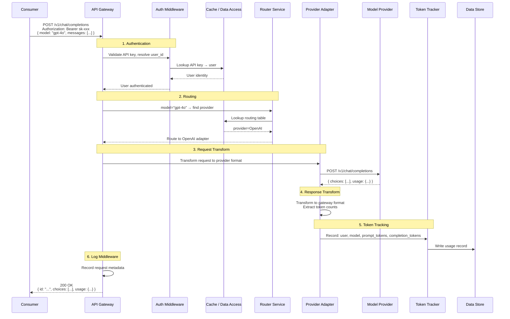
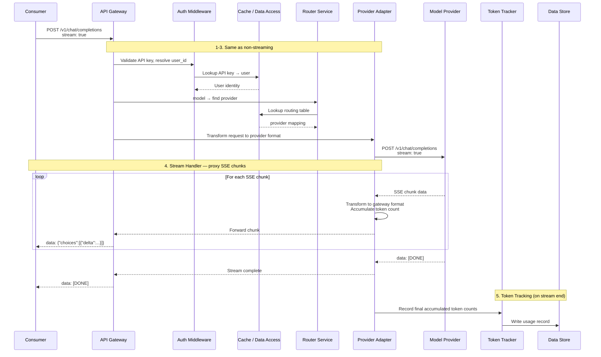
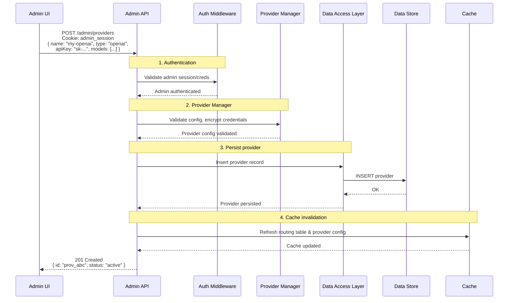
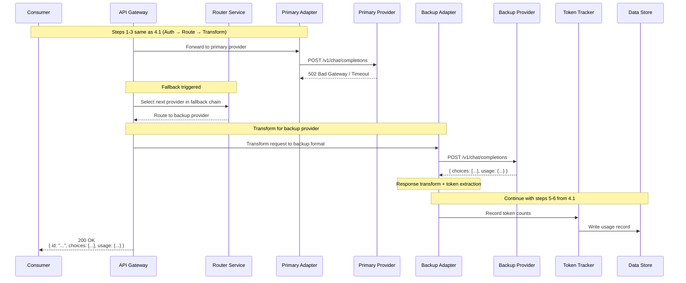
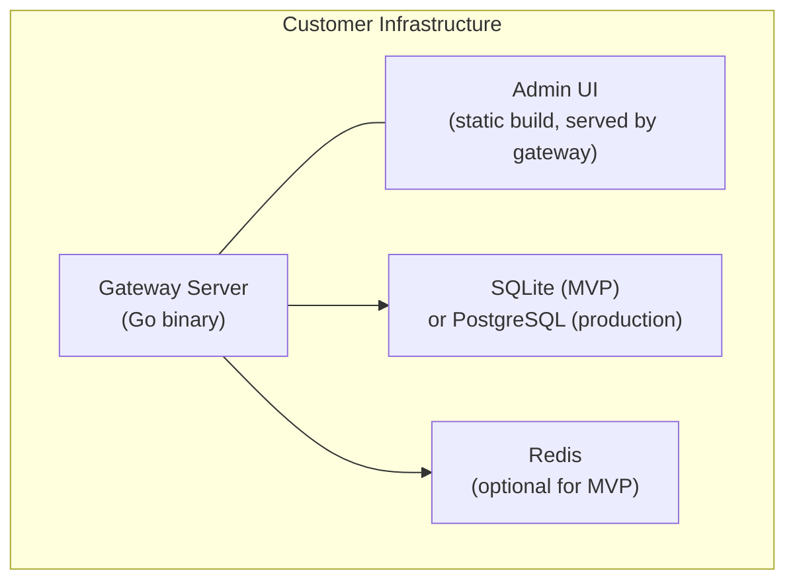

# Architecture Design — Enterprise AI Gateway

## 1. Design Decisions

| Decision | Choice | Rationale |
|---|---|---|
| API compatibility | OpenAI-compatible + custom extensions | Zero code change for existing OpenAI SDK users; custom endpoints for gateway-specific features |
| Deployment model | Self-hosted | Enterprises deploy on their own infrastructure (on-prem or their cloud) |
| Backend language | Go | High concurrency, low latency, single binary deployment |
| Frontend framework | React + TypeScript | Modern admin UI with rich component ecosystem |
| Data store | Abstracted access layer | SQLite for MVP demo; PostgreSQL for production; swappable via data access layer |
| Cache | Redis | Provider config caching, rate limit counters, session data; optional for MVP (in-memory fallback) |
| Streaming | SSE in Phase 1 | Most AI applications expect streaming; essential for real-time UX |

## 2. High-Level Architecture



**Layer responsibilities:**
- **API Gateway Layer** — HTTP handling, middleware orchestration, response streaming
- **Core Services Layer** — Business logic (routing, auth, token tracking)
- **Provider Adapter Layer** — Abstracts differences between AI providers; each adapter handles request/response transformation and SSE proxying for its provider type
- **Data Access Layer** — Abstracts data store operations; repository interfaces with swappable implementations (SQLite, PostgreSQL)
- **External dependencies** — Data Store (persistence), Cache (performance), Model Providers (upstream AI APIs)

## 3. Component Breakdown

### 3.1 API Gateway Layer

The entry point for all requests. Responsible for HTTP handling, middleware orchestration, and response streaming.

**Sub-components:**

- **OpenAI-Compatible Endpoints** — Implements `/v1/chat/completions`, `/v1/completions`, `/v1/models` etc. Consumers using OpenAI SDKs point their `base_url` to the gateway and it just works.
- **Custom Gateway Endpoints** — Gateway-specific APIs under `/gateway/...` (e.g., usage queries, model mapping, health checks).
- **Admin API Endpoints** — CRUD operations under `/admin/...` for providers, users, API keys, configuration. Protected by admin authentication.
- **Middleware Pipeline** — Ordered chain:
  1. **Authentication** — Validate API key, resolve user identity
  2. **Authorization** — Check user/model permissions (Phase 2+)
  3. **Rate Limiting** — Enforce quotas (Phase 3+)
  4. **Routing** — Determine target provider based on model name and routing rules
  5. **Request Transform** — Map incoming request to provider-specific format
  6. **Logging** — Record request metadata and token counts
  7. **Stream Handler** — Proxy SSE stream from provider to consumer; count streaming tokens

### 3.2 Router Service

Determines which provider handles a given request.

**Responsibilities:**
- Match model name to provider (e.g., `gpt-4o` → OpenAI, `claude-3` → Anthropic)
- Support routing rules: model name, cost tier, latency preference (Phase 2+)
- Fallback chain: if primary provider returns error/timeout, try next in chain (Phase 2+)
- Load balancing across multiple credentials for the same provider (Phase 4+)

**Key design:** Routing table stored in data store, cached in Redis (or in-memory for MVP). Reloaded on config change.

### 3.3 Provider Manager

Manages the lifecycle of AI model providers.

**Responsibilities:**
- CRUD for providers (name, type, base URL, API credentials, available models, status)
- Credential encryption at rest
- Health check: periodic probe to verify provider reachability (Phase 4+)
- Provider adapter pattern: each provider type has an adapter that handles request/response transformation and SSE proxying

**Provider Adapter Interface:**
```
ProviderAdapter {
  TransformRequest(gatewayRequest) → providerRequest
  TransformResponse(providerResponse) → gatewayResponse
  StreamResponse(providerStream) → SSE stream
  CountTokens(response) → tokenCounts
}
```

Initial adapters: OpenAI, Anthropic, Google Gemini. New providers added by implementing the adapter interface.

### 3.4 Auth & Access Control

Handles identity and permissions.

**Phase 1 (MVP):**
- API key authentication: each user has one or more API keys
- Admin vs. user role distinction (admin can access `/admin/...`)
- API keys stored hashed in data store

**Phase 2+:**
- Group/team membership
- Role-based access control (RBAC): define which models/actions each role can access
- API key scoping: keys restricted to specific models or groups
- SSO/SAML integration (Phase 3+)

### 3.5 Token Tracker

Records and aggregates token usage.

**Responsibilities:**
- Per-request: record prompt tokens, completion tokens, model, provider, user, timestamp
- Aggregation: daily/weekly/monthly totals per user, group, model, provider
- Cost estimation: apply configurable pricing per model to compute spend
- Storage: write to data store; cache recent aggregates in Redis for dashboard performance

### 3.6 Data Access Layer

Abstracts database operations so the storage backend is swappable.

**Design:**
- Define repository interfaces in Go (e.g., `ProviderRepo`, `UserRepo`, `UsageRepo`)
- Implementations: `SQLiteProviderRepo`, `PostgresProviderRepo`
- Configuration flag selects which implementation to use
- Migration scripts for each supported backend

**Entities:**
- Provider (id, name, type, base_url, credentials, models, status, created_at, updated_at)
- User (id, name, email, role, status, created_at)
- APIKey (id, user_id, key_hash, name, scopes, created_at, expires_at)
- UsageRecord (id, user_id, provider_id, model, prompt_tokens, completion_tokens, cost, timestamp)
- RoutingRule (id, model_pattern, provider_id, priority, fallback_provider_id)

### 3.7 Cache Layer (Redis)

**Uses:**
- Routing table cache (avoid DB query on every request)
- Provider config cache (credentials, model lists)
- Rate limit counters (Phase 3+)
- Session tokens (Phase 3+ for SSO)
- Usage aggregation cache (dashboard performance)

**MVP fallback:** If Redis is not configured, use in-memory cache with TTL. This simplifies demo/self-hosted setup while allowing production upgrade path.

### 3.8 Admin UI (React + TypeScript)

Single-page application for administration.

**Phase 1 screens:**
- Dashboard: overview of request volume, token usage, active providers
- Providers: list, add, edit, remove providers; configure credentials and models
- Users: list, create, disable users; issue/revoke API keys
- Usage: per-user token counts, filterable by date/model/provider

**Phase 2+ screens:**
- Groups & permissions management
- Routing rule configuration
- Cost dashboards and reports
- Audit log viewer

## 4. Detailed Request Workflow

### 4.1 Chat Completion — Non-Streaming



### 4.2 Chat Completion — Streaming (SSE)



### 4.3 Admin Operation — Add Provider



### 4.4 Error Handling — Provider Fallback (Phase 2+)



## 5. Deployment Architecture (Self-Hosted)



**Packaging options:**
- Single binary: Go server embeds Admin UI static files + SQLite — zero dependency deployment
- Docker Compose: Gateway + PostgreSQL + Redis — production-ready setup
- Helm chart: Kubernetes deployment (Phase 4+)

## 6. Phase 1 Scope Summary

| Component | Phase 1 Scope |
|---|---|
| API Gateway | OpenAI-compatible chat completion (streaming + non-streaming), models list; Admin API |
| Router | Model-name-based routing to single provider (no fallback yet) |
| Provider Manager | CRUD for providers; OpenAI + Anthropic adapters |
| Auth | API key authentication; admin vs. user role |
| Token Tracker | Per-request token counting; storage in data store |
| Data Access Layer | SQLite implementation; repository interfaces defined |
| Cache | In-memory with TTL (Redis optional) |
| Admin UI | Dashboard, provider management, user/API key management, basic usage view |
