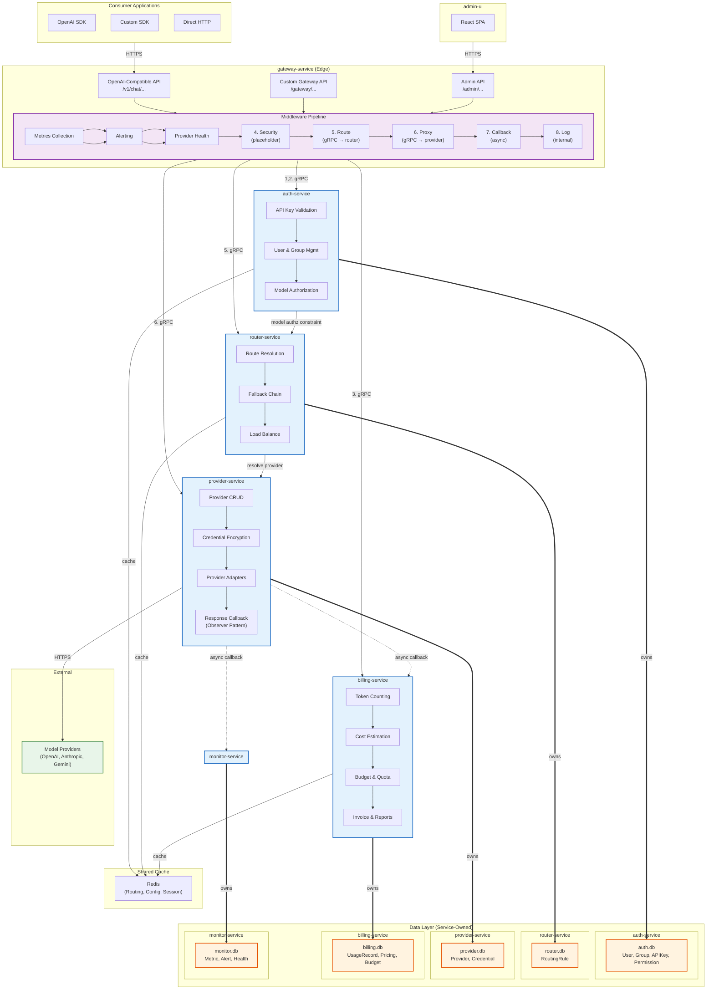
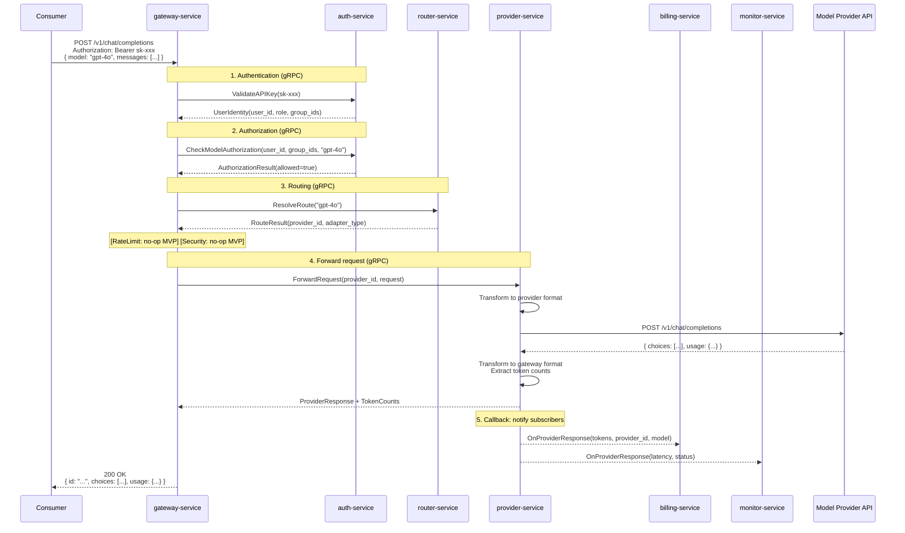
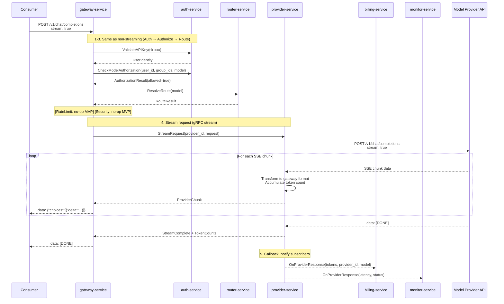
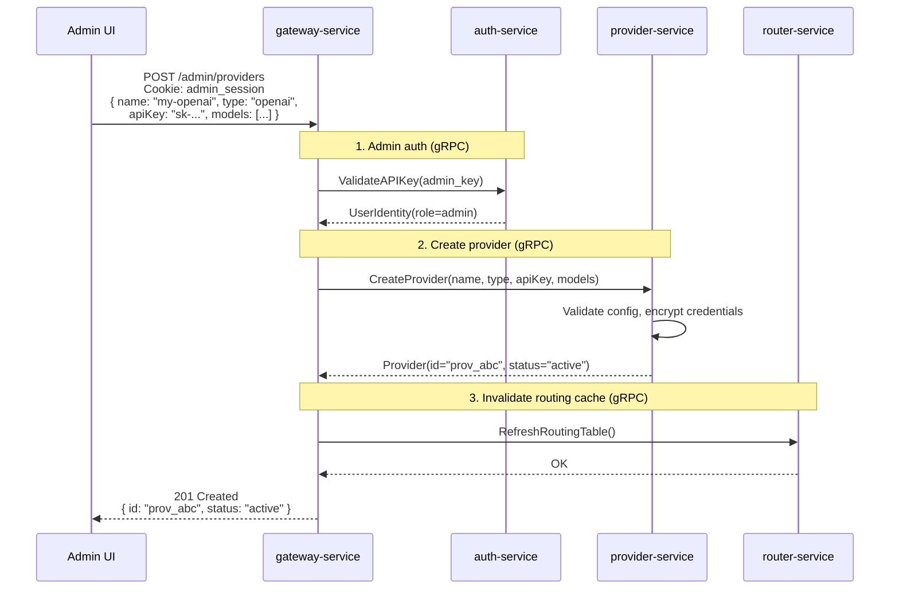
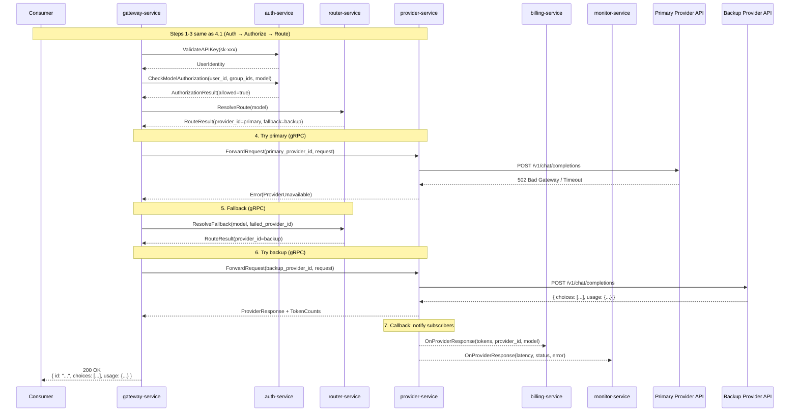
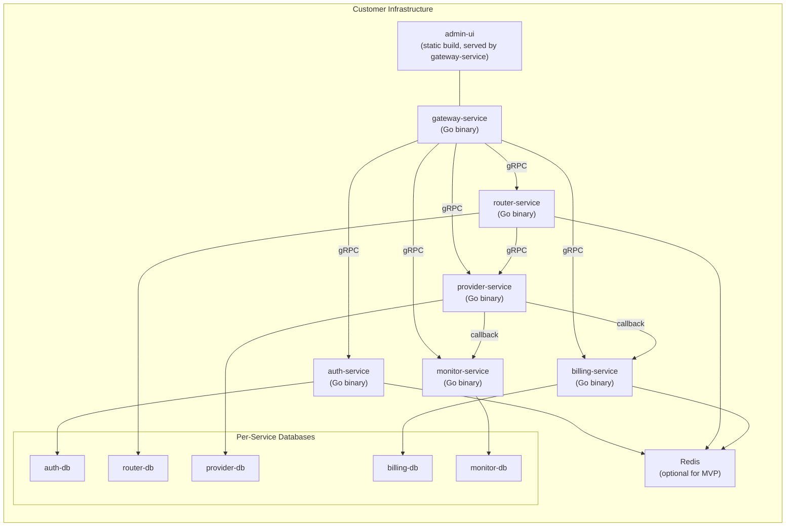

# Architecture Design — Enterprise AI Gateway

## 1. Design Decisions

| Decision | Choice | Rationale |
|---|---|---|
| Architecture style | Microservice | Each domain (gateway, auth, routing, provider, billing, monitor) is an independent service with its own API contract; enables independent deployment, scaling, and team ownership |
| Service communication | gRPC (internal) + HTTP/REST (external) | gRPC for low-latency inter-service calls; REST for consumer-facing and admin APIs |
| API compatibility | OpenAI-compatible + custom extensions | Zero code change for existing OpenAI SDK users; custom endpoints for gateway-specific features |
| Deployment model | Self-hosted | Enterprises deploy on their own infrastructure (on-prem or their cloud) |
| Backend language | Go | High concurrency, low latency, single binary deployment |
| Frontend framework | React + TypeScript | Modern admin UI with rich component ecosystem |
| Data store | Per-service database | Each service owns its own database exclusively; no shared database across service boundaries; SQLite for MVP demo; PostgreSQL for production; swappable via repository interface |
| Cache | Redis | Shared cache for routing table, provider config, rate limit counters, session data, security context; optional for MVP (in-memory fallback) |
| Streaming | SSE in Phase 1 | Most AI applications expect streaming; essential for real-time UX |
| Provider callback | Observer pattern | provider-service notifies registered subscribers (billing-service, monitor-service) after each provider response; decouples response-dependent logic from gateway middleware |
| Service discovery | Static config (MVP) → Consul/etcd (Phase 4+) | MVP uses static service addresses; production adds dynamic discovery |
| Security context | Phase 3+ | Prompt injection detection, content filtering, PII redaction; architecture reserves placeholder in middleware pipeline |
| Rate limiting | Phase 3+ | Per-user/group/global rate limits and token budgets; architecture reserves placeholder in middleware pipeline |

## 2. High-Level Architecture



**Microservices:**
- **gateway-service** — Edge service; HTTP entry point, middleware orchestration, SSE streaming. Routes consumer requests to internal services via gRPC. Does not own business logic.
- **auth-service** — Identity & access domain; API key validation, user/group CRUD, permission checks, model authorization (which user/group can access which models). Owns User, Group, APIKey, Permission entities.
- **router-service** — Routing domain; resolves model name to provider, manages fallback chains. Owns RoutingRule entity. Receives model authorization constraints from auth-service.
- **provider-service** — Provider domain (bottom layer); provider CRUD, credential encryption, provider adapters (request/response transform, SSE proxy). Owns Provider entity and adapter implementations. **After each provider response, notifies registered callback subscribers** (billing-service for usage recording, monitor-service for metrics) — decoupling response-dependent logic from gateway middleware.
- **billing-service** — Usage & billing domain; token counting, usage aggregation, cost estimation, pricing rules, budget/quota management, invoice generation. Owns UsageRecord, PricingRule, BillingAccount, Budget, Invoice entities. Receives provider response data via callback from provider-service.
- **monitor-service** — Observability domain; metrics collection, alerting, provider health monitoring. Owns Metric, AlertRule, Alert, ProviderHealthStatus entities. Receives provider response data via callback from provider-service.
- **admin-ui** — Frontend SPA; communicates exclusively with gateway-service Admin API.

**Layered structure:**
- **Edge Layer**: gateway-service — sole entry point for all external traffic
- **Service Layer**: auth-service, router-service, billing-service, monitor-service — business logic domains
- **Provider Layer** (bottom): provider-service — closest to external model providers, owns adapter implementations and callback dispatch

**Provider callback mechanism:**
provider-service extracts token counts and response metadata from every provider response, then notifies registered subscribers via gRPC callbacks. This decouples response-dependent processing from the gateway middleware:
- **billing-service** subscribes to receive token counts → records usage, applies pricing, checks budgets
- **monitor-service** subscribes to receive response metadata → records latency, error rates, throughput
- New subscribers can be registered without modifying provider-service or gateway-service

**Communication:**
- External (consumers, admin UI) → gateway-service: **HTTPS / REST**
- gateway-service → internal services: **gRPC**
- provider-service → subscribers: **gRPC callback (observer pattern)**
- Internal services → own database: **SQL (via repository interface)** — each service has its own dedicated database
- Internal services → cache: **Redis protocol**

**Model authorization flow:**
auth-service owns the mapping of users/groups → authorized models. When gateway-service resolves a route, it first calls auth-service to check if the user's group has permission to use the requested model. router-service receives this constraint to ensure only authorized providers are considered.

## 3. Microservice Breakdown

### 3.1 gateway-service

The edge service and sole entry point for all external traffic. Responsible for HTTP handling, middleware orchestration, and response streaming. Does not own business logic — delegates to internal services via gRPC.

**HTTP endpoints:**
- **OpenAI-Compatible API** — `/v1/chat/completions`, `/v1/completions`, `/v1/models`. Consumers using OpenAI SDKs point their `base_url` to the gateway.
- **Custom Gateway API** — `/gateway/...` (e.g., usage queries, model mapping, health checks).
- **Admin API** — `/admin/...` for providers, users, API keys, configuration. Protected by admin authentication.

**Middleware pipeline** (ordered chain - each step makes a gRPC call to the corresponding service):

| Step | Middleware | Service Called | Purpose | MVP Status |
|------|------------|---------------|---------|-----------|
| 1 | **Authentication** | auth-service | Validate API key via `ValidateAPIKey()`, resolve user identity, role, and group memberships | ✅ Active |
| 2 | **Authorization** | auth-service | Check if user's group is authorized for requested model via `CheckModelAuthorization()` | ✅ Active (MVP: all active users allowed) |
| 3 | **Rate Limiting** | billing-service | Check user/group quota via `CheckBudget()`, enforce per-user/group/global limits | ⏸ Placeholder |
| 4 | **Security** | (internal) | Prompt injection detection, content filtering, PII redaction | ⏸ Placeholder |
| 5 | **Routing** | router-service | Resolve model → provider via `ResolveRoute()`, apply auth constraints | ✅ Active |
| 6 | **Proxy** | provider-service | Forward request via `ForwardRequest()` / `StreamRequest()`, receive response | ✅ Active |
| 7 | **Callback** | (handled by provider-service) | provider-service notifies subscribers asynchronously after response | ✅ Active |
| 8 | **Logging** | (internal) | Record request metadata locally | ✅ Active |

**Middleware Service Flow:**
```
Consumer Request
    │
    ▼
┌─────────────────────────────────────────────────────────────────┐
│ gateway-service (middleware pipeline)                           │
│                                                                 │
│  1. Auth ──────► auth-service gRPC ──────► UserIdentity       │
│                       │                                         │
│  2. Authz ─────────► auth-service gRPC ──────► AuthResult      │
│                       │                                         │
│  3. RateLimit ────► billing-service gRPC ─────► BudgetStatus  │
│                       │                                         │
│  4. Security ─────► (internal/placeholder)                    │
│                       │                                         │
│  5. Route ────────► router-service gRPC ──────► RouteResult   │
│                       │                                         │
│  6. Proxy ────────► provider-service gRPC ─────► Response      │
│                       │              │                           │
│                       ▼              ▼ (async callback)           │
│                 Response ◄────────────────► billing-service    │
│                                    │        monitor-service    │
└─────────────────────────────────────────────────────────────────┘
    │
    ▼
Consumer Response
```

> **Key relationships:**
> - gateway-service ↔ auth-service: Bi-directional — gateway calls auth for authN/authZ; auth returns model authorization constraints to gateway for routing
> - gateway-service ↔ router-service: One-way — gateway resolves model → provider
> - gateway-service ↔ provider-service: One-way — gateway forwards request, provider handles callbacks internally
> - provider-service → billing-service/monitor-service: **Observer callback** — provider notifies subscribers automatically after each response (fire-and-forget)
> - Rate Limiting and Security middleware are placeholder no-ops in MVP

**Owns no entities.** Stateless — can be horizontally scaled.

### 3.2 auth-service

Identity, access control, and model authorization domain. Owns User, Group, APIKey, and Permission entities.

**gRPC API:**
- `ValidateAPIKey(key) → UserIdentity` (includes user_id, role, group_ids)
- `CheckModelAuthorization(user_id, group_ids, model) → AuthorizationResult` (Phase 2+: full check; MVP: always allow for active users)
- `GetUser(id) → User`
- `CreateUser/CreateAPIKey/DeleteAPIKey(...)` (called by gateway-service on behalf of Admin API)
- `CheckPermission(user, resource, action) → bool` (Phase 2+)
- Group CRUD: `CreateGroup/UpdateGroup/DeleteGroup/ListGroups(...)` (Phase 2+)
- Permission CRUD: `GrantPermission/RevokePermission/ListPermissions(...)` (Phase 2+)

**Owned entities:**
- User (id, name, email, role, status, created_at)
- Group (id, name, parent_group_id, created_at) — Phase 2+
- UserGroup (user_id, group_id) — Phase 2+
- APIKey (id, user_id, key_hash, name, scopes, created_at, expires_at)
- Permission (id, group_id, resource_type, resource_id, action) — Phase 2+
  - resource_type: "model", "provider", "admin_feature"
  - action: "access", "manage", "view"

**Model authorization model (Phase 2+):**
- Each group can be granted access to specific models (e.g., group "engineering" → ["gpt-4o", "claude-3"])
- API keys inherit permissions from their user's group memberships
- When a request arrives, gateway-service calls `CheckModelAuthorization` before routing
- router-service receives authorized model list as a constraint, only routes to providers the user/group can access

**Phase 1 (MVP):** API key auth, admin vs. user role, all active users can access all models
**Phase 2+:** Groups, RBAC, model authorization per group, API key scoping
**Phase 3+:** SSO/SAML integration

### 3.3 router-service

Routing domain. Resolves which provider handles a given model request. Owns RoutingRule entity.

**gRPC API:**
- `ResolveRoute(model) → RouteResult(provider_id, adapter_type, fallback_chain)`
- `GetRoutingRules() → []RoutingRule`
- `CreateRoutingRule/UpdateRoutingRule/DeleteRoutingRule(...)` (admin operations)

**Owned entity:**
- RoutingRule (id, model_pattern, provider_id, priority, fallback_provider_id)

**Key design:** Routing table cached in Redis (or in-memory for MVP). Invalidated when provider-service updates provider config.

**Phase 1:** Model-name-based routing to single provider (no fallback)
**Phase 2+:** Fallback chain, cost/latency-based routing rules

### 3.4 provider-service

Provider domain (bottom layer). Manages AI model provider lifecycle, implements provider adapters for request/response transformation and SSE proxying, and dispatches response callbacks to subscribers. Owns Provider entity.

**gRPC API:**
- `ForwardRequest(provider_id, request) → ProviderResponse` (non-streaming)
- `StreamRequest(provider_id, request) → stream ProviderChunk` (streaming)
- `GetProvider(id) → Provider`
- `CreateProvider/UpdateProvider/DeleteProvider(...)` (admin operations)
- `ListModels(provider_id) → []ModelInfo`
- `RegisterSubscriber(service_name, callback_endpoint) → OK` (register a service to receive response callbacks)
- `UnregisterSubscriber(service_name) → OK`

**Owned entity:**
- Provider (id, name, type, base_url, credentials, models, status, created_at, updated_at)

**Provider Adapter Interface** (internal to provider-service):
```
ProviderAdapter {
  TransformRequest(gatewayRequest) → providerRequest
  TransformResponse(providerResponse) → gatewayResponse
  StreamResponse(providerStream) → SSE stream
  CountTokens(response) → tokenCounts
}
```

Initial adapters: OpenAI, Anthropic, Google Gemini. New providers added by implementing the adapter interface.

**Response callback mechanism:**
After each provider response (both streaming and non-streaming), provider-service extracts response metadata and notifies all registered subscribers via gRPC callback:
```
ProviderResponseCallback {
  request_id: string
  user_id: string
  group_id: string
  provider_id: string
  model: string
  prompt_tokens: int64
  completion_tokens: int64
  latency_ms: int64
  status: string        // "success" | "error"
  error_code: string     // if error
  timestamp: int64
}
```
- **billing-service** subscribes to receive token counts → records usage, applies pricing, checks budgets
- **monitor-service** subscribes to receive latency/error data → records metrics, updates provider health
- Callbacks are dispatched asynchronously (fire-and-forget) — failure does not block the response to the consumer
- New subscribers can be registered without modifying provider-service or gateway-service

### 3.5 billing-service

Usage & billing domain. Records token usage from provider responses, estimates costs, manages budgets/quotas, and generates invoices. Owns UsageRecord, PricingRule, BillingAccount, Budget, and Invoice entities.

**gRPC API:**
- `OnProviderResponse(callback_data) → OK` (called by provider-service as a callback subscriber)
- `RecordUsage(user_id, provider_id, model, prompt_tokens, completion_tokens) → OK` (direct call from gateway-service)
- `GetUsage(filters) → []UsageRecord`
- `GetUsageAggregation(filters, granularity) → []UsageAggregation`
- `EstimateCost(model, prompt_tokens, completion_tokens) → CostEstimate`
- `CheckBudget(user_id, group_id) → BudgetStatus`
- `GetBillingAccount(id) → BillingAccount`
- `CreateBudget/UpdateBudget/DeleteBudget(...)` (admin operations)
- `CreatePricingRule/UpdatePricingRule/DeletePricingRule(...)` (admin operations)
- `GenerateInvoice(account_id, period) → Invoice` (Phase 3+)
- `GetInvoices(filters) → []Invoice` (Phase 3+)

**Owned entities:**
- UsageRecord (id, user_id, group_id, provider_id, model, prompt_tokens, completion_tokens, cost, timestamp)
- PricingRule (id, model, provider_id, price_per_prompt_token, price_per_completion_token)
- BillingAccount (id, group_id, balance, currency, created_at)
- Budget (id, account_id, limit, period, soft_cap_pct, hard_cap_pct, status)
- Invoice (id, account_id, period_start, period_end, total_cost, line_items, status)

**Key design:**
- **Dual data ingestion**: (1) provider-service callback delivers token counts automatically after each response; (2) gateway-service can call `RecordUsage` directly for cases where callback is not available (e.g., MVP with in-process calls)
- Pricing rules are applied to token counts to compute cost per request
- gateway-service Rate Limiting middleware calls `CheckBudget` before forwarding requests
- Budget enforcement: soft cap → alert, hard cap → block request with `429 Too Many Requests`
- Cache recent usage aggregates in Redis for dashboard performance

**Phase 1 (MVP):** Per-request token counting via direct `RecordUsage` call, basic usage query
**Phase 2+:** Provider callback integration, cost estimation, pricing rules, basic budget with hard cap
**Phase 3+:** Invoice generation, budget alerts, exportable reports

### 3.6 monitor-service

Observability domain. Collects metrics, monitors provider health, and manages alerting. Owns Metric, AlertRule, Alert, and ProviderHealthStatus entities.

**gRPC API:**
- `OnProviderResponse(callback_data) → OK` (called by provider-service as a callback subscriber)
- `RecordMetric(metric_type, labels, value) → OK` (called by any service)
- `GetMetrics(filters) → []Metric`
- `GetProviderHealth(provider_id) → ProviderHealthStatus`
- `ReportProviderHealth(provider_id, health_data) → OK` (called by provider-service for periodic probes)
- `CreateAlertRule/UpdateAlertRule/DeleteAlertRule(...)` (admin operations)
- `GetAlerts(filters) → []Alert`

**Owned entities:**
- Metric (id, type, labels, value, timestamp) — e.g., request_latency, error_rate, token_throughput
- AlertRule (id, metric_type, condition, threshold, channel, status)
- Alert (id, rule_id, triggered_at, status, acknowledged_at)
- ProviderHealthStatus (provider_id, latency_p50/p95/p99, error_rate, uptime_pct, last_check)

**Key design:**
- **Dual data ingestion**: (1) provider-service callback delivers latency/error data automatically after each response; (2) any service can call `RecordMetric` directly for custom metrics
- monitor-service aggregates and stores metrics; exposes dashboards via gateway-service Admin API
- Provider health: combination of real-time callback data and periodic probes by provider-service
- Alerting: threshold-based rules trigger notifications (email, webhook, Slack)

**Phase 1 (MVP):** Not implemented (placeholder interface)
**Phase 3:** Basic metrics (latency, error rate, throughput), provider health, alert rules
**Phase 4+:** Anomaly detection, provider comparison dashboards, SLA monitoring

### 3.7 Data Layer (Service-Owned)

Each microservice **manages its own data layer** — owns the database, defines repository interfaces, and controls its schema. This enforces **strong domain isolation** and enables independent deployment and scaling.

**Service-Owned Data Architecture:**

```mermaid
flowchart TD
    subgraph AuthSvc["auth-service"]
        AuthRepo["Repository Interface<br/>UserRepo, APIKeyRepo, GroupRepo, PermissionRepo"]
        AuthImpl["SQLite Impl │ Postgres Impl"]
        AuthRepo --> AuthImpl
    end

    subgraph RouterSvc["router-service"]
        RouterRepo["Repository Interface<br/>RoutingRuleRepo"]
        RouterImpl["SQLite Impl │ Postgres Impl"]
        RouterRepo --> RouterImpl
    end

    subgraph ProviderSvc["provider-service"]
        ProviderRepo["Repository Interface<br/>ProviderRepo, CredentialRepo"]
        ProviderImpl["SQLite Impl │ Postgres Impl"]
        ProviderRepo --> ProviderImpl
    end

    subgraph BillingSvc["billing-service"]
        BillingRepo["Repository Interface<br/>UsageRepo, PricingRepo, BudgetRepo, InvoiceRepo"]
        BillingImpl["SQLite Impl │ Postgres Impl"]
        BillingRepo --> BillingImpl
    end

    subgraph MonitorSvc["monitor-service"]
        MonitorRepo["Repository Interface<br/>MetricRepo, AlertRepo, HealthRepo"]
        MonitorImpl["SQLite Impl │ Postgres Impl"]
        MonitorRepo --> MonitorImpl
    end
```



**Data Ownership Matrix:**

| Service | Database | Repository Interfaces | Entities |
|---|---|---|---|
| auth-service | auth-db | `UserRepo`, `APIKeyRepo`, `GroupRepo`, `PermissionRepo` | User, Group, UserGroup, APIKey, Permission |
| router-service | router-db | `RoutingRuleRepo` | RoutingRule |
| provider-service | provider-db | `ProviderRepo`, `CredentialRepo` | Provider, EncryptedCredential |
| billing-service | billing-db | `UsageRepo`, `PricingRepo`, `BudgetRepo`, `InvoiceRepo` | UsageRecord, PricingRule, BillingAccount, Budget, Invoice |
| monitor-service | monitor-db | `MetricRepo`, `AlertRepo`, `HealthRepo` | Metric, AlertRule, Alert, ProviderHealthStatus |

**Design Principles:**

| Principle | Description |
|---|---|
| **Service ownership** | Each service owns its database exclusively. No cross-service DB access. |
| **Repository pattern** | Service defines abstract repository interfaces; implementation injected via config (SQLite or PostgreSQL) |
| **Schema isolation** | Each service manages its own migrations. Schema changes are service-local. |
| **Data flow** | Cross-domain data flows through gRPC API contracts, not direct DB access |
| **Encrypted credentials** | provider-service encrypts credentials at rest using AES-256-GCM |

**Implementation:**

- **Repository Interface** (e.g., auth-service):
  ```go
  type UserRepo interface {
      FindByID(id string) (*User, error)
      FindByAPIKey(keyHash string) (*User, error)
      Create(user *User) error
      Update(user *User) error
      Delete(id string) error
  }
  ```

- **Implementation selection** via config flag:
  - `SQLite` — file-based (`auth.db`, `router.db`, etc.), embedded, zero setup
  - `PostgreSQL` — production, separate DB instance or schema per service

- **Migration strategy**: Each service ships its own migration scripts; run at service startup or via CI/CD

- **Cross-service communication**: Never query another service's database directly. All data exchange happens through gRPC APIs:
  ```
  gateway-service ──gRPC──► auth-service    (auth reads user/api-key from auth-db)
  gateway-service ──gRPC──► router-service  (router reads routing rules from router-db)
  provider-service ──gRPC──► billing-service (billing records usage to billing-db)
  ```

**Storage Backends:**

| Backend | Use Case | Setup |
|---|---|---|
| SQLite | MVP / local dev | Per-service file (`*.db`), auto-migrated on startup |
| PostgreSQL | Production | Per-service DB instance or schema, migrations via Flyway/SQL |

### 3.8 Cache Layer (Redis)

Shared cache used by multiple services:

| Service | Cache Use |
|---|---|
| auth-service | API key → user lookup, group memberships, model permissions |
| router-service | Routing table, provider config |
| billing-service | Pricing rules, budget status, usage aggregation (dashboard) |
| monitor-service | Provider health status, recent metrics |
| gateway-service | (no direct cache — delegates to other services) |

**MVP fallback:** If Redis is not configured, each service uses in-memory cache with TTL.

### 3.9 admin-ui (React + TypeScript)

Single-page application. Communicates exclusively with gateway-service Admin API.

**Phase 1 screens:**
- Dashboard: overview of request volume, token usage, active providers
- Providers: list, add, edit, remove providers; configure credentials and models
- Users: list, create, disable users; issue/revoke API keys
- Usage: per-user token counts, filterable by date/model/provider

**Phase 2+ screens:**
- Groups & permissions management (assign models to groups)
- Routing rule configuration
- Cost dashboards, budgets, pricing rules, and reports (billing-service)
- Audit log viewer

**Phase 3+ screens:**
- Alerting & monitoring dashboards (monitor-service)
- Provider health status
- Security & rate limit configuration

## 4. Detailed Request Workflow

### 4.1 Chat Completion — Non-Streaming



### 4.2 Chat Completion — Streaming (SSE)



### 4.3 Admin Operation — Add Provider



### 4.4 Error Handling — Provider Fallback (Phase 2+)



## 5. Deployment Architecture (Self-Hosted)



**Packaging options:**
- **All-in-one binary** (MVP): All services compiled into single Go process, in-process gRPC calls, embedded Admin UI + per-service SQLite files — zero dependency deployment
- **Docker Compose** (production): Each service as separate container + per-service PostgreSQL databases + Redis — independent scaling and deployment
- **Helm chart** (Phase 4+): Kubernetes deployment with service discovery

## 6. Phase 1 Scope Summary

| Service | Phase 1 Scope | Phase 2+ |
|---|---|---|
| gateway-service | OpenAI-compatible chat completion (streaming + non-streaming), models list; Admin API; middleware pipeline (RateLimit, Security, Callback as no-op placeholders) | Full middleware with billing budget check and callback integration |
| auth-service | API key validation; user CRUD; admin vs. user role; all active users can access all models | Groups, RBAC, model authorization per group, API key scoping |
| router-service | Model-name-based routing to single provider (no fallback yet) | Fallback chain, cost/latency-based routing, auth-aware routing |
| provider-service | Provider CRUD; OpenAI + Anthropic adapters; request forwarding and SSE streaming; callback mechanism (subscribers registered but only billing-service active) | Health checks via monitor-service callback |
| billing-service | Per-request token counting via direct `RecordUsage` call; basic usage query | Provider callback integration, cost estimation, pricing rules, budgets, invoices |
| monitor-service | Not implemented (placeholder interface) | Metrics via provider callback, provider health, alerting |
| Data access | Per-service SQLite file; repository interfaces defined | Per-service PostgreSQL database |
| Cache | In-memory with TTL per service (Redis optional) | Redis with per-service cache strategies |
| admin-ui | Dashboard, provider management, user/API key management, basic usage view | Groups & permissions, billing/pricing, monitoring dashboards |
