# Service Interaction & Domain Boundaries

This document details how each microservice communicates with others, the API contracts between services, and domain ownership boundaries.

## 1. Service Overview

| Service | Domain | Owned Entities | Port (dev) |
|---|---|---|---|
| gateway-service | Edge / API gateway | None (stateless) | :8080 (HTTP) |
| auth-service | Identity, access & model authz | User, Group, APIKey, Permission | :50051 (gRPC) |
| router-service | Routing | RoutingRule | :50052 (gRPC) |
| provider-service | Provider management & callback dispatch | Provider | :50053 (gRPC) |
| billing-service | Usage tracking & billing | UsageRecord, PricingRule, BillingAccount, Budget, Invoice | :50054 (gRPC) |
| monitor-service | Observability & alerting | Metric, AlertRule, Alert, ProviderHealthStatus | :50055 (gRPC) |
| admin-ui | Frontend | None | served by gateway-service |

## 2. Service Interaction Map

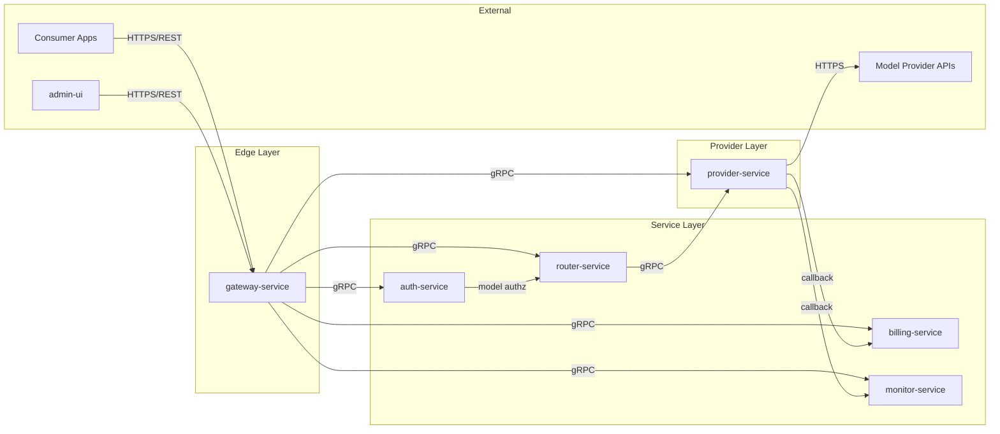

## 3. gRPC API Contracts

### 3.1 auth-service

```protobuf
service AuthService {
  // Called by gateway-service on every request
  rpc ValidateAPIKey(ValidateAPIKeyRequest) returns (UserIdentity);
  rpc CheckModelAuthorization(CheckModelAuthorizationRequest) returns (AuthorizationResult);
  rpc GetUser(GetUserRequest) returns (User);
  rpc CreateUser(CreateUserRequest) returns (User);
  rpc UpdateUser(UpdateUserRequest) returns (User);
  rpc DeleteUser(DeleteUserRequest) returns (Empty);
  rpc ListUsers(ListUsersRequest) returns (ListUsersResponse);

  // API key management
  rpc CreateAPIKey(CreateAPIKeyRequest) returns (CreateAPIKeyResponse);
  rpc DeleteAPIKey(DeleteAPIKeyRequest) returns (Empty);
  rpc ListAPIKeys(ListAPIKeysRequest) returns (ListAPIKeysResponse);

  // Group management (Phase 2+)
  rpc CreateGroup(CreateGroupRequest) returns (Group);
  rpc UpdateGroup(UpdateGroupRequest) returns (Group);
  rpc DeleteGroup(DeleteGroupRequest) returns (Empty);
  rpc ListGroups(ListGroupsRequest) returns (ListGroupsResponse);
  rpc AddUserToGroup(AddUserToGroupRequest) returns (Empty);
  rpc RemoveUserFromGroup(RemoveUserFromGroupRequest) returns (Empty);

  // Permission management (Phase 2+)
  rpc GrantPermission(GrantPermissionRequest) returns (Permission);
  rpc RevokePermission(RevokePermissionRequest) returns (Empty);
  rpc ListPermissions(ListPermissionsRequest) returns (ListPermissionsResponse);
  rpc CheckPermission(CheckPermissionRequest) returns (CheckPermissionResponse);
}

message ValidateAPIKeyRequest { string api_key = 1; }
message UserIdentity {
  string user_id = 1;
  string role = 2;             // "admin" | "user"
  repeated string group_ids = 3;  // Phase 2+: user's group memberships
  repeated string scopes = 4;     // Phase 2+: API key scopes
}

message CheckModelAuthorizationRequest {
  string user_id = 1;
  repeated string group_ids = 2;
  string model = 3;            // requested model name
}
message AuthorizationResult {
  bool allowed = 1;
  string reason = 2;           // e.g. "model not authorized for group", "user disabled"
  repeated string authorized_models = 3;  // full list of models this user/group can access
}

message User {
  string id = 1;
  string name = 2;
  string email = 3;
  string role = 4;
  string status = 5;           // "active" | "disabled"
  repeated string group_ids = 6;  // Phase 2+
  int64 created_at = 7;
}

message Group {
  string id = 1;
  string name = 2;
  string parent_group_id = 3;  // optional hierarchy
  int64 created_at = 4;
}

message Permission {
  string id = 1;
  string group_id = 2;
  string resource_type = 3;    // "model" | "provider" | "admin_feature"
  string resource_id = 4;      // e.g. model name "gpt-4o", provider id, or "*" for all
  string action = 5;           // "access" | "manage" | "view"
}

message CreateAPIKeyRequest {
  string user_id = 1;
  string name = 2;
  repeated string scopes = 3;  // Phase 2+: model restrictions
}
message CreateAPIKeyResponse {
  string api_key_id = 1;
  string api_key = 2;          // Only returned on creation, never stored in plain text
}
```

### 3.2 router-service

```protobuf
service RouterService {
  // Called by gateway-service to resolve routing
  rpc ResolveRoute(ResolveRouteRequest) returns (RouteResult);

  // Routing rule management (admin operations proxied through gateway-service)
  rpc GetRoutingRules(GetRoutingRulesRequest) returns (ListRoutingRulesResponse);
  rpc CreateRoutingRule(CreateRoutingRuleRequest) returns (RoutingRule);
  rpc UpdateRoutingRule(UpdateRoutingRuleRequest) returns (RoutingRule);
  rpc DeleteRoutingRule(DeleteRoutingRuleRequest) returns (Empty);

  // Cache invalidation (called by gateway-service after provider config changes)
  rpc RefreshRoutingTable(Empty) returns (Empty);

  // Phase 2+
  rpc ResolveFallback(ResolveFallbackRequest) returns (RouteResult);
}

message ResolveRouteRequest {
  string model = 1;
  repeated string authorized_models = 2;  // from auth-service: models this user/group can access
}
message RouteResult {
  string provider_id = 1;
  string adapter_type = 2;       // "openai" | "anthropic" | "gemini" | "custom"
  repeated string fallback_provider_ids = 3;  // Phase 2+
}

message RoutingRule {
  string id = 1;
  string model_pattern = 2;     // e.g. "gpt-4*" or "claude-*"
  string provider_id = 3;
  int32 priority = 4;
  string fallback_provider_id = 5;
}
```

### 3.3 provider-service

```protobuf
service ProviderService {
  // Request forwarding — called by gateway-service
  rpc ForwardRequest(ForwardRequestRequest) returns (ForwardRequestResponse);
  rpc StreamRequest(StreamRequestRequest) returns (stream ProviderChunk);

  // Provider management (admin operations proxied through gateway-service)
  rpc GetProvider(GetProviderRequest) returns (Provider);
  rpc CreateProvider(CreateProviderRequest) returns (Provider);
  rpc UpdateProvider(UpdateProviderRequest) returns (Provider);
  rpc DeleteProvider(DeleteProviderRequest) returns (Empty);
  rpc ListProviders(ListProvidersRequest) returns (ListProvidersResponse);
  rpc ListModels(ListModelsRequest) returns (ListModelsResponse);

  // Called by router-service to get provider info for routing
  rpc GetProviderByType(GetProviderByTypeRequest) returns (Provider);

  // Callback subscriber management
  rpc RegisterSubscriber(RegisterSubscriberRequest) returns (Empty);
  rpc UnregisterSubscriber(UnregisterSubscriberRequest) returns (Empty);
}

message ForwardRequestRequest {
  string provider_id = 1;
  bytes request_body = 2;       // JSON-encoded request
  map<string, string> headers = 3;
}
message ForwardRequestResponse {
  bytes response_body = 1;      // JSON-encoded response
  TokenCounts token_counts = 2;
  int32 status_code = 3;
}

message StreamRequestRequest {
  string provider_id = 1;
  bytes request_body = 2;
  map<string, string> headers = 3;
}
message ProviderChunk {
  bytes chunk_data = 1;         // SSE-formatted chunk
  TokenCounts accumulated_tokens = 2;
  bool done = 3;
}

message TokenCounts {
  int64 prompt_tokens = 1;
  int64 completion_tokens = 2;
}

message Provider {
  string id = 1;
  string name = 2;
  string type = 3;              // "openai" | "anthropic" | "gemini" | "custom"
  string base_url = 4;
  string credentials = 5;       // encrypted
  repeated string models = 6;
  string status = 7;            // "active" | "inactive"
  int64 created_at = 8;
  int64 updated_at = 9;
}

// Callback: dispatched by provider-service to all registered subscribers after each response
message ProviderResponseCallback {
  string request_id = 1;
  string user_id = 2;
  string group_id = 3;
  string provider_id = 4;
  string model = 5;
  int64 prompt_tokens = 6;
  int64 completion_tokens = 7;
  int64 latency_ms = 8;
  string status = 9;            // "success" | "error"
  string error_code = 10;       // if error
  int64 timestamp = 11;
}

message RegisterSubscriberRequest {
  string service_name = 1;      // e.g. "billing-service", "monitor-service"
  string callback_endpoint = 2; // gRPC endpoint address
}
message UnregisterSubscriberRequest {
  string service_name = 1;
}
```

### 3.4 billing-service

```protobuf
service BillingService {
  // Provider callback — called by provider-service as a registered subscriber
  rpc OnProviderResponse(ProviderResponseCallback) returns (Empty);

  // Direct usage recording — called by gateway-service (MVP fallback when callback not available)
  rpc RecordUsage(RecordUsageRequest) returns (Empty);

  // Usage queries (admin operations proxied through gateway-service)
  rpc GetUsage(GetUsageRequest) returns (ListUsageResponse);
  rpc GetUsageAggregation(GetUsageAggregationRequest) returns (ListUsageAggregationResponse);

  // Cost estimation
  rpc EstimateCost(EstimateCostRequest) returns (CostEstimate);

  // Budget check — called by gateway-service Rate Limiting middleware
  rpc CheckBudget(CheckBudgetRequest) returns (BudgetStatus);

  // Billing account management (admin operations)
  rpc GetBillingAccount(GetBillingAccountRequest) returns (BillingAccount);
  rpc CreateBillingAccount(CreateBillingAccountRequest) returns (BillingAccount);
  rpc UpdateBillingAccount(UpdateBillingAccountRequest) returns (BillingAccount);

  // Budget management (admin operations)
  rpc CreateBudget(CreateBudgetRequest) returns (Budget);
  rpc UpdateBudget(UpdateBudgetRequest) returns (Budget);
  rpc DeleteBudget(DeleteBudgetRequest) returns (Empty);
  rpc ListBudgets(ListBudgetsRequest) returns (ListBudgetsResponse);

  // Pricing rules (admin operations)
  rpc CreatePricingRule(CreatePricingRuleRequest) returns (PricingRule);
  rpc UpdatePricingRule(UpdatePricingRuleRequest) returns (PricingRule);
  rpc DeletePricingRule(DeletePricingRuleRequest) returns (Empty);
  rpc ListPricingRules(ListPricingRulesRequest) returns (ListPricingRulesResponse);

  // Invoicing (Phase 3+)
  rpc GenerateInvoice(GenerateInvoiceRequest) returns (Invoice);
  rpc GetInvoices(GetInvoicesRequest) returns (ListInvoicesResponse);
}

message RecordUsageRequest {
  string user_id = 1;
  string group_id = 2;
  string provider_id = 3;
  string model = 4;
  int64 prompt_tokens = 5;
  int64 completion_tokens = 6;
}

message UsageRecord {
  string id = 1;
  string user_id = 2;
  string group_id = 3;
  string provider_id = 4;
  string model = 5;
  int64 prompt_tokens = 6;
  int64 completion_tokens = 7;
  double cost = 8;
  int64 timestamp = 9;
}

message GetUsageRequest {
  string user_id = 1;           // optional filter
  string group_id = 2;          // optional filter
  string provider_id = 3;       // optional filter
  string model = 4;             // optional filter
  int64 start_time = 5;        // optional filter
  int64 end_time = 6;          // optional filter
  int32 page_size = 7;
  string page_token = 8;
}

message UsageAggregation {
  string group_key = 1;         // user_id, model, or provider_id
  int64 total_prompt_tokens = 2;
  int64 total_completion_tokens = 3;
  double total_cost = 4;
  int64 request_count = 5;
}

message EstimateCostRequest {
  string model = 1;
  int64 prompt_tokens = 2;
  int64 completion_tokens = 3;
}
message CostEstimate {
  double estimated_cost = 1;
  string currency = 2;
  double price_per_prompt_token = 3;
  double price_per_completion_token = 4;
}

message CheckBudgetRequest {
  string user_id = 1;
  string group_id = 2;         // optional: check at group level
}
message BudgetStatus {
  double current_spend = 1;
  double budget_limit = 2;
  double remaining = 3;
  double soft_cap_pct = 4;     // e.g. 0.8 = alert at 80%
  double hard_cap_pct = 5;     // e.g. 1.0 = block at 100%
  bool soft_cap_exceeded = 6;
  bool hard_cap_exceeded = 7;
}

message BillingAccount {
  string id = 1;
  string group_id = 2;
  double balance = 3;
  string currency = 4;
  int64 created_at = 5;
}

message Budget {
  string id = 1;
  string account_id = 2;
  double limit = 3;
  string period = 4;           // "daily" | "weekly" | "monthly"
  double soft_cap_pct = 5;
  double hard_cap_pct = 6;
  string status = 7;           // "active" | "paused"
}

message PricingRule {
  string id = 1;
  string model = 2;
  string provider_id = 3;
  double price_per_prompt_token = 4;
  double price_per_completion_token = 5;
  string currency = 6;
}

message Invoice {
  string id = 1;
  string account_id = 2;
  int64 period_start = 3;
  int64 period_end = 4;
  double total_cost = 5;
  repeated InvoiceLineItem line_items = 6;
  string status = 7;           // "draft" | "finalized" | "paid"
}

message InvoiceLineItem {
  string model = 1;
  string provider_id = 2;
  int64 total_prompt_tokens = 3;
  int64 total_completion_tokens = 4;
  double cost = 5;
}
```

### 3.5 monitor-service

```protobuf
service MonitorService {
  // Provider callback — called by provider-service as a registered subscriber
  rpc OnProviderResponse(ProviderResponseCallback) returns (Empty);

  // Metrics ingestion — called by any service (fire-and-forget, non-blocking)
  rpc RecordMetric(RecordMetricRequest) returns (Empty);

  // Metrics queries (admin operations via gateway-service)
  rpc GetMetrics(GetMetricsRequest) returns (ListMetricsResponse);
  rpc GetMetricAggregation(GetMetricAggregationRequest) returns (MetricAggregationResponse);

  // Provider health
  rpc GetProviderHealth(GetProviderHealthRequest) returns (ProviderHealthStatus);
  rpc ListProviderHealth(ListProviderHealthRequest) returns (ListProviderHealthResponse);
  rpc ReportProviderHealth(ReportProviderHealthRequest) returns (Empty);  // called by provider-service for periodic probes

  // Alert rules (admin operations)
  rpc CreateAlertRule(CreateAlertRuleRequest) returns (AlertRule);
  rpc UpdateAlertRule(UpdateAlertRuleRequest) returns (AlertRule);
  rpc DeleteAlertRule(DeleteAlertRuleRequest) returns (Empty);
  rpc ListAlertRules(ListAlertRulesRequest) returns (ListAlertRulesResponse);

  // Alerts
  rpc GetAlerts(GetAlertsRequest) returns (ListAlertsResponse);
  rpc AcknowledgeAlert(AcknowledgeAlertRequest) returns (Alert);
}

message RecordMetricRequest {
  string metric_type = 1;      // "request_latency" | "error_rate" | "token_throughput" | "request_count"
  map<string, string> labels = 2;  // e.g. {"provider": "openai", "model": "gpt-4o", "user_id": "..."}
  double value = 3;
  int64 timestamp = 4;
}

message Metric {
  string id = 1;
  string type = 2;
  map<string, string> labels = 3;
  double value = 4;
  int64 timestamp = 5;
}

message ProviderHealthStatus {
  string provider_id = 1;
  double latency_p50 = 2;
  double latency_p95 = 3;
  double latency_p99 = 4;
  double error_rate = 5;
  double uptime_pct = 6;
  int64 last_check = 7;
  string status = 8;           // "healthy" | "degraded" | "down"
}

message AlertRule {
  string id = 1;
  string metric_type = 2;
  string condition = 3;        // "gt" | "lt" | "eq"
  double threshold = 4;
  string channel = 5;          // "email" | "webhook" | "slack"
  string channel_config = 6;   // JSON: email address, webhook URL, etc.
  string status = 7;           // "active" | "paused"
}

message Alert {
  string id = 1;
  string rule_id = 2;
  int64 triggered_at = 3;
  string status = 4;           // "firing" | "acknowledged" | "resolved"
  int64 acknowledged_at = 5;
  int64 resolved_at = 6;
}
```

## 4. Service Call Matrix

Detailed breakdown of which service calls which, and why.

### 4.1 gateway-service → auth-service

| Trigger | gRPC Call | Purpose |
|---|---|---|
| Every incoming request | `ValidateAPIKey` | Resolve API key to user identity, role, and group memberships |
| Every chat completion request | `CheckModelAuthorization` | Verify user/group is authorized to access the requested model |
| Admin: create user | `CreateUser` | Create a new user |
| Admin: list users | `ListUsers` | List all users |
| Admin: issue API key | `CreateAPIKey` | Generate new API key for a user |
| Admin: revoke API key | `DeleteAPIKey` | Revoke an API key |
| Admin: manage groups (Phase 2+) | `CreateGroup`, `AddUserToGroup`, etc. | Organize users into groups |
| Admin: assign model permissions (Phase 2+) | `GrantPermission`, `RevokePermission` | Control which groups can access which models |
| Admin: check permission (Phase 2+) | `CheckPermission` | Verify user has access to a resource |

### 4.2 gateway-service → router-service

| Trigger | gRPC Call | Purpose |
|---|---|---|
| Chat completion request | `ResolveRoute` | Map model name to provider |
| Admin: add/update/delete provider | `RefreshRoutingTable` | Invalidate routing cache after config change |
| Admin: manage routing rules | `CreateRoutingRule`, `UpdateRoutingRule`, `DeleteRoutingRule` | Configure routing rules |
| Provider fallback (Phase 2+) | `ResolveFallback` | Get next provider in fallback chain |

### 4.3 gateway-service → provider-service

| Trigger | gRPC Call | Purpose |
|---|---|---|
| Chat completion (non-streaming) | `ForwardRequest` | Forward request to provider, get response |
| Chat completion (streaming) | `StreamRequest` | Forward request, receive SSE stream |
| Admin: add provider | `CreateProvider` | Register a new provider |
| Admin: update provider | `UpdateProvider` | Update provider config |
| Admin: delete provider | `DeleteProvider` | Remove a provider |
| Admin: list providers | `ListProviders` | List all providers |
| Models list endpoint | `ListModels` | List available models for a provider |

### 4.4 gateway-service → billing-service

| Trigger | gRPC Call | Purpose |
|---|---|---|
| After every completed request (MVP) | `RecordUsage` | Record token counts for the request (direct call, before callback is active) |
| Rate Limiting middleware | `CheckBudget` | Check if user/group has exceeded budget before forwarding request |
| Admin: view usage | `GetUsage` | Query usage records with filters |
| Admin: usage dashboard | `GetUsageAggregation` | Get aggregated usage stats |
| Admin: view cost | `EstimateCost` | Estimate cost for a given model/token count |
| Admin: manage budgets | `CreateBudget`, `UpdateBudget`, `DeleteBudget` | Configure spending limits per group |
| Admin: manage pricing | `CreatePricingRule`, `UpdatePricingRule`, `DeletePricingRule` | Configure per-model pricing |
| Admin: generate invoice (Phase 3+) | `GenerateInvoice` | Generate invoice for a billing period |

### 4.5 router-service → provider-service

| Trigger | gRPC Call | Purpose |
|---|---|---|
| Resolving route | `GetProviderByType` | Verify provider exists and is active for a given adapter type |

### 4.6 provider-service → billing-service (callback)

| Trigger | gRPC Call | Purpose |
|---|---|---|
| After every provider response | `OnProviderResponse` | Deliver token counts, model, provider info for usage recording and cost calculation |

### 4.7 provider-service → monitor-service (callback)

| Trigger | gRPC Call | Purpose |
|---|---|---|
| After every provider response | `OnProviderResponse` | Deliver latency, error data for metrics recording and provider health tracking |
| Periodic health probe | `ReportProviderHealth` | Report provider reachability, latency, error rate |

### 4.8 gateway-service → monitor-service

| Trigger | gRPC Call | Purpose |
|---|---|---|
| After every request (Logging middleware) | `RecordMetric` | Emit request latency, token throughput, error metrics |
| Admin: view metrics | `GetMetrics`, `GetMetricAggregation` | Query metrics for dashboards |
| Admin: provider health | `GetProviderHealth`, `ListProviderHealth` | View provider health status |
| Admin: manage alerts | `CreateAlertRule`, `UpdateAlertRule`, `DeleteAlertRule` | Configure alerting rules |
| Admin: view alerts | `GetAlerts`, `AcknowledgeAlert` | View and acknowledge active alerts |

### 4.9 auth-service → router-service (indirect)

auth-service does not call router-service directly. The model authorization flow works as follows:
1. gateway-service calls auth-service `CheckModelAuthorization` → gets `authorized_models` list
2. gateway-service passes `authorized_models` to router-service `ResolveRoute` as a constraint
3. router-service only returns providers for models in the authorized list

### 4.10 No other inter-service calls

- **auth-service** does not call any other internal service
- **provider-service** only calls external Model Provider APIs and dispatches callbacks to registered subscribers (billing-service, monitor-service)
- **billing-service** does not call any other internal service (receives data via provider callback and gateway-service direct calls)
- **monitor-service** does not call any other internal service (receives data via provider callback and direct `RecordMetric` calls from other services)

## 5. Domain Boundaries & Data Ownership

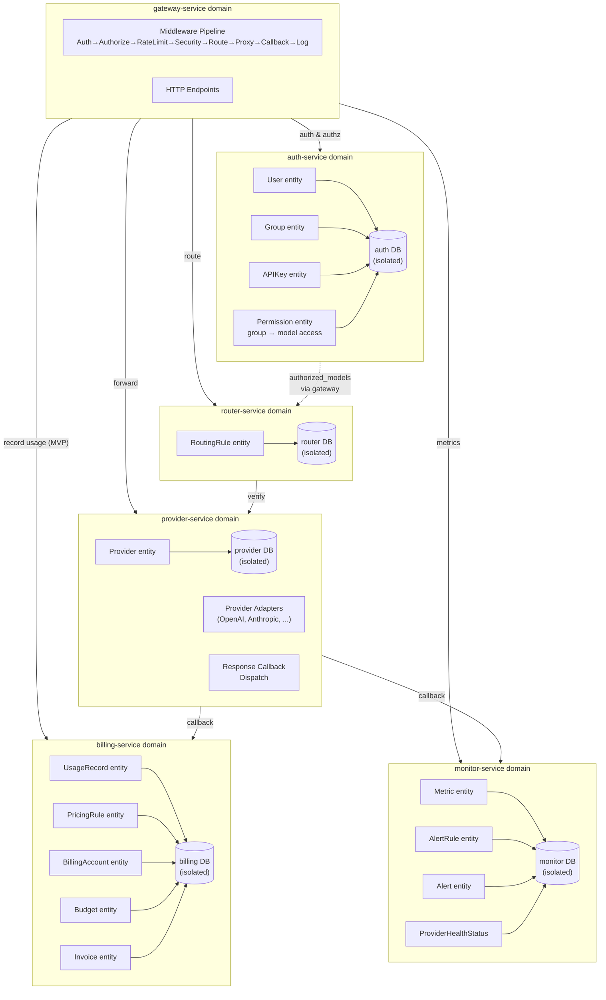

**Key principles:**
- Each service owns its **own dedicated database** — no shared database across service boundaries
- All cross-domain access goes through gRPC API contracts — no cross-service database reads
- gateway-service is the orchestrator: it calls other services but owns no data itself
- provider-service is the only service that makes outbound calls to external APIs (Model Providers)
- **Provider callback mechanism**: provider-service dispatches response data to registered subscribers (billing-service, monitor-service) after each response, decoupling response-dependent logic from the gateway request path
- **Model authorization** is owned by auth-service (Permission entity: group → model mapping), but enforced via gateway-service passing `authorized_models` to router-service as a routing constraint
- **billing-service** receives token data via two paths: (1) provider-service callback (primary), (2) gateway-service direct `RecordUsage` call (MVP fallback)

## 6. Cross-Service Event Flow

### 6.1 Provider Config Change → Cache Invalidation

When a provider is added, updated, or deleted, the routing cache in router-service must be refreshed.

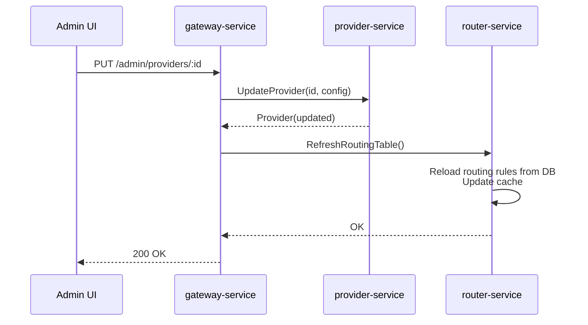

### 6.2 User Created → API Key Issued

Creating a user and issuing their first API key involves two sequential gRPC calls to auth-service.

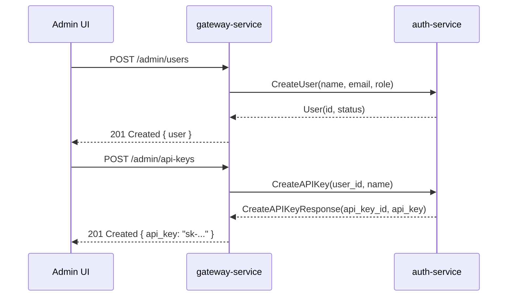

### 6.3 Usage Query → Dashboard Data

The admin dashboard queries billing-service for aggregated usage data.

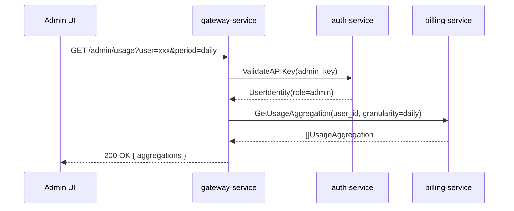

### 6.4 Provider Response Callback Dispatch

After each provider response, provider-service dispatches callbacks to all registered subscribers.

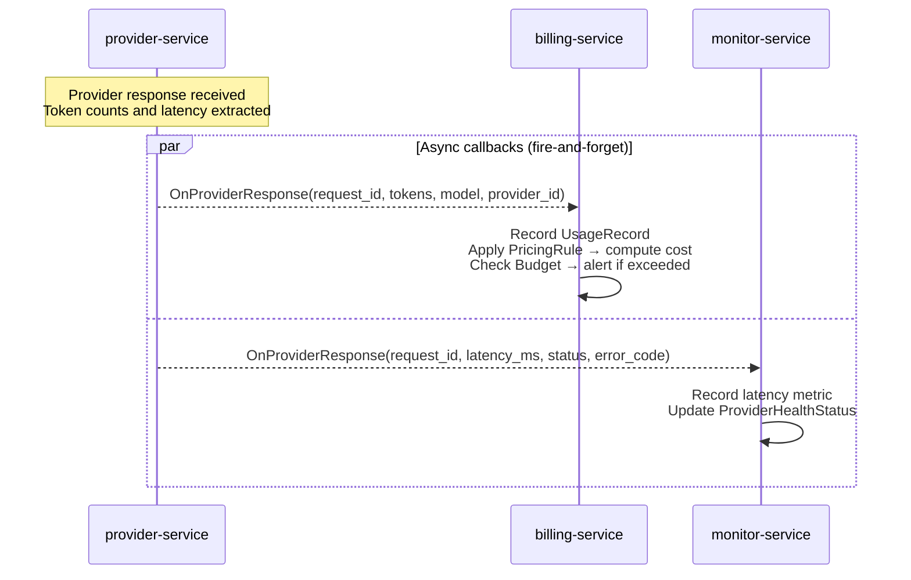

### 6.5 Model Authorization — Group Assigned to Models

When a group admin assigns model access to a group, auth-service updates permissions and invalidates its cache.

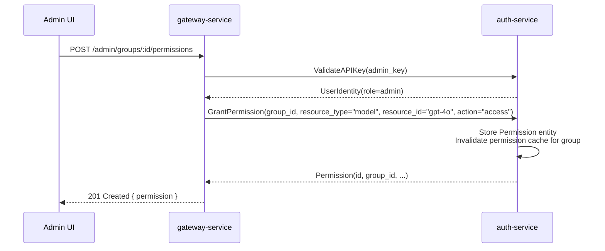

### 6.6 Model Authorization Check at Request Time

When a user in a restricted group makes a request, gateway-service checks model authorization before routing.

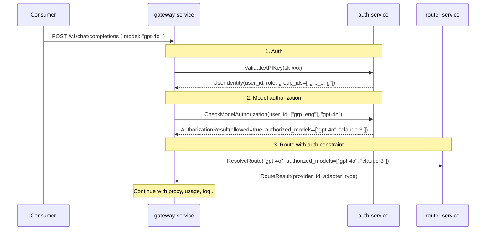

### 6.7 Model Authorization Denied

When a user tries to access a model not authorized for their group.

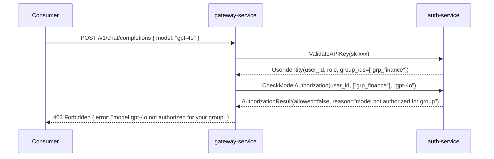

### 6.8 Budget Check & Enforcement

gateway-service checks budget before forwarding a request.

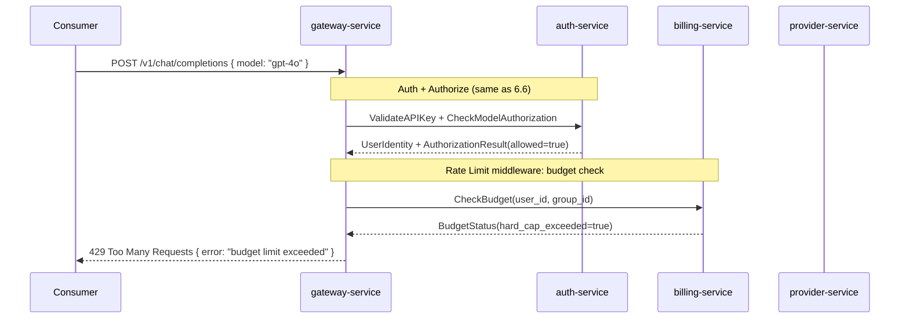

### 6.9 Metrics Emission

After a request completes, metrics are recorded via two paths: provider-service callback (automatic) and gateway-service direct calls.

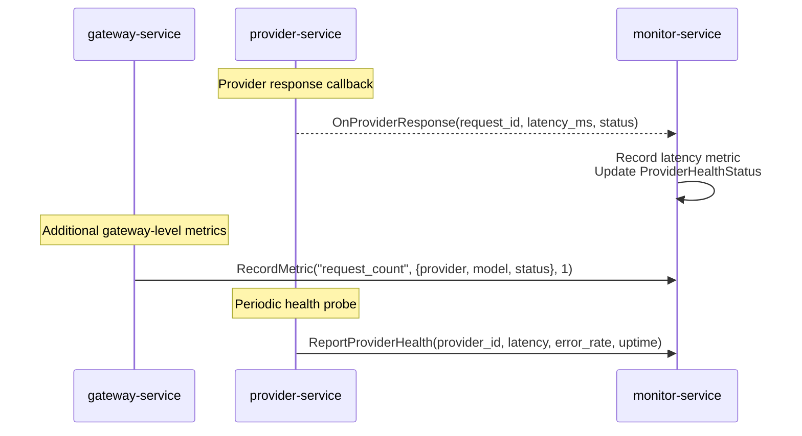

## 7. Error Handling Between Services

| Scenario | Handling |
|---|---|
| auth-service unavailable | gateway-service returns `503 Service Unavailable` to consumer; no request can proceed without auth |
| Model authorization denied | gateway-service returns `403 Forbidden` with reason; no routing or forwarding occurs |
| router-service unavailable | gateway-service returns `503 Service Unavailable`; cannot route without provider resolution |
| provider-service unavailable | gateway-service returns `503 Service Unavailable`; cannot forward requests |
| billing-service unavailable | gateway-service logs warning but still returns response to consumer; if using direct `RecordUsage` (MVP), usage record is queued for retry; budget check is skipped (fail-open) |
| Budget hard cap exceeded | gateway-service returns `429 Too Many Requests` with budget limit details |
| Budget soft cap exceeded | Request proceeds; billing-service triggers alert notification to admin |
| monitor-service unavailable | All services continue normally; metrics dropped (fire-and-forget); no impact on request flow |
| Provider callback to subscriber fails | provider-service logs the failure; callback is fire-and-forget (non-blocking); subscriber misses one data point but continues normally |
| provider-service → Model Provider error | provider-service returns error to gateway-service; if fallback enabled, gateway-service calls router-service for backup route |
| Duplicate API key creation | auth-service returns `ALREADY_EXISTS` gRPC status; gateway-service maps to `409 Conflict` HTTP status |

**Key design:**
- **Blocking calls** (auth, router, provider): Must succeed for request to proceed; failure returns error to consumer
- **Non-blocking calls** (billing `RecordUsage`, monitor `RecordMetric`): Failure does not block the response; data is queued for retry
- **Callback calls** (provider → billing/monitor): Fire-and-forget; failure does not block the provider response to gateway-service
- **Fail-open calls** (billing `CheckBudget`): If budget check cannot be performed, request proceeds (conservative fail-open to avoid blocking all traffic)
- Rate Limiting and Security middleware are no-op placeholders in MVP, so their service dependencies are not yet in the critical path
