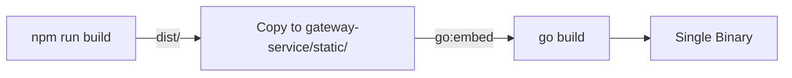

# Design: Developer C Completion

## Architecture Overview

```
┌─────────────────────────────────────────────────────────────────┐
│                     gateway-service                              │
├─────────────────────────────────────────────────────────────────┤
│  HTTP Entry                                                      │
│  ├── /health (liveness)                                        │
│  ├── /gateway/health (readiness)                                │
│  ├── /gateway/models (aggregated)                               │
│  ├── /v1/chat/completions (with full middleware)                │
│  ├── /admin/auth/* (JWT auth → auth-service gRPC)               │
│  ├── /admin/providers (→ provider-service gRPC)                 │
│  ├── /admin/routing-rules (→ router-service gRPC)               │
│  ├── /admin/usage (→ billing-service gRPC)                      │
│  ├── /admin/budgets (NEW → billing-service gRPC)                │
│  ├── /admin/pricing-rules (NEW → billing-service gRPC)          │
│  ├── /admin/alert-rules (UPDATED → monitor-service gRPC)        │
│  ├── /admin/alerts (UPDATED → monitor-service gRPC)              │
│  └── /* (static files from embedded admin-ui)  ← NEW           │
├─────────────────────────────────────────────────────────────────┤
│  gRPC Clients                                                    │
│  ├── AuthClient                                                  │
│  ├── RouterClient                                                │
│  ├── ProviderClient                                              │
│  ├── BillingClient (EXTENDED: Budget/PricingRule methods)       │
│  └── MonitorClient (NEW: AlertRule/Alert methods)               │
├─────────────────────────────────────────────────────────────────┤
│  Static File Server                                              │
│  └── go:embed admin-ui/dist/ → serve at / with SPA fallback     │
└─────────────────────────────────────────────────────────────────┘
```

## 1. BillingClient Extension

### New Methods

```go
// Budget CRUD
func (c *BillingClient) ListBudgets(ctx, page, pageSize) (*ListBudgetsResponse, error)
func (c *BillingClient) CreateBudget(ctx, userID, limit, period, softCapPct, hardCapPct) (*Budget, error)
func (c *BillingClient) UpdateBudget(ctx, id, userID, limit, period, softCapPct, hardCapPct, status) (*Budget, error)
func (c *BillingClient) DeleteBudget(ctx, id) error

// PricingRule CRUD
func (c *BillingClient) ListPricingRules(ctx, page, pageSize) (*ListPricingRulesResponse, error)
func (c *BillingClient) CreatePricingRule(ctx, model, providerID, promptPrice, completionPrice, currency) (*PricingRule, error)
func (c *BillingClient) UpdatePricingRule(ctx, id, model, providerID, promptPrice, completionPrice, currency) (*PricingRule, error)
func (c *BillingClient) DeletePricingRule(ctx, id) error
```

### Proto Mapping

| REST Endpoint | gRPC Method | Proto Request |
|---------------|-------------|---------------|
| GET /admin/budgets | ListBudgets | ListBudgetsRequest |
| POST /admin/budgets | CreateBudget | CreateBudgetRequest |
| PUT /admin/budgets/:id | UpdateBudget | UpdateBudgetRequest |
| DELETE /admin/budgets/:id | DeleteBudget | DeleteBudgetRequest |
| GET /admin/pricing-rules | ListPricingRules | ListPricingRulesRequest |
| POST /admin/pricing-rules | CreatePricingRule | CreatePricingRuleRequest |
| PUT /admin/pricing-rules/:id | UpdatePricingRule | UpdatePricingRuleRequest |
| DELETE /admin/pricing-rules/:id | DeletePricingRule | DeletePricingRuleRequest |

## 2. MonitorClient

### New gRPC Client

```go
type MonitorClient struct {
    client monitorv1.MonitorServiceClient
    conn   *grpc.ClientConn
}

// AlertRule CRUD
func (c *MonitorClient) ListAlertRules(ctx, page, pageSize) (*ListAlertRulesResponse, error)
func (c *MonitorClient) CreateAlertRule(ctx, metricType, condition, threshold, channel, channelConfig) (*AlertRule, error)
func (c *MonitorClient) UpdateAlertRule(ctx, id, metricType, condition, threshold, channel, channelConfig, status) (*AlertRule, error)
func (c *MonitorClient) DeleteAlertRule(ctx, id) error

// Alert operations
func (c *MonitorClient) GetAlerts(ctx, ruleID, status, page, pageSize) (*ListAlertsResponse, error)
func (c *MonitorClient) AcknowledgeAlert(ctx, id) (*Alert, error)
```

### Proto Mapping

| REST Endpoint | gRPC Method | Proto Request |
|---------------|-------------|---------------|
| GET /admin/alert-rules | ListAlertRules | ListAlertRulesRequest |
| POST /admin/alert-rules | CreateAlertRule | CreateAlertRuleRequest |
| PUT /admin/alert-rules/:id | UpdateAlertRule | UpdateAlertRuleRequest |
| DELETE /admin/alert-rules/:id | DeleteAlertRule | DeleteAlertRuleRequest |
| GET /admin/alerts | GetAlerts | GetAlertsRequest |
| PUT /admin/alerts/:id/acknowledge | AcknowledgeAlert | AcknowledgeAlertRequest |

## 3. Admin Handlers

### admin_budgets.go

```go
type AdminBudgetsHandler struct {
    billingClient *client.BillingClient
}

func (h *AdminBudgetsHandler) ListBudgets(c *gin.Context)
func (h *AdminBudgetsHandler) CreateBudget(c *gin.Context)
func (h *AdminBudgetsHandler) UpdateBudget(c *gin.Context)
func (h *AdminBudgetsHandler) DeleteBudget(c *gin.Context)
```

**REST Response Format** (adapted from proto for UI compatibility):

```json
{
  "id": "budget-1",
  "name": "Dev Budget",
  "scope": "user",
  "scope_id": "user-123",
  "limit": 100.0,
  "current_spend": 45.2,
  "period": "monthly",
  "status": "active",
  "created_at": "2026-05-01T00:00:00Z",
  "updated_at": "2026-05-01T00:00:00Z"
}
```

### admin_pricing_rules.go

```go
type AdminPricingRulesHandler struct {
    billingClient *client.BillingClient
}

func (h *AdminPricingRulesHandler) ListPricingRules(c *gin.Context)
func (h *AdminPricingRulesHandler) CreatePricingRule(c *gin.Context)
func (h *AdminPricingRulesHandler) UpdatePricingRule(c *gin.Context)
func (h *AdminPricingRulesHandler) DeletePricingRule(c *gin.Context)
```

### admin_alerts.go (Refactored)

Replace in-memory mock with gRPC calls to monitor-service:

```go
type AdminAlertsHandler struct {
    monitorClient *client.MonitorClient  // was: sync.RWMutex + in-memory data
}
```

## 4. UI Embedding (go:embed)

### Static File Serving

```go
//go:embed static
var staticFiles embed.FS

func setupStaticFiles(r *gin.Engine) {
    // Serve static assets
    r.StaticFS("/assets", http.FS(staticFiles))

    // SPA fallback: serve index.html for all non-API, non-static routes
    r.NoRoute(func(c *gin.Context) {
        // Skip API routes
        if strings.HasPrefix(c.Request.URL.Path, "/admin/") ||
           strings.HasPrefix(c.Request.URL.Path, "/v1/") ||
           strings.HasPrefix(c.Request.URL.Path, "/gateway/") ||
           strings.HasPrefix(c.Request.URL.Path, "/health") {
            c.Next()
            return
        }
        data, _ := staticFiles.ReadFile("static/index.html")
        c.Data(200, "text/html; charset=utf-8", data)
    })
}
```

### Build Pipeline



### Makefile Target

```makefile
build-single: build-ui embed-ui build-gateway

build-ui:
	cd admin-ui && npm ci && npm run build

embed-ui:
	rm -rf gateway-service/static
	cp -r admin-ui/dist gateway-service/static

build-gateway:
	cd gateway-service && go build -o bin/gateway ./cmd/server
```

## 5. Testing Strategy

### Unit Tests

| Component | Test File | Coverage |
|-----------|-----------|----------|
| AuthContext | `src/contexts/__tests__/AuthContext.test.tsx` | Login/logout/session restore |
| ProtectedRoute | `src/components/__tests__/ProtectedRoute.test.tsx` | Auth/role checks |
| BillingClient | `billing_client_test.go` | Budget/PricingRule gRPC calls |
| MonitorClient | `monitor_client_test.go` | AlertRule/Alert gRPC calls |
| Admin handlers | `admin_budgets_test.go`, `admin_pricing_rules_test.go` | REST→gRPC mapping |

### Integration Tests

| Flow | Test |
|------|------|
| Budget CRUD | Create → List → Update → Delete via REST |
| PricingRule CRUD | Create → List → Update → Delete via REST |
| AlertRule CRUD | Create → List → Update → Delete via REST |
| Embedded UI | GET / returns HTML, GET /assets/* returns JS/CSS |

## 6. File Structure

```
gateway-service/
├── internal/
│   ├── client/
│   │   ├── billing_client.go    # UPDATE: Add Budget/PricingRule methods
│   │   └── monitor_client.go    # NEW: Monitor gRPC client
│   └── handler/
│       ├── admin_budgets.go     # NEW: Budget REST→gRPC proxy
│       ├── admin_pricing_rules.go # NEW: PricingRule REST→gRPC proxy
│       └── admin_alerts.go      # UPDATE: Replace mock with gRPC
├── static/                     # NEW: Embedded admin-ui build output
│   └── index.html + assets/
└── cmd/server/
    └── main.go                 # UPDATE: Embed, static serving, new routes

admin-ui/
└── (no changes needed - already calls correct endpoints)
```
