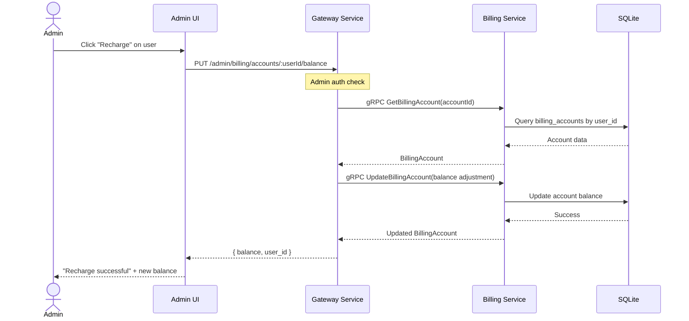

## Context

The billing service has gRPC methods for billing account CRUD (`CreateBillingAccount`, `GetBillingAccount`, `UpdateBillingAccount`), but they are not exposed through the gateway HTTP layer and the `CreateBillingAccountRequest` proto lacks a `user_id` field. Additionally, no endpoint exists for adjusting a user's balance. Admins currently have no way to create accounts or recharge users except via direct database writes.

## Goals / Non-Goals

**Goals:**
- Provide HTTP endpoints for admin to create billing accounts and adjust balances
- Integrate recharge functionality into the existing Users admin UI page
- Restrict billing account management to admin role only
- Show user account balance in the Users table

**Non-Goals:**
- User self-service recharge (not in scope)
- Automatic billing account creation on user registration (future enhancement)
- Refund or invoice generation
- Balance history/transaction log (future enhancement)

## Decisions

**1. HTTP Layer in Gateway-Service**
- **Choice**: Add billing account HTTP endpoints to gateway-service
- **Rationale**: Gateway-service already handles admin HTTP routes (budgets, pricing rules) that proxy to billing-service gRPC. Billing account management follows the same pattern.
- **Alternative**: Direct endpoints in billing-service - rejected due to inconsistent admin API pattern

**2. Balance Adjustment via UpdateBillingAccount**
- **Choice**: Reuse existing `UpdateBillingAccount` gRPC, adding `user_id` and `balance` fields to the proto request
- **Rationale**: Avoids adding a new gRPC method for a simple balance change. The existing proto message just needs extended fields.
- **Alternative**: New dedicated `AdjustBalance` RPC - cleaner but more proto changes

**3. Admin-Only Authorization**
- **Choice**: Apply JWT auth middleware + admin role check on billing account routes
- **Rationale**: Follows same pattern as other admin-only routes (budget management, pricing rules)
- **Alternative**: Permission-based check - over-engineered for current scope

**4. UI Integration in Users Page**
- **Choice**: Add balance column and recharge button to existing Users table
- **Rationale**: Users already manage users here; billing is a natural extension. Avoids a separate billing accounts page.
- **Alternative**: Separate Billing Accounts page - would duplicate user data

## Data Flow

## Risks / Trade-offs

**Race Condition**: Concurrent balance adjustments could cause inconsistent state
- **Mitigation**: Use SQLite transaction with atomic read-write in billing service

**No History**: Balance changes are not tracked as transactions
- **Mitigation**: Accept for MVP; transaction log can be added later

**Proto Compatibility**: Modifying existing proto messages could affect other consumers
- **Mitigation**: Add new optional fields (backward compatible)
