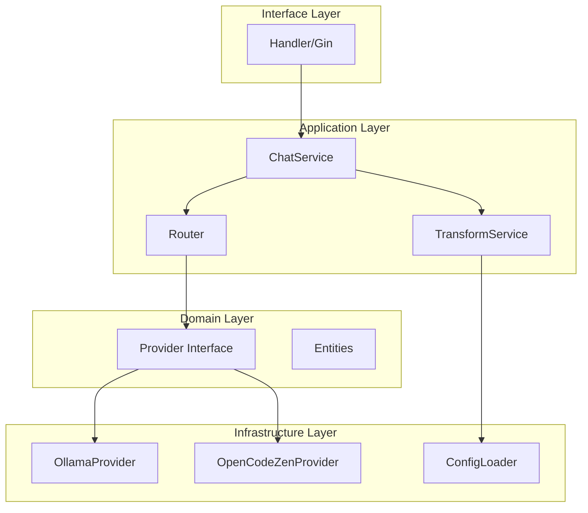
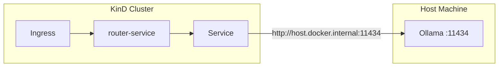

## Context

The AI API gateway project is a greenfield monorepo containing multiple services (Go + Python + React). The first service to be built is the router-service—a Go 1.26 HTTP service that proxies LLM requests to multiple providers through a unified OpenAI-compatible API.

**Current State:** No existing services implemented. Project uses KinD (Kubernetes in Docker) for local development with NGINX Ingress deployed via Helm.

**Constraints:**
- Go 1.26 with Gin framework
- Domain-Driven Design + Clean Architecture
- No persistence—configuration via mounted YAML file
- Ollama runs on the host machine (not in cluster)
- OpenCode Zen API requires HTTPS communication
- Deployment to local KinD cluster only

## Goals / Non-Goals

**Goals:**
- Build a functional router-service with OpenAI-compatible endpoints
- Support streaming (SSE) for real-time responses
- Route requests to Ollama (local) or OpenCode Zen (cloud) based on model name
- Containerize with multi-stage Docker build (distroless base, ~15MB)
- Deploy to KinD via Helm chart with config mounted from host
- Provide testable architecture with clear layer separation

**Non-Goals:**
- Authentication/authorization (future capability)
- Rate limiting and quota management (future capability)
- Caching layer (future capability)
- Additional LLM providers beyond Ollama and OpenCode Zen (Phase 1)
- Production-grade monitoring/observability (future capability)
- Multi-replica deployment (single replica for Phase 1)

## Decisions

### 1. Clean Architecture Layer Structure

**Decision:** Use four-layer Clean Architecture (Domain → Application → Infrastructure → Interface)

**Rationale:** Ensures testability (domain has no external dependencies), maintainability (clear separation), and extensibility (add new providers by implementing interfaces).

### 2. Multi-Stage Docker Build with Alpine Base

**Decision:** Use `golang:1.26-alpine` for build stage, `alpine:3.23` for runtime

**Alternatives Considered:**
- `scratch`: Smaller (~8MB) but no CA certificates for HTTPS to OpenCode Zen
- `distroless`: Smaller (~15MB), but had network timeout issues during build
- Full `golang`: Too large (~850MB), never ship compiler to production

**Rationale:** Alpine provides CA certificates (required for OpenCode Zen HTTPS), nonroot user (security via USER directive), and reasonable size (~22MB). Distroless was originally planned but had network timeout issues during build.

### 3. Configuration via Mounted YAML

**Decision:** Load config from `/app/config/config.yaml` (mounted from host path)

**Alternatives Considered:**
- Environment variables: Less readable for complex provider configs
- ConfigMap: Good for Kubernetes, but development workflow prefers host-mounted file
- No config (hardcoded): Not extensible

**Rationale:** Matches user requirement for mounted YAML file. Simpler than ConfigMap for local development, no persistence needed anyway.

### 4. Ollama Connection via host.docker.internal

**Decision:** Use `host.docker.internal:11434` for Ollama (Docker macOS) or `172.17.0.1:11434` (Linux)

**Rationale:** Ollama runs on host by requirement. Docker provides `host.docker.internal` for macOS, Linux uses bridge IP.

### 5. Streaming Implementation

**Decision:** Use Gin's `c.Stream()` with manual SSE formatting

**Alternatives Considered:**
- `c.SSEvent()`: Formats as `event: message` which OpenAI SDK doesn't expect
- Custom HTTP handler: More code, less idiomatic

**Rationale:** OpenAI SDK expects raw JSON in `data:` field. Manual `c.Stream()` with `data: {json}\n\n` format is the correct approach.

### 6. Helm Chart Structure

**Decision:** Create Helm chart with values.yaml, templates for deployment/service/ingress

**Rationale:** Matches user requirement for Helm deployment. Simple structure sufficient for single-service deployment.

## Risks / Trade-offs

- **[Risk]** Ollama on host may not be reachable from KinD on Linux
  - **Mitigation:** Use `172.17.0.1` as fallback, document both options
  - **Mitigation:** Add health check to detect unavailable Ollama

- **[Risk]** OpenCode Zen API key in plain text config
  - **Mitigation:** Support `${ENV_VAR}` syntax in config for env-based secrets
  - **Risk Accepted:** Development phase only, production will use Kubernetes Secrets

- **[Risk]** No retry logic for failed provider requests
  - **Mitigation:** Document as future enhancement, add basic timeout handling
  - **Risk Accepted:** Phase 1 MVP scope

- **[Risk]** Single replica means no HA
  - **Risk Accepted:** Matches local development scope, production would need replicas

- **[Risk]** Config file changes require pod restart
  - **Risk Accepted:** Simple approach for MVP, Kubernetes ConfigMap with reload is enhancement

## Migration Plan

1. **Create project structure** under `router-service/`
2. **Implement domain layer** (entities, interfaces, ports)
3. **Implement infrastructure layer** (provider implementations, config loader)
4. **Implement application layer** (services, DTOs)
5. **Implement interface layer** (Gin handlers)
6. **Create Dockerfile** with multi-stage build
7. **Create Helm chart** with templates
8. **Build and load image** into KinD
9. **Deploy via Helm** and verify endpoints
10. **Test with curl** against `/v1/chat/completions`

**Rollback:** `helm uninstall router-service -n ai-gateway` removes all Kubernetes resources. `kind delete cluster` removes KinD.

## Open Questions

- **Q:** Should we include a `/health` endpoint for Kubernetes liveness/readiness probes?
  - **Decision needed:** Yes, add simple `/health` returning `{"status": "ok"}`

- **Q:** How to handle Ollama model list—should we proxy `/v1/models` to list Ollama models?
  - **Decision needed:** Yes, aggregate models from all enabled providers

- **Q:** Should we log request/response for debugging?
  - **Decision needed:** Add structured logging (JSON) with configurable level

- **Q:** What Go module path to use?
  - **Decision needed:** `github.com/ai-api-gateway/router-service` following repo convention