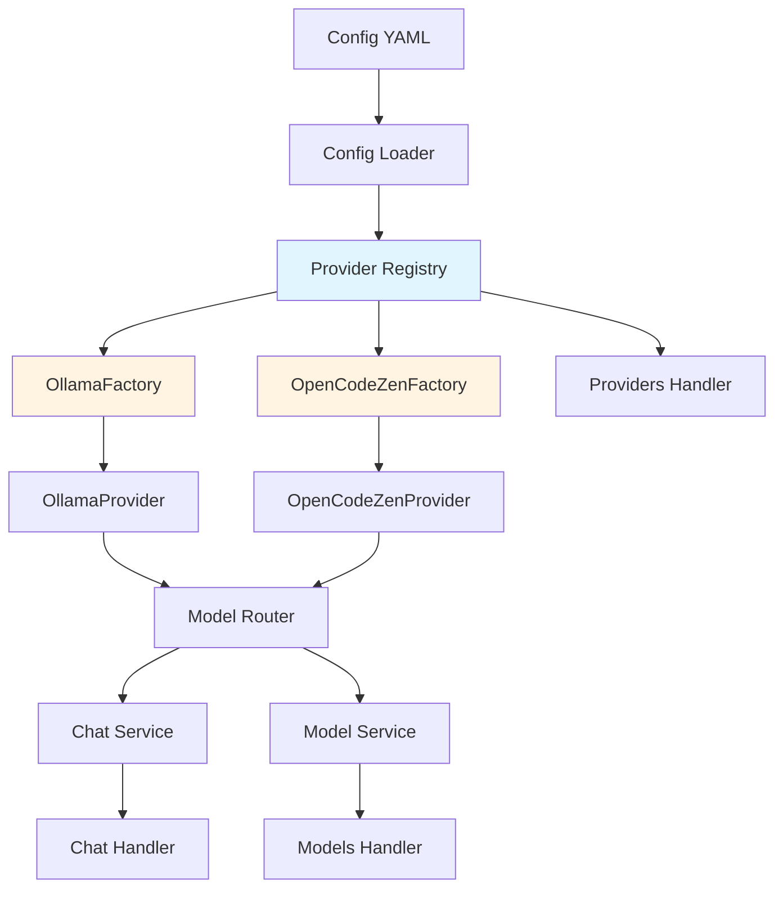

## Context

The router-service currently uses hardcoded URL matching to determine which provider to instantiate. This approach is fragile because:
- Ollama endpoint URLs are hardcoded (localhost:11434, host.docker.internal:11434, 172.17.0.1:11434)
- Adding new providers requires modifying the handler switch statement
- Cannot support multiple instances of the same provider type
- No validation or defaults mechanism
- Provider discovery is not possible

The current architecture has a clean separation between handler, service, and provider layers, but the provider instantiation logic in the handler breaks this pattern by embedding provider-specific knowledge.

## Goals / Non-Goals

**Goals:**
- Enable extensible provider registration without modifying core handler code
- Support dynamic provider configuration via config file only
- Add provider validation and defaults per provider type
- Enable provider discovery via API endpoint
- Maintain clean separation of concerns with factory pattern
- Support future plugin architecture for external providers

**Non-Goals:**
- Backwards compatibility with old config structure (clean break)
- Plugin system in this phase (deferred to future)
- Provider health checks (deferred to future)
- Metrics collection per provider (deferred to future)
- Dynamic runtime provider loading (deferred to future)

## Decisions

### 1. Factory Pattern over Simple Constructor Map

**Decision:** Use full ProviderFactory interface with Type(), Create(), Validate(), Defaults(), Description() methods instead of simple constructor functions.

**Rationale:**
- Provides validation and defaults per provider type
- Self-documenting through Description() method
- Enables future enhancements (health checks, capabilities discovery)
- Follows established Go patterns for extensible systems
- Clear separation between factory logic and provider implementation

**Alternatives considered:**
- Simple `map[string]func(settings) Provider` - Rejected due to lack of validation/defaults
- Reflective factory - Rejected due to complexity and runtime errors

### 2. Map-Based Config Structure

**Decision:** Convert ProviderConfig from struct to `map[string]ProviderSettings`.

**Rationale:**
- Enables dynamic provider addition without code changes
- Aligns with factory pattern's extensibility goals
- Simpler config parsing (no struct fields to maintain)
- Natural fit for registry-based instantiation

**Alternatives considered:**
- Keep struct with Type field - Rejected due to need to modify struct for each new provider
- Hybrid approach - Rejected for complexity

### 3. Provider Registry with Thread Safety

**Decision:** Implement ProviderRegistry with sync.RWMutex for concurrent access.

**Rationale:**
- Handler setup happens at startup, but future plugin loading may be dynamic
- Standard Go pattern for shared mutable state
- Minimal performance overhead
- Enables future runtime provider registration

**Alternatives considered:**
- No locking (single-threaded startup) - Rejected for future extensibility
- Global registry - Rejected for testability

### 4. Provider Naming Convention Change

**Decision:** Change OpenCode provider name from "opencode" to "opencode_zen" and model prefix from "opencode:" to "opencode_zen:".

**Rationale:**
- Aligns with config key name (opencode_zen)
- Consistency across config, handler, router, and provider layers
- Clear distinction between generic OpenCode service and specific Zen product
- Future-proof if OpenCode launches other products

**Alternatives considered:**
- Keep "opencode" name - Rejected due to inconsistency with config
- Use "opencode-zen" with hyphen - Rejected to match config key naming

### 5. New /v1/providers Endpoint

**Decision:** Add GET /v1/providers endpoint for provider discovery and status.

**Rationale:**
- Enables runtime provider discovery
- Useful for debugging and monitoring
- Standard pattern for API gateways
- Low implementation cost, high value

**Alternatives considered:**
- Skip endpoint - Rejected due to lost observability
- Use health endpoint - Rejected (different purpose)

## Architecture

## Risks / Trade-offs

### Risk 1: Config Migration Complexity
**Risk:** Users with existing deployments will need to manually migrate config structure.
**Mitigation:** Clear migration guide in documentation, example config provided.

### Risk 2: Runtime Provider Type Typos
**Risk:** Typos in config provider type names caught at runtime vs compile time.
**Mitigation:** Registry returns clear error messages with available types, /v1/providers endpoint for validation.

### Risk 3: Increased Complexity
**Risk:** Factory pattern adds abstraction layers and complexity for 2-provider use case.
**Mitigation:** Well-documented patterns, clear separation of concerns, tests for each component.

### Risk 4: Breaking Model Prefixes
**Risk:** Existing clients using "opencode:" model prefix will break.
**Mitigation:** Document breaking changes clearly, this is intentional clean break.

### Trade-off: Simplicity vs Extensibility
**Trade-off:** Factory pattern is overkill for current 2 providers but enables future growth.
**Decision:** Choose extensibility - project is expected to grow with more providers.

## Migration Plan

1. **Update Config Structure**
   - Backup existing config.yaml
   - Convert to new map-based structure
   - Update provider keys if needed
   - Test config loading

2. **Deploy Code Changes**
   - Deploy new binary with factory pattern
   - Monitor startup logs for provider initialization
   - Verify /v1/providers endpoint

3. **Update Client Model Prefixes**
   - Find all clients using "opencode:" prefix
   - Update to "opencode_zen:" prefix
   - Test model routing

4. **Rollback Strategy**
   - Keep previous binary version available
   - Revert config.yaml to old structure if needed
   - Document rollback procedure

## Open Questions

1. **Should we add provider version field?** Deferred - not needed for current providers
2. **Should factories support dependency injection?** Deferred - current providers don't need shared resources
3. **Should we add provider capabilities metadata?** Deferred - can be added to factory interface later
4. **Should config support provider aliases?** Deferred - not needed for clean break