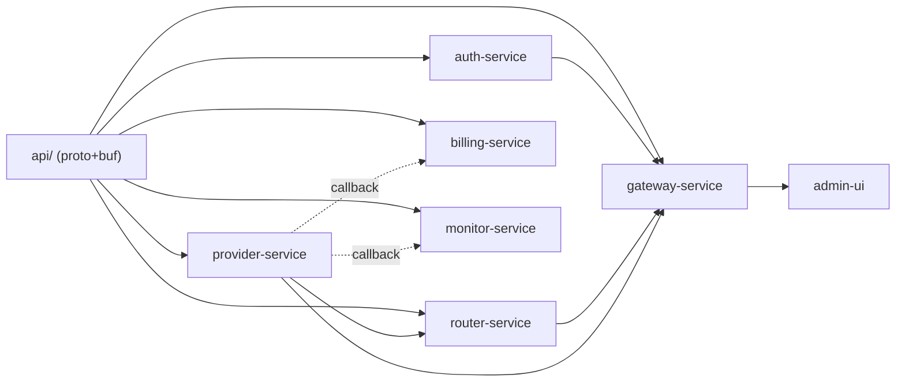

## Context

The repository currently contains a single working `router-service/` — a Go binary built with Gin that routes OpenAI-format chat requests to LLM providers (Ollama, OpenCode Zen) based on model name prefixes. It has no authentication, no persistence, no usage tracking, and no admin interface.

The design documents in `docs/` and `openspec/specs/` prescribe a 6-service microservice architecture with gRPC inter-service communication, per-service SQLite databases, and a React admin UI. All specs and API contracts are already defined. This change implements that architecture from scratch, freezing the existing prototype as `router-service-legacy/`.

**Key constraints:**
- All services are Go (no Python services despite openspec config mentioning FastAPI)
- SQLite per service for MVP (swappable to PostgreSQL via repository interface)
- buf for protobuf code generation
- go.work multi-module repo structure
- admin-ui as separate nginx container (not embedded)
- Copy-paste repository pattern per service (no shared pkg module)
- Redis optional for MVP (in-memory fallback where needed)

## Goals / Non-Goals

**Goals:**
- Implement all 6 microservices + admin UI as defined in the existing specs
- Establish shared `api/` module with protobuf definitions and buf-generated gRPC stubs
- Deliver working end-to-end flow: consumer → gateway → auth → route → provider → LLM → response
- Deliver admin flow: UI → gateway → service CRUD → SQLite persistence
- Deliver callback flow: provider → billing + monitor (async observer pattern)
- All services runnable via `docker-compose up`
- Each service independently buildable and testable

**Non-Goals:**
- PostgreSQL implementation (SQLite only for MVP)
- Redis integration (in-memory fallback for MVP)
- Kubernetes/Helm deployment (Docker Compose only for MVP)
- Rate limiting enforcement (middleware is placeholder pass-through)
- Security middleware (prompt injection detection, content filtering)
- SSO/SAML, RBAC, group management (Phase 2+)
- Fallback routing chains (Phase 2+)
- Invoice generation, exportable reports (Phase 3+)

## Decisions

### D1: Microservices from day one

**Choice:** Build 6 separate gRPC services from the start, not a monolith.

**Alternatives considered:**
- Modular monolith with Go interfaces → rejected: doesn't enforce service boundaries, team coordination harder on single codebase
- Monolith-first, extract later → rejected: extraction is harder than people think; gRPC boundaries force clean contracts

**Rationale:** The specs already define all gRPC contracts. Building with gRPC from day one ensures no implicit coupling. Each service can be developed, tested, and deployed independently. The cost is operational complexity (6 containers), but Docker Compose handles that for MVP.

### D2: Freeze existing router-service, build fresh

**Choice:** Rename `router-service/` → `router-service-legacy/`, build all new services from scratch.

**Alternatives considered:**
- Refactor in-place → rejected: messy transition, existing DDD layers don't map cleanly to gRPC server structure
- Fork and split → rejected: git history confusion, temporary code duplication

**Rationale:** The existing code proves the adapter concept works, but its structure (Gin HTTP handler → service → provider) doesn't match the target (gRPC server → domain → repo). Starting fresh with consistent patterns across all services is cleaner. The legacy code remains as reference.

### D3: buf for protobuf code generation

**Choice:** Use buf for proto compilation, linting, and code generation.

**Alternatives considered:**
- protoc + plugins → rejected: more manual, more Makefile targets, no built-in linting
- buf + protoc fallback → rejected: unnecessary complexity for a greenfield project

**Rationale:** buf is the modern standard. It provides linting (catches proto issues early), deterministic generation, and a single config file. No legacy protoc config to migrate.

### D4: go.work multi-module structure

**Choice:** Each service has its own `go.mod`. Shared proto stubs in `api/` module. `go.work` ties them together.

**Rationale:** Matches microservice philosophy — each service is independently versionable and deployable. The `api/` module is the shared contract that all services depend on. `go.work` enables local cross-module development without `replace` directives.

### D5: SQLite per service, copy-paste repository pattern

**Choice:** Each service owns a SQLite database. Repository interfaces and implementations are duplicated per service (no shared pkg module).

**Rationale:** Zero coupling between services. Each service can evolve its repository pattern independently. The duplication is acceptable for 6 services with similar but not identical patterns. SQLite requires zero ops for local dev and demo.

### D6: Admin UI as separate nginx container

**Choice:** React SPA served by nginx in its own Docker container. CORS configured to call gateway-service API.

**Alternatives considered:**
- go:embed in gateway-service → rejected: UI rebuild requires gateway recompile
- Dev separately, embed for prod → rejected: adds build pipeline complexity

**Rationale:** Clean separation. UI can be updated and redeployed independently. Standard SPA deployment pattern. Vite dev server with proxy for local development.

### D7: All services in Go

**Choice:** All 6 backend services are Go. No Python services.

**Rationale:** Consistent stack, simpler build pipeline, one language for the team. The openspec config mentions Python/FastAPI but the architecture docs and all existing code are Go. Billing and monitor services don't need Python's data strengths for MVP.

### D8: Build order and critical path

**Choice:** Build in this order: `api/` → leaf services (auth, provider) → router → gateway → billing/monitor → admin-ui → integration.

**Rationale:** The end-to-end chat flow depends on auth + provider + router + gateway. Billing and monitor are callback receivers with no dependents — they can be built in parallel with gateway. Admin UI needs gateway admin API to exist first.



### D9: Service internal structure (DDD)

**Choice:** Every service follows the same 4-layer DDD structure:

```
cmd/server/main.go          ← entry point
internal/
├── domain/                  ← entities, port interfaces (no external deps)
│   ├── entity/              ← domain models
│   └── port/                ← interfaces (Repository, etc.)
├── application/             ← business logic, orchestration
├── infrastructure/          ← adapters (SQLite repos, config, external clients)
└── handler/                 ← gRPC server implementation
configs/config.yaml
Dockerfile
Makefile
```

**Rationale:** Consistent structure across all services reduces cognitive load. Domain layer has zero external imports. Infrastructure implements domain ports. Handler is a thin gRPC adapter.

## Risks / Trade-offs

| Risk | Mitigation |
|------|------------|
| 6 services + admin UI is ambitious for 4 weeks | Build in dependency order; core chat flow (auth+provider+router+gateway) is the critical path; billing/monitor/admin-ui can ship incrementally |
| gRPC boilerplate is verbose | buf generates stubs; service handlers follow a template pattern; copy-paste from first service speeds up subsequent ones |
| SQLite not production-ready | Repository interface abstracts storage; PostgreSQL implementation can be added per-service without architecture changes |
| No Redis means no distributed caching | In-memory caches with TTL for API key lookups and routing tables; acceptable for single-instance MVP |
| Callback failures could lose usage data | Fire-and-forget with error logging; gateway-service also calls `RecordUsage` directly as MVP fallback |
| Docker Compose startup ordering | Use `depends_on` with health checks; each service retries gRPC connections on startup |
| Admin UI CORS complexity | nginx proxy pass to gateway-service in Docker Compose network; Vite dev proxy for local development |
| Copy-paste repo pattern leads to drift | Consistent code generation template; code review enforces pattern consistency |

## Migration Plan

1. **Rename** `router-service/` → `router-service-legacy/` (single commit, tag as v2.0)
2. **Create** `api/` module with proto definitions and buf config; generate stubs
3. **Create** `go.work` and per-service `go.mod` files
4. **Build** services in dependency order (leaf services first)
5. **Create** `docker-compose.yaml` wiring all services together
6. **Create** `admin-ui/` scaffold
7. **Integration test** end-to-end flow via Docker Compose
8. **Demo** smoke test: add provider → create user → chat → view usage

**Rollback:** The legacy service remains intact. If the new architecture has critical issues, `router-service-legacy/` can be redeployed as a standalone service.

## Open Questions

None — all key decisions have been resolved through the exploration phase.
