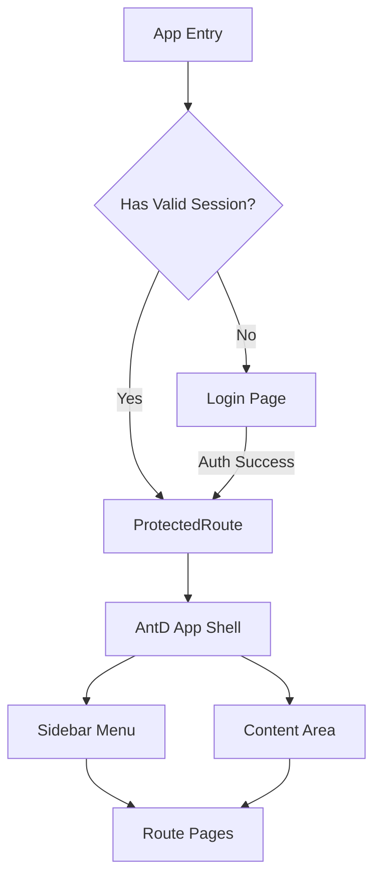
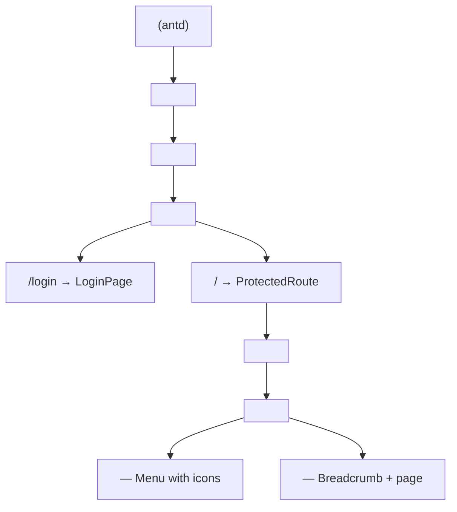
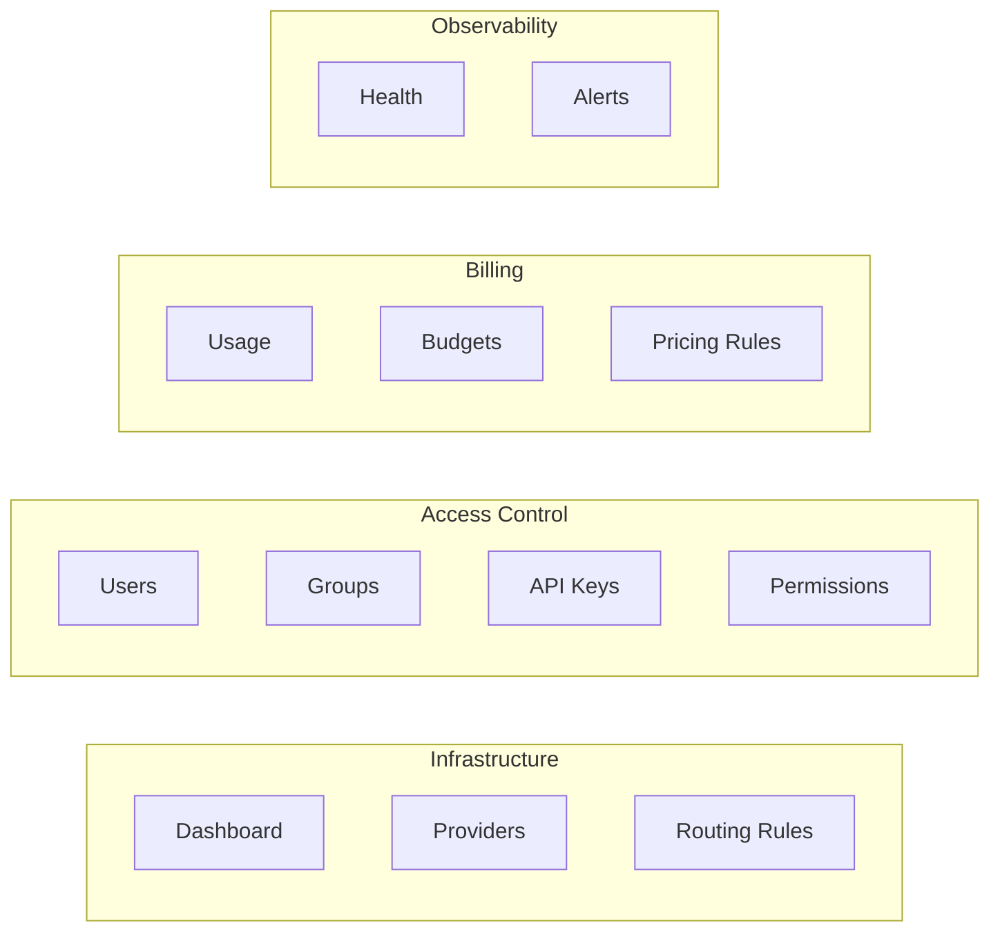

## Context

The admin-ui is a React 19.2 SPA built with Vite, currently using raw Tailwind utility classes with no component library. It has 5 flat page components (Providers, Users, APIKeys, Usage, Health) that wrap themselves in a shared Layout component — but the Layout is also applied at the route level, causing double-wrapping. The API client has typed methods for some `/admin/*` endpoints but uses hardcoded user dropdowns and mock health data. There is no authentication, no i18n, no error feedback, no empty/loading states, and leftover Vite template CSS.

The backend defines 6 microservices with entities far beyond what the UI covers: RoutingRule, Group, Permission, Budget, PricingRule, AlertRule, Alert, ProviderHealthStatus. All admin traffic routes through gateway-service via `/admin/*` endpoints.

## Goals / Non-Goals

**Goals:**
- Migrate from raw Tailwind to Ant Design 6.3.6 component system for all UI elements
- Add login authentication with session management and protected routes
- Add Chinese/English i18n with antd locale integration
- Add Dashboard overview page as the landing route
- Overhaul all 5 existing pages to use antd components with proper CRUD, error/empty/loading states
- Add 6 new pages: Routing Rules, Groups, Permissions, Budgets, Pricing Rules, Alerts
- Fix API client: typed methods for all endpoints, auth header injection, error feedback
- Define new gateway-service admin API endpoints for uncovered entities
- Remove all Vite template leftovers

**Non-Goals:**
- Backend implementation of new admin endpoints (separate change)
- Real-time updates or WebSocket integration
- Time-series charts or data visualization beyond antd table/card components
- Role-based UI rendering (all admin users see all pages)
- SSO/OAuth integration (username/password only for now)
- Dark mode or custom theming beyond antd defaults

## Decisions

### 1. Ant Design 6.3.6 as component library

**Choice**: Ant Design 6.3.6 with `@ant-design/icons`
**Alternatives considered**: shadcn/ui (requires Tailwind + Radix, less integrated), Headless UI (no opinionated design), MUI (heavier, different design language)
**Rationale**: Ant Design provides a complete enterprise-grade component set (Table, Form, Modal, Menu, Card, Badge, Statistic, etc.) out of the box. It has built-in i18n locale support, which is critical for the Chinese/English requirement. Version 6.3.6 is the latest stable and supports React 19.

### 2. Application architecture — Auth context + route guards

**Choice**: React Context for auth state + route wrapper component for protected routes
**Rationale**: Minimal complexity. Auth context stores JWT token + user info. A `<ProtectedRoute>` component wraps all admin routes, redirecting to `/login` if no valid session. Token stored in localStorage with session expiry check.

### 3. Page layout — Ant Design App + Sider + Breadcrumb

**Choice**: Use `<App>` component as root, `<Layout>` with `<Sider>` for navigation, `<Breadcrumb>` for context
**Rationale**: Ant Design's `App` component provides global context for message, notification, and modal APIs. The `Sider` gives collapsible sidebar navigation with icons. This replaces the custom Layout component entirely.

### 4. API client — Singleton with interceptor pattern

**Choice**: Refactor `APIClient` class to use request interceptor for auth headers, centralized error handler that calls `message.error()` from antd
**Rationale**: Every API call needs the same auth header. An interceptor pattern avoids repeating it. Centralized error handling via antd's `message` API gives consistent user feedback without per-page try/catch boilerplate.

### 5. i18n — react-i18next + antd locale

**Choice**: `react-i18next` for UI strings + antd's `ConfigProvider locale` for component locale
**Rationale**: antd components (DatePicker, Pagination, Empty, etc.) have their own locale data. `react-i18next` handles all custom strings. The two systems coexist — `ConfigProvider` wraps the app for antd locale, `useTranslation` hook for custom strings. Language switcher in the header.

### 6. Navigation structure — Grouped sidebar menu

**Choice**: 4 groups in the sidebar menu with icons:

**Rationale**: Groups reflect the backend service domains (provider-service, auth-service, billing-service, monitor-service). This makes the mental model consistent between frontend and backend.

### 7. Gateway-service API contract extensions

**Choice**: Add new `/admin/*` endpoints following existing patterns:

| Category | New Endpoints |
|----------|--------------|
| Auth | `POST /admin/auth/login`, `POST /admin/auth/logout`, `GET /admin/auth/me` |
| Routing | `GET/POST /admin/routing-rules`, `GET/PUT/DELETE /admin/routing-rules/:id` |
| Groups | `GET/POST /admin/groups`, `GET/PUT/DELETE /admin/groups/:id`, `POST /admin/groups/:id/members`, `DELETE /admin/groups/:id/members/:userId` |
| Permissions | `GET/POST /admin/permissions`, `GET/PUT/DELETE /admin/permissions/:id` |
| Budgets | `GET/POST /admin/budgets`, `GET/PUT/DELETE /admin/budgets/:id` |
| Pricing | `GET/POST /admin/pricing-rules`, `GET/PUT/DELETE /admin/pricing-rules/:id` |
| Alerts | `GET/POST /admin/alert-rules`, `GET/PUT/DELETE /admin/alert-rules/:id`, `GET /admin/alerts`, `PUT /admin/alerts/:id/acknowledge` |
| Health | `GET /admin/health` (replaces mock) |

**Rationale**: All admin traffic goes through gateway-service (Option A from exploration). Endpoints follow the existing REST pattern. Gateway translates HTTP to gRPC calls to the owning service.

## Risks / Trade-offs

- **[Ant Design 6.3.6 stability]** → Ant Design 6.x is relatively new. Mitigate by pinning the exact version and testing all component interactions early.
- **[Large scope — 11 pages + auth + i18n]** → Risk of incomplete implementation. Mitigate by implementing in dependency order: auth first, then shared components, then pages one by one. Each page is independently testable.
- **[Backend gap — new endpoints don't exist yet]** → The UI will call endpoints that return 404 until backend is implemented. Mitigate by building the API client with graceful fallback and mock data toggle for development.
- **[i18n string volume]** → ~11 pages × ~30 strings each = ~330 translation keys per language. Mitigate by using namespace-per-page in i18next and generating the English file first, then translating to Chinese.
- **[Token storage in localStorage]** → Vulnerable to XSS. Mitigate by using httpOnly cookies in production (future improvement), and keeping the current approach for MVP simplicity.
