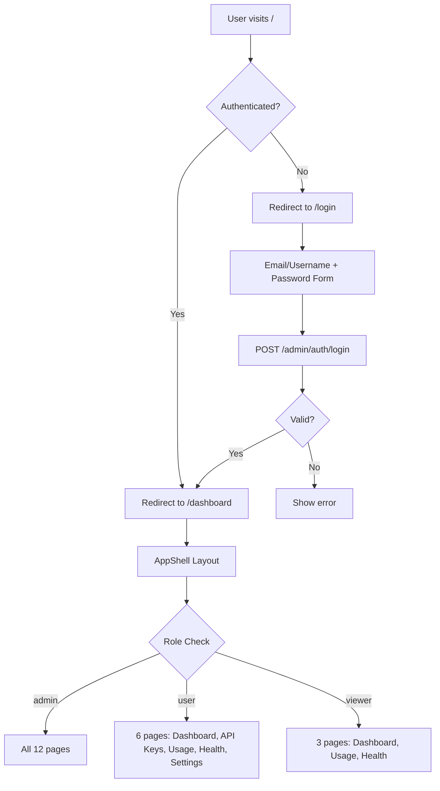

## Context

The admin UI is a React 19 + TypeScript application using Vite, antd 6, Tailwind CSS 4, and react-router-dom v7. It communicates with gateway-service (port 8080) which proxies to backend gRPC services (auth-service, billing-service, monitor-service, etc.).

The redesign introduced a complete auth flow (login/register), role-based navigation, antd component library, i18n support, and a professional visual design.

## Goals / Non-Goals

**Goals:**
- Add email/username + password login and registration flows
- Implement role-based access control with three roles: admin, user, viewer
- Redesign UI with antd 6 components and Tailwind CSS 4
- Add AppShell layout with sidebar navigation and role-filtered tabs
- Add dashboard as the authenticated landing page
- Add i18n support (English/Chinese)
- Redirect `/` to login (unauthenticated) or dashboard (authenticated)
- Upgrade data fetching and form handling

**Non-Goals:**
- Changing the existing admin API endpoints (CRUD operations remain the same)
- Modifying auth-service gRPC protocol beyond adding Login/Register RPCs
- Implementing group-based permissions (Phase 2+ feature)
- Adding real-time notifications or WebSocket support

## Decisions

### UI Component Library
**Decision**: Use antd 6 with Tailwind CSS 4
- **Rationale**: antd provides comprehensive, production-ready components out of the box. Tailwind handles custom styling. Together they provide both speed and flexibility.
- **Alternative**: shadcn/ui — rejected due to manual component management overhead
- **Alternative**: Material UI — rejected due to opinionated styling that conflicts with Tailwind

### State Management
**Decision**: React Context for auth state + TanStack Query for server state
- **Rationale**: Auth context is minimal (user, role, token). TanStack Query handles caching, refetching, and loading states for API data.
- **Alternative**: Zustand — adds a dependency for minimal benefit over Context
- **Alternative**: Redux — overkill for this scale

### Authentication Flow
**Decision**: Email/username + password login → gateway-service `POST /admin/auth/login` → auth-service `Login` RPC → JWT token stored in localStorage + Bearer header
- **Rationale**: Current implementation uses localStorage for token persistence and `Authorization: Bearer <token>` header for API calls. This is simpler to implement and works with the existing gateway middleware that accepts both cookie and Bearer token.
- **Security note**: localStorage is vulnerable to XSS. Mitigation: strict Content-Security-Policy headers, no inline scripts, sanitize all user input. Future improvement: migrate to HTTP-only cookies.
- **Alternative**: HTTP-only cookies — more secure but requires gateway to set cookie and complicates CORS configuration

### Role-Based Access Control
**Decision**: Three roles with navigation filtering: admin (full access), user (limited), viewer (read-only)
- **Rationale**: Matches the user entity `role` field. Uses existing role values.
- **Implementation**: 
  - `AuthContext.User` includes `role` field for role checks
  - `ProtectedRoute` accepts optional `requiredRole` prop for per-page guards
  - `AppShell` filters `menuItems` based on `user.role`
- **Navigation matrix**:

| Tab | admin | user | viewer |
|-----|-------|------|--------|
| Dashboard | ✓ | ✓ | ✓ |
| Providers | ✓ | ✗ | ✗ |
| Routing | ✓ | ✗ | ✗ |
| Users | ✓ | ✗ | ✗ |
| Groups | ✓ | ✗ | ✗ |
| API Keys | ✓ | ✓ (own) | ✗ |
| Permissions | ✓ | ✗ | ✗ |
| Usage | ✓ | ✓ (own) | ✓ (own) |
| Budgets | ✓ | ✗ | ✗ |
| Pricing | ✓ | ✗ | ✗ |
| Health | ✓ | ✓ | ✓ |
| Alerts | ✓ | ✗ | ✗ |
| Settings | ✓ | ✓ | ✗ |

### Routing and Auth Guards
**Decision**: React Router v7 with ProtectedRoute wrapper that checks auth context and optional role
- **Rationale**: Standard pattern. `/` redirects to `/login` or `/dashboard` based on auth state. All management routes are nested under a protected layout.
- **Route structure**:
  - `/login` — Login page (public)
  - `/register` — Registration page (public)
  - `/` — Protected layout (AppShell) with nested routes:
    - `/` (index) — Dashboard
    - `/providers` — Provider management (admin only)
    - `/routing` — Routing rules (admin only)
    - `/users` — User management (admin only)
    - `/groups` — Group management (admin only)
    - `/api-keys` — API key management (admin + user)
    - `/permissions` — Permission management (admin only)
    - `/usage` — Usage analytics (all roles, filtered by ownership)
    - `/budgets` — Budget management (admin only)
    - `/pricing` — Pricing rules (admin only)
    - `/health` — Service health (admin + user + viewer)
    - `/alerts` — Alert management (admin only)
    - `/settings` — User settings (admin + user)

### Sidebar Design
**Decision**: antd Menu-based sidebar with role-filtered items and collapsible behavior
- **Rationale**: antd Menu provides built-in active state, icons, and collapsible behavior. Toggle button collapses to icon-only view.
- **Menu structure**: Grouped by domain (Infrastructure, Access Control, Billing, Observability)
- **Role filtering**: Menu items filtered at render time based on `user.role` from AuthContext

### i18n
**Decision**: i18next with react-i18next
- **Rationale**: Industry standard for React i18n. Supports lazy loading, pluralization, and context.
- **Supported locales**: English (en), Chinese (zh)
- **Implementation**: Language switcher in header, antd locale sync via ConfigProvider

### Error Handling
**Decision**: antd message.error for API errors + ErrorBoundary for render failures
- **Rationale**: antd message provides consistent error feedback. ErrorBoundary catches unexpected render errors and shows fallback UI.
- **API errors**: Handled in APIClient.request() with message.error display
- **Render errors**: ErrorBoundary wrapper around AppShell content area

### Loading States
**Decision**: antd Spin for page-level loading + antd Skeleton for data loading
- **Rationale**: antd Spin provides full-page loading overlay. Skeleton provides content-area placeholders during data fetch.
- **Page loading**: Spin with fullscreen overlay during route transitions
- **Data loading**: Skeleton matching table/card layout during TanStack Query fetch

## Risks / Trade-offs

**[Risk]** Auth-service has no `Login` RPC yet — must be added
→ Mitigation: Add `Login` RPC to auth-service proto and handler. Requires user entity to store password hash.

**[Risk]** localStorage token storage is XSS-vulnerable
→ Mitigation: Strict CSP headers, no inline scripts, sanitize user input. Future: migrate to HTTP-only cookies.

**[Risk]** Role filtering is client-side only — determined users can bypass via direct API calls
→ Mitigation: Server-side role checks in gateway middleware. Client-side filtering is UX convenience, not security boundary.

**[Trade-off]** JWT in localStorage vs HTTP-only cookie
→ Chose: localStorage for simplicity and current gateway support. Trade-off is XSS vulnerability. Cookie path requires gateway changes and CORS configuration.

**[Trade-off]** Adding viewer role changes auth-service user entity
→ Chose: Extend role field to support `admin` | `user` | `viewer`. Minimal proto change, backward-compatible.
