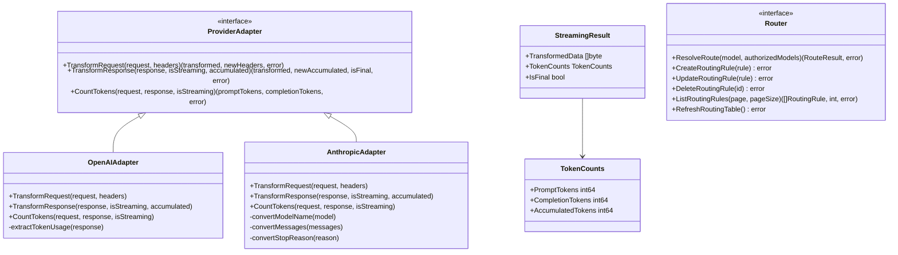

## Context

Week 1 of Phase 1 requires establishing the core abstractions for provider adapters and routing. The existing codebase has:
- Basic `ProviderAdapter` interface with 3 methods (missing streaming support)
- OpenAI and Anthropic adapters that only handle non-streaming responses
- Router service with application logic but no explicit domain interface

## Goals / Non-Goals

**Goals:**
1. Extend `ProviderAdapter` to support both streaming and non-streaming via unified interface
2. Implement SSE transformation for OpenAI and Anthropic adapters with token accumulation
3. Define explicit `Router` domain interface with full CRUD operations
4. Achieve 100% unit test coverage for adapter transformation and token counting
5. Ensure Docker Compose local verification works

**Non-Goals:**
1. No gateway-service integration (Week 2 task)
2. No actual HTTP calls to external providers (mock-based testing only)
3. No Redis caching implementation (MVP uses in-memory)
4. No PostgreSQL implementation (Week 4 task for Developer B)
5. No group_id field in UsageRecord (Developer B to add in Week 1)

## Decisions

### 1. Unified TransformResponse with Streaming Flag

**Decision**: Extend `TransformResponse` signature to handle both streaming and non-streaming:
```go
TransformResponse(response []byte, isStreaming bool, accumulatedTokens TokenCounts) 
    ([]byte, TokenCounts, bool, error)
```

**Rationale**: 
- Single method reduces interface complexity
- `accumulatedTokens` parameter allows stateful streaming accumulation
- Return values: (transformedData, newAccumulatedTokens, isFinalChunk, error)

**Trade-off**: Method signature is more complex than separate methods, but avoids interface bloat.

### 2. Token Accumulation in Adapter vs Service Layer

**Decision**: Adapters are responsible for token accumulation during streaming.

**Rationale**:
- Token counting rules vary by provider (OpenAI sends usage in final chunk, Anthropic may not)
- Adapters understand provider-specific response formats
- Service layer remains generic

### 3. StreamingResult Entity Design

**Decision**: Create new `StreamingResult` entity to encapsulate streaming transformation results.

```go
type StreamingResult struct {
    TransformedData []byte
    TokenCounts     TokenCounts
    IsFinal         bool
}
```

**Rationale**: Clean return type for streaming operations, aligns with proto `ProviderChunk` structure.

### 4. SSE Error Handling - Graceful Close

**Decision**: On stream interruption, simulate [DONE] chunk and return accumulated tokens.

**Rationale**:
- Consumers expect well-formed SSE stream termination
- Allows billing-service to record partial usage
- Better UX than abrupt disconnection

### 5. Router Interface Scope

**Decision**: Include full CRUD operations in Router interface.

```go
type Router interface {
    ResolveRoute(model string, authorizedModels []string) (*entity.RouteResult, error)
    CreateRoutingRule(rule *entity.RoutingRule) error
    UpdateRoutingRule(rule *entity.RoutingRule) error
    DeleteRoutingRule(id string) error
    ListRoutingRules(page, pageSize int) ([]*entity.RoutingRule, int, error)
    RefreshRoutingTable() error
}
```

**Rationale**: Clean Architecture - domain interface defines complete contract, implementations (gRPC handlers) adapt to transport.

## Architecture



## Risks / Trade-offs

| Risk | Mitigation |
|------|------------|
| Breaking existing tests | Run full test suite before and after changes; keep MockAdapter updated |
| Interface signature complexity | Document with examples; provide helper functions |
| SSE format variations between providers | Each adapter handles its provider's specific SSE format |
| Token accumulation accuracy | Document estimation approach; note production should use tiktoken |
| Week 2 integration gaps | Document interface contracts clearly for gateway-service developers |

## Local Docker Verification

Verification will use existing Docker Compose setup:
- `docker-compose up provider-service router-service` starts services
- `go test ./...` runs unit tests inside containers
- No external provider API calls required (mock-based)
