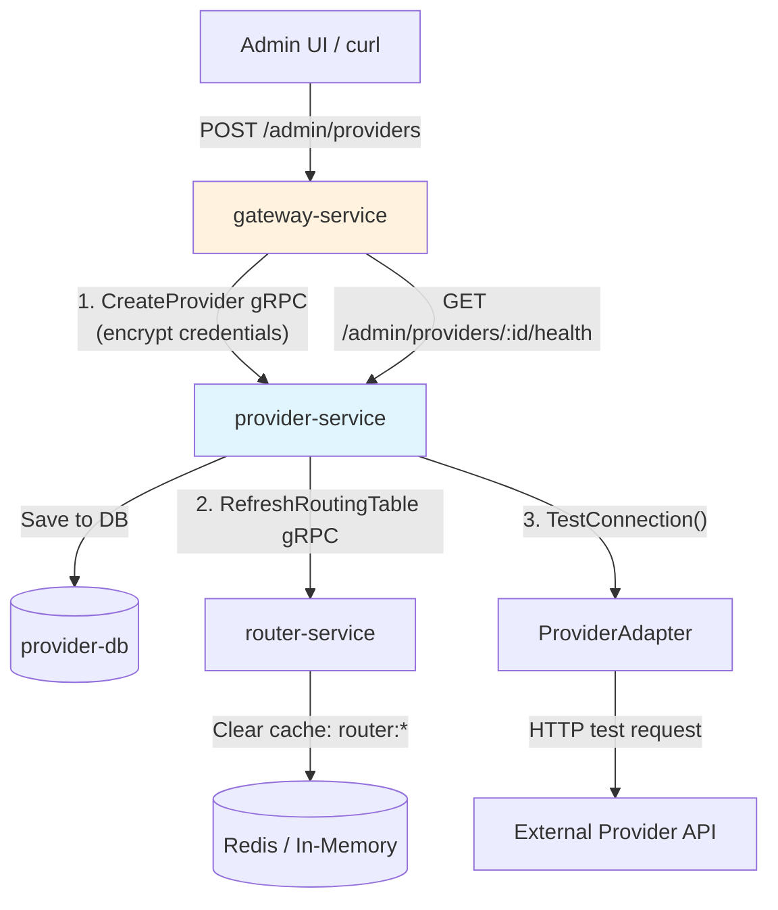

## Context

Dev A Week 3 scope implementation for the AI API Gateway. The provider-service currently has empty gRPC handlers (only TODO stubs), credential encryption exists but is not applied during CRUD operations, Admin API routes in gateway-service are not wired, and cache invalidation is not triggered after provider config changes.

**Current State:**
- `provider-service/internal/handler/handler.go`: Empty shell with TODO comments
- `provider-service/internal/application/service.go`: Has business logic but `NewService` has duplicate parameters (bug)
- `gateway-service/internal/handler/admin_providers.go`: `AdminProvidersHandler` exists but is not wired to Gin routes
- `gateway-service/internal/client/provider_client.go`: Create/Update/Delete return stub errors ("not implemented in MVP")
- `router-service`: `RefreshRoutingTable` gRPC method exists and clears cache by prefix

**Constraints:**
- AES-256-GCM encryption for credentials (crypto package already exists)
- UUID v4 for provider ID generation (new dependency: `github.com/google/uuid`)
- Double masking of credentials (provider-service gRPC layer + gateway-service handler layer)
- Provider adapters must implement new `TestConnection` method

## Goals / Non-Goals

**Goals:**
- Implement complete Provider Manager with CRUD, credential encryption, UUID generation, timestamp tracking
- Implement all gRPC handlers in provider-service for ProviderService interface
- Add `TestConnection(credentials string) error` to ProviderAdapter interface, implement in all adapters
- Add Admin API endpoints in gateway-service: `POST/GET/PUT/DELETE /admin/providers` and `GET /admin/providers/:id/health`
- Wire AdminProvidersHandler to Gin routes in gateway-service main.go
- Trigger `RefreshRoutingTable` in router-service after provider CRUD operations
- Mask credentials in all responses (return `***`)
- Create integration test using mock HTTP server

**Non-Goals:**
- Fallback chain routing (Phase 2+)
- Budget/rate limiting (Phase 3+)
- Actual monitor-service integration for health checks (use adapter TestConnection instead)

## Decisions

### Decision 1: ID Generation Strategy
**Choice:** UUID v4 auto-generated in `provider-service` `CreateProvider` method

**Rationale:** UUID v4 provides globally unique IDs without coordination. Generating in provider-service (not gateway) maintains domain ownership - provider-service owns the Provider entity.

**Alternatives Considered:**
- **Caller-provided ID (gateway-service)**: Rejected - breaks domain boundary, gateway shouldn't assign provider IDs
- **Name-based ID**: Rejected - names may change, need immutable identifier

### Decision 2: Credential Encryption Location
**Choice:** Encrypt in `provider-service` `CreateProvider`/`UpdateProvider` before repo save

**Rationale:** Follows single responsibility - provider-service owns credential encryption. The `ForwardRequest` method already decrypts credentials using the same crypto package, so encryption on write is symmetric.

**Alternatives Considered:**
- **Gateway-service encrypts before gRPC call**: Rejected - gateway shouldn't handle provider credentials
- **Env vars instead of DB storage**: Rejected - less flexible for multi-provider setups

### Decision 3: Cache Invalidation Trigger
**Choice:** Gateway-service triggers `RefreshRoutingTable` after calling provider-service CRUD

**Rationale:** Gateway is the orchestrator per architecture docs. Single trigger point for all provider changes. The gateway already calls provider-service for CRUD, so adding one more gRPC call is natural.

**Alternatives Considered:**
- **Provider-service triggers RefreshRoutingTable**: Rejected - breaks orchestration pattern, creates provider→router dependency
- **Redis pub/sub eventing**: Rejected - overkill for MVP, adds unnecessary Redis dependency

### Decision 4: Health Check Implementation
**Choice:** Extend `ProviderAdapter` interface with `TestConnection(credentials string) error`, implement in each adapter

**Rationale:** Uses existing adapter pattern. Each adapter knows how to validate connectivity for its specific provider (OpenAI can call `/models`, Ollama has `/api/tags`, etc.). More thorough than simple HTTP reachability check.

**Implementation Note:** For MVP, `TestConnection` will make a lightweight request (e.g., list models) and return error if it fails.

**Alternatives Considered:**
- **Simple HTTP GET to base URL**: Rejected - doesn't verify full API functionality (auth may be wrong)
- **Periodic probes via monitor-service**: Rejected - stale data possible, requires monitor-service integration

### Decision 5: Credential Masking Strategy
**Choice:** Double masking - both provider-service gRPC handler layer AND gateway-service AdminProvidersHandler layer return `***` for credentials

**Rationale:** Defense in depth. Even if one layer fails, the other protects credentials. Provider-service owns the data, gateway-service is the API boundary.

**Implementation:** 
- In provider-service gRPC handler: before returning Provider proto, set credentials field to `***`
- In gateway-service AdminProvidersHandler: before returning JSON, set credentials field to `***`

### Decision 6: Integration Test Approach
**Choice:** Mock HTTP server (httptest.NewServer) to simulate provider

**Rationale:** No external dependency (Ollama/OpenAI API key not required). Fast, deterministic, tests the full flow: add provider via Admin API → route request through it.

**Test Flow:**
1. Start mock HTTP server that responds like an LLM provider
2. Create provider via `POST /admin/providers` with mock server URL
3. Verify provider created (GET /admin/providers)
4. Make chat completion request that routes to the mock provider
5. Verify response received

## Risks / Trade-offs

**[Risk] UUID package adds new dependency**
→ **Mitigation:** Well-established package (`github.com/google/uuid`), widely used in Go projects. Minimal risk.

**[Risk] Provider adapter TestConnection requires adapter instantiation with credentials**
→ **Mitigation:** Pass credentials string to TestConnection, let adapter use it for the test request. Adapters already have the logic to transform requests - reuse it.

**[Risk] Double masking may cause issues if one layer doesn't mask**
→ **Mitigation:** Both layers implemented simultaneously in this change. Add test to verify credentials never appear in API responses.

**[Risk] RefreshRoutingTable call adds latency to CRUD operations**
→ **Mitigation:** gRPC call is fast (clears cache by prefix). If router-service is down, provider CRUD should still succeed (log warning but don't fail).

**[Risk] Timestamps not set if caller provides them**
→ **Mitigation:** In CreateProvider, always set CreatedAt=Now, UpdatedAt=Now. In UpdateProvider, always set UpdatedAt=Now. Ignore any timestamps in the input.

## Migration Plan

1. **Add `github.com/google/uuid` dependency:**
   ```bash
   cd provider-service && go get github.com/google/uuid
   ```

2. **Apply changes:** Run `/opsx-apply` to implement all changes

3. **Test:**
   - Unit tests: provider-service (CreateProvider encryption, UUID generation, timestamps)
   - Integration test: mock HTTP server test
   - Manual test: `curl` Admin API endpoints

4. **Rollback:** All changes are additive or bug fixes. No database migration needed (GORM auto-migrates). To rollback, revert the commits.

## Open Questions

(None - all questions were resolved during the explore phase.)

## Architecture Diagram



Created design.md
