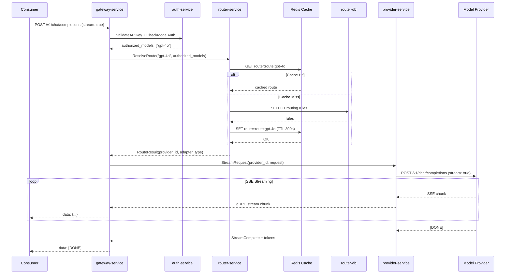

## Context

Week 1 established the foundational interfaces and adapters:
- `ProviderAdapter` interface with streaming support in provider-service
- OpenAI and Anthropic adapters with SSE handling
- `Router` domain interface in router-service

However, the actual gRPC handlers and middleware that wire everything together are not implemented. The gateway-service can receive HTTP requests but cannot route them to providers. The router-service has domain logic but no gRPC server to expose it.

## Goals / Non-Goals

**Goals:**
1. Implement gRPC handlers for router-service to serve `ResolveRoute` and routing rule management
2. Add Redis-based routing table caching with TTL and invalidation support
3. Complete gateway-service router client to call router-service
4. Implement gateway middleware for both streaming (SSE) and non-streaming provider request proxying
5. Generate up-to-date protobuf Go files with `buf generate`
6. End-to-end integration test verifying request flow through OpenAI adapter

**Non-Goals:**
- Fallback chain routing (Phase 2+ feature)
- Provider callback subscribers (billing-service, monitor-service integration - separate change)
- Authentication/Authorization middleware (Developer B's responsibility)
- Admin UI integration (Developer C's responsibility)
- Production deployment configuration

## Decisions

### 1. Redis-Only Caching (No Memory Fallback)
**Decision:** Use Redis exclusively for routing table cache, no in-memory fallback.

**Rationale:**
- Consistent with microservice architecture requiring shared state
- Simplifies invalidation logic (single source of truth)
- Redis is already required for other services (auth-service cache)

**Implementation:**
- TTL: 5 minutes (300 seconds)
- Key format: `router:route:{model}` for resolved routes
- Key format: `router:rules` for full routing table
- Invalidation via `RefreshRoutingTable` gRPC call clears all `router:*` keys

### 2. buf generate for Protobuf
**Decision:** Regenerate all Go protobuf files with `buf generate` before implementation.

**Rationale:**
- Ensures generated code matches current proto definitions
- Catches any proto changes made during Week 1 that weren't regenerated

**Process:**
- Run `cd api && buf generate` from project root
- Verify `/api/gen/router/v1/` and `/api/gen/provider/v1/` are updated

### 3. SSE Proxy Location in Gateway Middleware
**Decision:** Implement SSE streaming proxy in gateway-service middleware layer.

**Rationale:**
- Follows Clean Architecture - gateway orchestrates the request flow
- Allows middleware pipeline (auth, rate limit, route, proxy) to function correctly
- provider-service remains focused on provider communication, not HTTP streaming

**Implementation:**
```
Consumer → gateway-service (HTTP SSE)
              ↓
         [Proxy Middleware]
              ↓
    provider-service.StreamRequest (gRPC streaming)
              ↓
         External Provider (HTTP SSE)
```

Gateway reads gRPC stream chunks, transforms to HTTP SSE format, writes to consumer response.

### 4. Authorized Models Filtering
**Decision:** Router-service filters by `authorized_models` passed from gateway-service.

**Rationale:**
- Auth-service owns authorization decisions (which models user can access)
- Router-service owns routing decisions (which provider handles which model)
- Gateway passes `authorized_models` from auth-service to router-service as constraint

**Implementation:**
- `ResolveRoute` receives `authorized_models` list
- After finding matching rules, filter to only providers serving authorized models
- Return error if no authorized route found

## Risks / Trade-offs

| Risk | Mitigation |
|------|------------|
| Redis unavailable during development | Add connection retry with exponential backoff; cache miss falls back to DB query |
| SSE streaming performance | Use buffered channels; monitor for backpressure between provider and consumer |
| Proto generation conflicts | Commit generated files; ensure all developers use same buf version |
| Integration test flakiness | Use testcontainers or mock providers for deterministic tests |
| Week 2 scope creep | Strictly limit to routing/streaming; defer callbacks and monitoring to Week 3 |

## Architecture Flow


