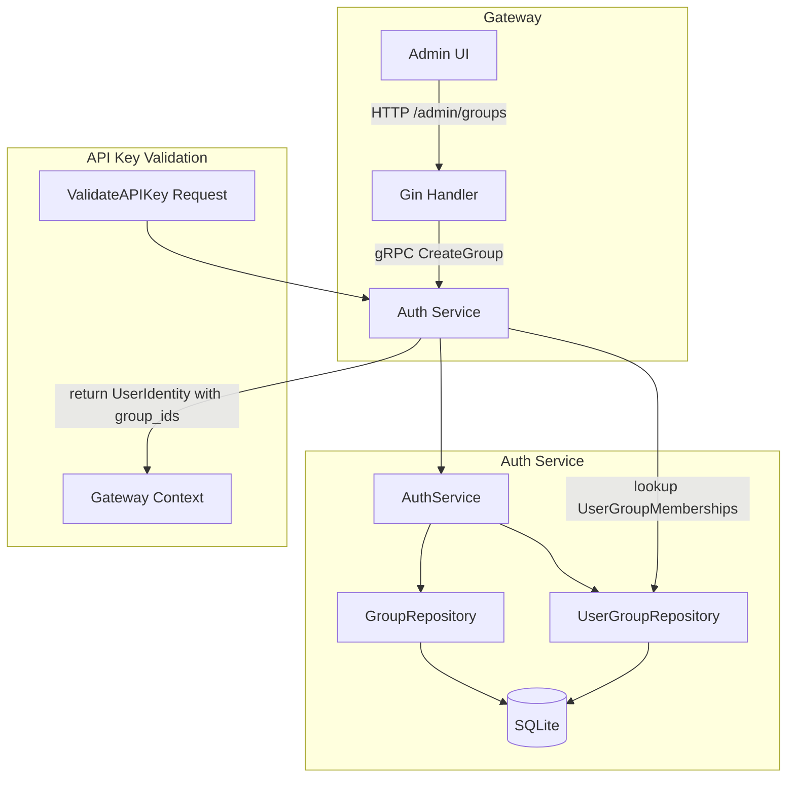

## Context

The auth-service currently has proto-defined Group and Permission RPCs (marked "Phase 2+") but all handlers return `nil`. The gateway admin endpoints (`/admin/users`, `/admin/api-keys`, `/admin/usage`) return hardcoded mock data instead of calling gRPC backends. The `ValidateAPIKey` response always sends an empty `group_ids` slice. This change implements the domain layer for groups/permissions and wires the gateway to real backends.

## Goals / Non-Goals

**Goals:**
- Create Group, Permission, UserGroupMembership entities with full GORM persistence in auth-service
- Wire all gateway admin handlers to their respective gRPC service backends
- Populate `UserIdentity.group_ids` from the UserGroupMembership table
- Add gateway HTTP routes for group and permission management proxying to auth-service
- Enable admin users to manage groups and assign users to groups via the admin API

**Non-Goals:**
- Real `CheckModelAuthorization` logic (Sprint 2)
- Group-scoped token/rate limit enforcement in billing-service (Sprint 3)
- Admin UI changes (coordinate with Dev C later)
- PostgreSQL repository implementations (Week 4 target)
- Redis cache layer (Week 4 target)

## Decisions

### D1: Group entity carries model patterns, token limit, and rate limit

**Decision**: Store `model_patterns`, `token_limit`, and `rate_limit` directly on the Group entity as serialized JSON fields via GORM.

**Rationale**: These are group-level configuration that travels with the group. Keeping them on Group avoids a separate config table and simplifies lookups during authorization. The admin UI already expects these fields on the group form.

**Alternative**: Separate `GroupConfig` table — rejected because it adds a join for every group lookup with no normalization benefit (each group has exactly one config).

### D2: Permission uses resource_type + resource_id + action + effect

**Decision**: Follow the proto schema: `resource_type` (model|provider|admin_feature), `resource_id` (glob pattern or feature name), `action` (access|manage|view), `effect` (allow|deny).

**Rationale**: This matches the existing proto definition and supports deny-override semantics. The `effect` field enables explicit deny rules that override allow rules from other permissions.

### D3: UserGroupMembership as a separate join entity

**Decision**: Use a `UserGroupMembership` join table with its own ID rather than a GORM many2many relationship.

**Rationale**: Explicit join entity allows tracking `added_at` timestamp and makes the repository interface clear. It also simplifies queries like "list all groups for a user" and "list all members of a group".

### D4: Gateway admin handlers call gRPC directly

**Decision**: Gateway handlers in `cmd/server/main.go` will call `authClient` and `billingClient` gRPC methods directly, replacing the inline mock handlers.

**Rationale**: The existing `authClient` is already initialized in `main.go`. Adding `billingClient` follows the same pattern. No need for a separate handler layer — the gateway is a thin proxy.

### D5: Group/Permission admin routes use `/admin/groups` and `/admin/permissions`

**Decision**: Add routes under the existing `/admin` group with JWT auth middleware, matching the admin-ui API client expectations.

**Rationale**: The admin-ui `apiClient` already calls `/admin/groups`, `/admin/permissions`, `/admin/groups/:id/members` etc. No frontend changes needed.

## Risks / Trade-offs

- **[GORM JSON serialization for TokenLimit/RateLimit]** → SQLite stores these as TEXT; queries against individual limit fields require JSON parsing. Acceptable since limits are read during authz checks (full entity loaded), not filtered in SQL.
- **[Gateway handler rewrite may break existing mock-dependent tests]** → Existing `main_test.go` uses mock responses; will need updating to use gRPC mock clients.
- **[No real authorization enforcement yet]** → `CheckModelAuthorization` still returns `allowed=true, models=["*"]` until Sprint 2 implements permission evaluation. Groups exist in data but aren't checked.
- **[Proto not updated this sprint]** → Group message lacks `description`, `model_patterns`, `token_limit`, `rate_limit` fields. Handler will map entity fields to proto best-effort; proto update deferred to Sprint 2 when we add new RPCs.

## Data Flow

