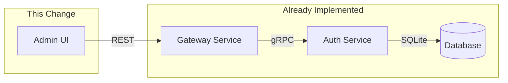

## Context

The admin-ui has basic Groups and Permissions pages that render tables and modals, but they are incomplete:

- **Groups.tsx**: Lists groups with name/description columns, supports create/edit/delete. **Missing**: member management, permission assignment, model pattern config, token/rate limit config.
- **Permissions.tsx**: Lists permissions with group/model_pattern/effect columns. **Mismatch**: form uses `model_pattern` field but backend gRPC API uses `resource_type` + `resource_id` + `action` + `effect`.
- **Users.tsx**: Lists users with name/email/role/status. **Missing**: group assignment during create/edit, password field on create.

The backend (auth-service gRPC + gateway-service REST proxy) already fully supports all CRUD operations for groups, members, and permissions. The gap is purely in the admin-ui layer.

## Goals / Non-Goals

**Goals:**
- Add group member management (view, add, remove) to the Groups page
- Fix Permissions page form to align with backend API fields (resource_type, resource_id, action, effect)
- Add group assignment to Users create/edit form
- Add a group detail view combining members and permissions
- Add search/filter to Users and Groups tables

**Non-Goals:**
- Backend API changes (auth-service, gateway-service are complete)
- Group-based access control enforcement in auth middleware (separate change)
- API key scope/expiration management (separate change)
- Role-based navigation filtering (already specified in admin-ui-permissions spec, out of scope here)

## Decisions

### 1. Group detail as expandable row vs separate page

**Decision**: Use Ant Design Table `expandable` rows on the Groups table to show members and permissions inline.

**Rationale**: Avoids navigation complexity. Users can see group details without leaving the list. The expandable row pattern is native to Ant Design and keeps the UX simple. A separate `/groups/:id` page would require routing changes and more boilerplate for limited benefit at this scale.

**Alternative considered**: Separate group detail page at `/groups/:id` — rejected because it adds routing complexity and the data volume per group (members + permissions) fits well in an expanded row.

### 2. Permission form field alignment

**Decision**: Replace `model_pattern` with `resource_type` (Select: model/provider/system) + `resource_id` (Input, e.g., `gpt-4`, `ollama:*`) + `action` (Select: access/manage) + `effect` (Select: allow/deny).

**Rationale**: The auth-service gRPC `GrantPermission` handler takes `resource_type`, `resource_id`, `action`, `effect`. The current `model_pattern` field doesn't map to any backend field and would fail on submission. Aligning the form with the actual API contract is the only viable approach.

### 3. User group assignment via multi-select

**Decision**: Add a `groups` multi-select field to the User create/edit form, populated from `GET /admin/groups`. On submit, call `POST /admin/groups/:id/members` for each new group and `DELETE /admin/groups/:id/members/:userId` for each removed group.

**Rationale**: The backend has no single endpoint to set a user's groups atomically. Using individual add/remove calls is simple and the volume is low (typically 1-5 groups per user). Optimistic updates via React Query keep the UI responsive.

**Alternative considered**: Batch endpoint `PUT /admin/users/:id/groups` — would require backend changes, out of scope.

### 4. Search/filter implementation

**Decision**: Client-side filtering using Ant Design Table's built-in `filter` and `sorter` props on the data already loaded via React Query.

**Rationale**: Dataset sizes are small (tens to hundreds of users/groups). Server-side search would require new API parameters. Client-side is sufficient and avoids backend changes.

## Risks / Trade-offs

- **[Multiple API calls for group assignment]** → Each group add/remove is a separate API call. If a user is in 10 groups and all are removed, that's 10 DELETE calls. Mitigation: acceptable at current scale; batch endpoint can be added later.
- **[Permission form migration]** → Existing permissions created with wrong field names may display incorrectly. Mitigation: the current Permissions page likely has no real data in production yet; fresh start with correct fields.
- **[Expandable row performance]** → Expanding a group row triggers 2 API calls (members + permissions). Mitigation: React Query caching prevents duplicate calls; loading spinner per row.
