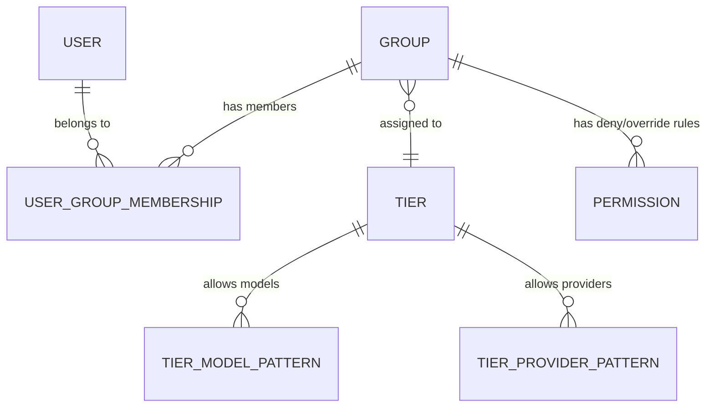

## Context

The AI API Gateway currently has a granular permission model where each `Permission` entity maps a single `{group_id, resource_type, resource_id, action, effect}` rule. While flexible, this creates administrative overhead: configuring access for a group requires creating many individual permission records (one per model/provider). The `CheckModelAuthorization` gRPC is an MVP stub that returns `*` (all models allowed), and the existing `Group.model_patterns`, `token_limit`, and `rate_limit` fields are stored but not enforced.

The gateway follows a microservices architecture where auth-service owns identity and model authorization exclusively. Gateway-service calls auth-service via gRPC for `ValidateAPIKey` and `CheckModelAuthorization`. No other service accesses auth-service's database directly.

## Goals / Non-Goals

**Goals:**
- Replace granular per-model permission assignment with tier-based access control
- Provide predefined tiers (Basic, Standard, Premium, Enterprise) with sensible defaults
- Allow administrators to create custom tiers with configurable provider/model patterns
- Enforce tier-based authorization in `CheckModelAuthorization`, replacing the MVP stub
- Provide admin UI for tier management and tier-based group permission assignment
- Migrate existing granular permissions to tier assignments

**Non-Goals:**
- Removing the existing `Permission` entity entirely (it remains for deny-rules and admin_feature permissions)
- Enforcing token limits or rate limits (those remain stored-but-not-enforced for a future change)
- Changing the `CheckModelAuthorization` gRPC interface signature (gateway-service sees no proto change)
- Cross-service database access (tier resolution stays within auth-service)

## Decisions

### Decision 1: Tier as a first-class entity with provider/model pattern lists

A `Tier` entity holds `allowed_providers` (glob patterns) and `allowed_models` (glob patterns following `{provider}:{model}` naming). Groups reference a tier via `tier_id` foreign key. At authorization time, the user's groups are resolved → their tiers are loaded → model patterns are matched.

**Enhancement for bulk selection:** The admin interface provides a unified model selector that allows administrators to browse and select models from multiple providers simultaneously when creating/editing tiers, eliminating the need to add permissions one-by-one in a provider:model manner.

**Alternative considered:** Embed tier definitions in config files. Rejected because tiers need admin CRUD at runtime, not redeployment.

**Rationale:** Keeps the data model simple — one tier per group — while supporting both predefined and custom tiers. The glob pattern approach is consistent with the existing `model_patterns` field on Group.

### Decision 2: Tier resolution in CheckModelAuthorization replaces MVP stub

The current `CheckModelAuthorization(user_id, group_ids, model)` returns `(true, ["*"], "")`. The updated flow:

1. Resolve user's groups → load each group's tier
2. Collect all `allowed_models` patterns from the user's tiers
3. Match the requested model against collected patterns
4. Check for deny-rules in the existing Permission table (deny still overrides)
5. Return `(allowed, authorized_models, reason)`

**Alternative considered:** Merge tier patterns into Permission records at assignment time. Rejected because it duplicates data and loses the tier abstraction.

### Decision 3: Predefined tiers seeded on startup, custom tiers via admin API

Four predefined tiers are seeded in the database on auth-service startup (idempotent). Administrators can create additional custom tiers via `CreateTier` RPC. Predefined tiers are immutable (cannot be deleted); custom tiers can be modified or deleted if no group references them.

### Decision 4: Proto additions for Tier CRUD

New messages and RPCs added to `api.proto`:
- `Tier` message with id, name, description, is_default, allowed_models, allowed_providers, created_at, updated_at
- `CreateTier`, `GetTier`, `UpdateTier`, `DeleteTier`, `ListTiers` RPCs
- `AssignTierToGroup`, `RemoveTierFromGroup` RPCs
- `CheckModelAuthorization` request/response unchanged
- `Group` message gains `tier_id` field
- `CreateGroupRequest` gains `tier_id` field (for assigning tier at creation time)
- `UpdateGroupRequest` gains `tier_id` field (for assigning/removing tier on update)

### Decision 5: Group-Tier Binding via tier_id

Groups bind to tiers via `tier_id` foreign key. The binding is managed through:
- `CreateGroup`: When `tier_id` is provided, the group is created and immediately assigned to that tier
- `UpdateGroup`: When `tier_id` is non-empty, assigns the tier; when empty, removes the tier assignment
- `AssignTierToGroup` / `RemoveTierFromGroup`: Dedicated RPCs for explicit tier management

Tier deletion is protected: a tier cannot be deleted if any group references it. This ensures referential integrity.

### Decision 6: Admin UI tier management page

New page under admin UI for tier management. Group permission assignment flow changes from individual rule editor to tier selector with a preview panel showing allowed models/providers.

### Decision 7: Group CRUD with Tier Assignment

HTTP API endpoints for group management in gateway-service:
- `POST /admin/auth/groups` - Create group with optional tier_id
- `GET /admin/auth/groups` - List groups
- `GET /admin/auth/groups/:id` - Get group details
- `PUT /admin/auth/groups/:id` - Update group (including tier_id for tier assignment/removal)
- `DELETE /admin/auth/groups/:id` - Delete group

Tier assignment is part of the group create/update payload, not a separate API call from the frontend perspective.

## Risks / Trade-offs

- **[Migration complexity]** Existing Permission records with `resource_type=model` and `effect=allow` must be migrated to tier assignments → Write a migration script that groups allow-permissions by group_id, creates a custom tier per group with the collected patterns, and assigns the tier to the group
- **[Deny-rule coexistence]** The Permission entity remains for deny-rules and admin_feature permissions → Document clearly that tiers handle allow-rules while Permission handles deny-rules and feature access
- **[Multiple groups with different tiers]** A user in multiple groups gets the union of all tier patterns → This is intentional (least-surprise: more groups = more access), with deny-rules as the override mechanism
- **[Predefined tier immutability]** Admins cannot modify predefined tiers → Reduces accidental breakage; custom tiers cover non-standard needs
