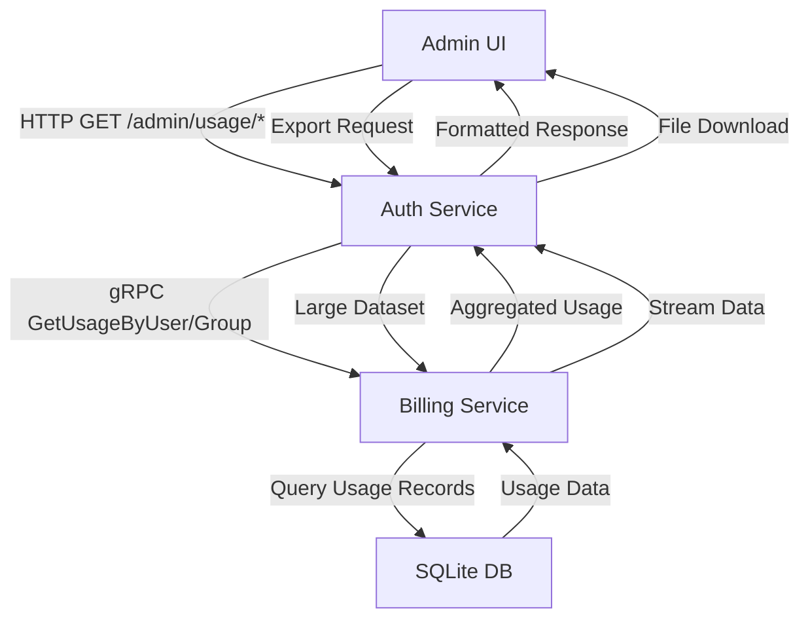

## Context

The AI API Gateway currently tracks usage data in the billing-service through gRPC endpoints only. Admin users need HTTP-based access to usage analytics through the auth-service, following the established pattern where auth-service handles admin APIs while billing-service owns the data. The current implementation has basic usage tracking but lacks user/group-specific views, export functionality, and HTTP accessibility.

## Goals / Non-Goals

**Goals:**
- Provide HTTP endpoints for usage data access through auth-service
- Enable user and group-specific usage filtering and aggregation
- Add export functionality in CSV/JSON formats
- Maintain service boundaries (auth-service for APIs, billing-service for data)
- Support date range filtering and pagination

**Non-Goals:**
- Real-time usage streaming (existing token tracker handles this)
- Usage prediction or forecasting
- Cost optimization recommendations
- Multi-tenant isolation beyond existing group model

## Decisions

**1. HTTP Layer in Auth-Service**
- **Choice**: Add usage endpoints to auth-service rather than billing-service
- **Rationale**: Auth-service already handles admin APIs (/admin/*), maintains authentication middleware, and follows the pattern of API gateway for admin functions
- **Alternative**: Direct HTTP endpoints in billing-service - rejected due to inconsistent admin API patterns

**2. gRPC Communication Pattern**
- **Choice**: Auth-service calls billing-service via existing gRPC client
- **Rationale**: Maintains service boundaries, leverages existing proto definitions, follows established cross-service communication pattern
- **Alternative**: Direct database access - rejected per anti-patterns (no cross-service DB access)

**3. Export Implementation**
- **Choice**: Server-side generation of CSV/JSON in auth-service
- **Rationale**: Simpler client implementation, consistent with existing admin patterns, allows server-side filtering before export
- **Alternative**: Client-side export - rejected due to large dataset limitations

**4. Data Flow Architecture**

## Risks / Trade-offs

**Performance Risk**: Large usage queries may impact billing-service performance
- **Mitigation**: Implement pagination, date range limits, and async export for large datasets

**Data Consistency**: Usage data may have slight delays due to async token tracking
- **Mitigation**: Document near-real-time nature, add timestamp indicators

**Service Coupling**: Auth-service becomes more dependent on billing-service
- **Mitigation**: Use circuit breakers, implement graceful degradation when billing-service unavailable

**Memory Usage**: Export operations may consume significant memory
- **Mitigation**: Stream-based export generation, configurable export size limits

**Frontend Performance**: Large usage datasets may cause UI slowdowns
- **Mitigation**: Virtual scrolling, lazy loading, data caching, and progressive rendering
