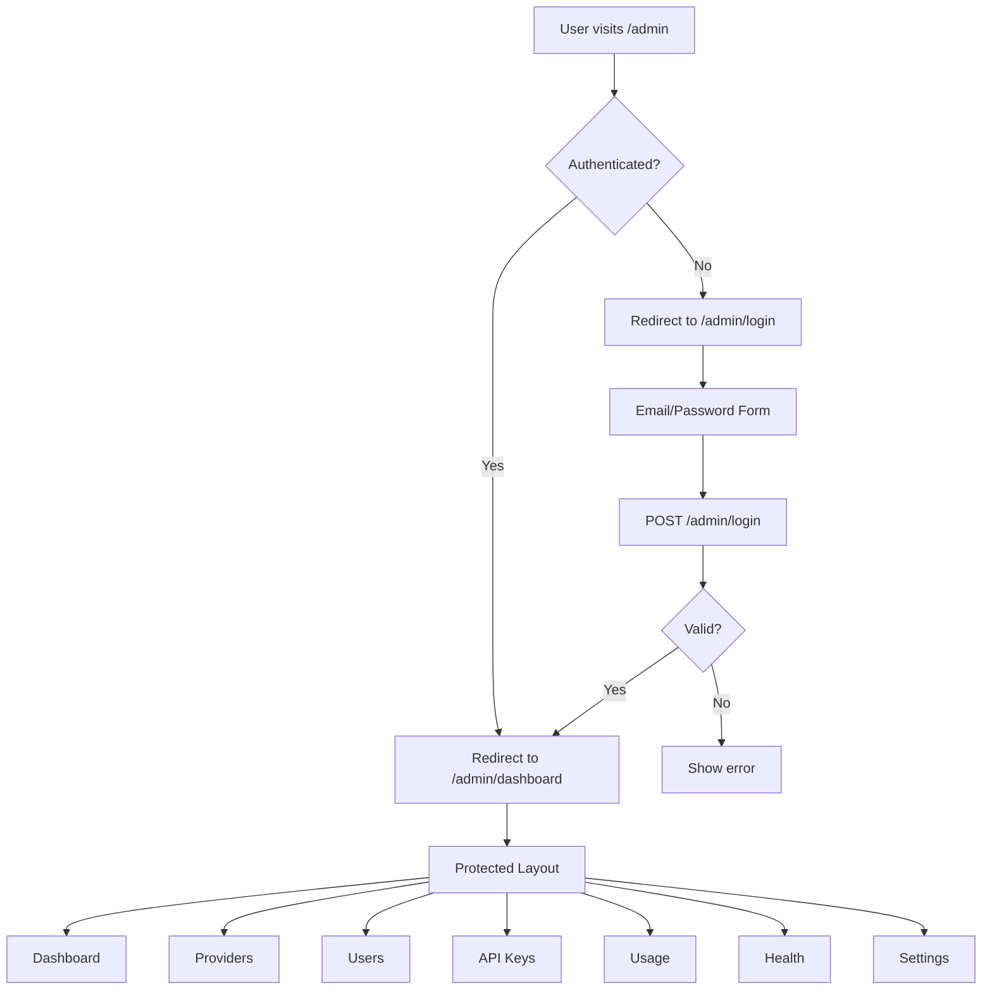

## Context

The current admin UI is a minimal React + Tailwind prototype with 5 pages (Providers, Users, API Keys, Usage, Health), a plain sidebar layout, and no authentication or role-based access. The API client calls gateway-service endpoints directly without any auth headers. The auth-service supports API key validation and user CRUD but has no login/session mechanism for UI users.

The redesign must introduce a complete auth flow, role-based navigation, a modern component library, and a professional visual design — while aligning the login mechanism with auth-service capabilities.

## Goals / Non-Goals

**Goals:**
- Add email/password login flow aligned with auth-service
- Implement role-based access control with three roles: admin, user, viewer
- Redesign UI with shadcn/ui components and Lucide icons
- Add collapsible sidebar with role-filtered navigation
- Add dashboard as the authenticated landing page
- Redirect `/admin` to login (unauthenticated) or dashboard (authenticated)
- Upgrade data fetching and form handling

**Non-Goals:**
- Changing the existing admin API endpoints (CRUD operations remain the same)
- Modifying auth-service gRPC protocol beyond adding the Login RPC
- Implementing group-based permissions (Phase 2+ feature)
- Adding real-time notifications or WebSocket support
- Mobile-responsive design (focus on desktop admin panel)

## Decisions

### UI Component Library
**Decision**: Use shadcn/ui with Tailwind CSS and Lucide React icons
- **Rationale**: shadcn/ui provides accessible, composable components that integrate with Tailwind. Not a dependency — components are copied into the project. Lucide pairs perfectly with shadcn/ui.
- **Alternative**: Material UI — rejected due to opinionated styling that conflicts with Tailwind
- **Alternative**: Chakra UI — rejected due to runtime overhead and CSS-in-JS

### State Management
**Decision**: React Context for auth state + TanStack Query for server state
- **Rationale**: Auth context is minimal (user, role, token). TanStack Query handles caching, refetching, and loading states for API data — eliminates manual useState+useEffect patterns.
- **Alternative**: Zustand — adds a dependency for minimal benefit over Context
- **Alternative**: Redux — overkill for this scale

### Authentication Flow
**Decision**: Email/password login → gateway-service `POST /admin/login` → auth-service `Login` RPC → JWT in HTTP-only cookie
- **Rationale**: HTTP-only cookies are XSS-resistant. Gateway-service sets the cookie after auth-service validates credentials. Subsequent requests include the cookie automatically.
- **Alternative**: Bearer token in localStorage — simpler but vulnerable to XSS
- **Alternative**: API key as login credential — rejected per user requirement (API keys are for AI requests, not admin login)

### Role-Based Access Control
**Decision**: Three roles with navigation filtering: admin (full access), user (limited), viewer (read-only)
- **Rationale**: Matches the user's requirement for viewer role. Uses existing `role` field in auth-service user entity, extended with a third value.
- **Navigation matrix**:

| Tab | admin | user | viewer |
|-----|-------|------|--------|
| Dashboard | ✓ | ✓ | ✓ |
| Providers | ✓ | ✗ | ✗ |
| Users | ✓ | ✗ | ✗ |
| API Keys | ✓ | ✓ (own) | ✗ |
| Usage | ✓ | ✓ (own) | ✓ (own) |
| Health | ✓ | ✓ | ✓ |
| Settings | ✓ | ✓ | ✗ |

### Routing and Auth Guards
**Decision**: React Router with a ProtectedRoute wrapper that checks auth context
- **Rationale**: Standard pattern. `/admin` redirects to `/admin/login` or `/admin/dashboard` based on auth state. All management routes are nested under a protected layout.
- **Alternative**: Middleware-based auth — not supported by React Router v7

### Sidebar Design
**Decision**: Collapsible sidebar with icon-only mode
- **Rationale**: Maximizes content area on smaller screens. Toggle button collapses to icon-only view. Active tab highlighted with accent color and background.
- **Alternative**: Always-expanded sidebar — wastes space
- **Alternative**: Off-canvas drawer — less discoverable

## Risks / Trade-offs

**[Risk]** Auth-service has no `Login` RPC yet — must be added
→ Mitigation: Add `Login` RPC to auth-service proto and handler as part of this change. Requires user entity to store password hash.

**[Risk]** HTTP-only cookie requires gateway-service to set it, adding coupling
→ Mitigation: Gateway already proxies admin requests; adding a login endpoint is a natural extension. Cookie is scoped to `/admin` path.

**[Risk]** shadcn/ui components are copied into the project, increasing maintenance surface
→ Mitigation: shadcn/ui components are stable and rarely need updates. CLI makes updates easy.

**[Trade-off]** Adding viewer role changes auth-service user entity
→ Chose: Extend role field to support `admin` | `user` | `viewer`. Minimal proto change, backward-compatible.

**[Trade-off]** JWT in cookie vs Bearer token
→ Chose: Cookie for security (XSS-resistant). Trade-off is slightly more complex logout (must clear cookie server-side).
