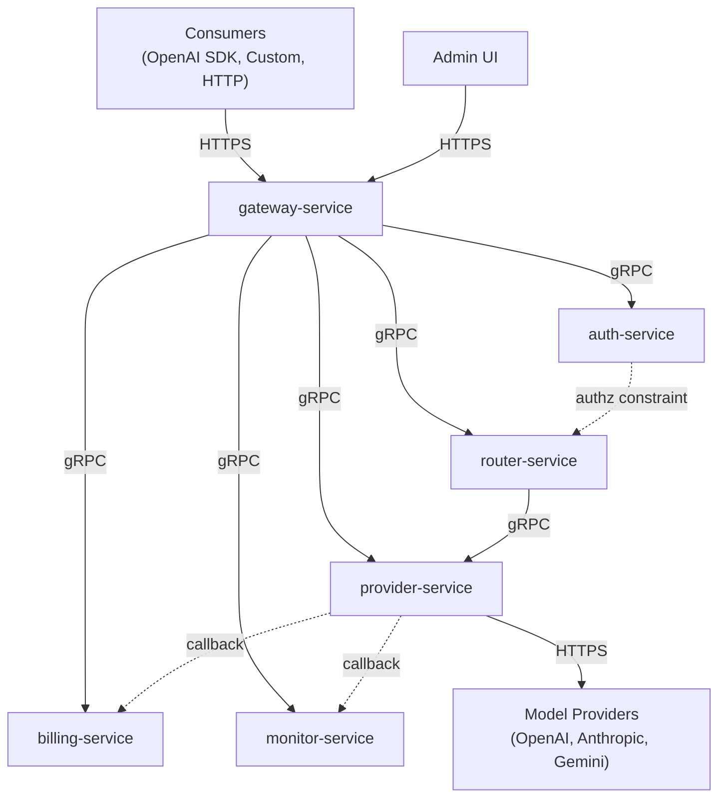

# system

## Purpose

Cross-cutting design capturing service relationships, dependencies, and communication patterns.

## Service Relationships

### Layered Architecture

### Service Calling Matrix

| Caller → | auth-service | router-service | provider-service | billing-service | monitor-service |
|---|---|---|---|---|---|
| **gateway-service** | ValidateAPIKey, CheckModelAuthorization | ResolveRoute | ForwardRequest, StreamRequest | CheckBudget, RecordUsage | RecordMetric |
| **router-service** | — | — | GetProviderByType | — | — |
| **provider-service** | — | — | — | OnProviderResponse | OnProviderResponse, ReportProviderHealth |

### Key Patterns

| Pattern | Description |
|---|---|
| **Request Pipeline** | gateway-service orchestrates: Auth → Authorize → Route → Proxy |
| **Observer Callback** | provider-service notifies billing/monitor async after response |
| **Model Authorization** | Auth returns authorized_models → gateway passes to router as constraint |

## Service Summary

### gateway-service

- **Responsibility**: HTTP entry point, middleware orchestration, response streaming
- **Owned Entities**: None (stateless)
- **Data Layer**: None

### auth-service

- **Responsibility**: Identity validation, model authorization
- **Owned Entities**: User, Group, APIKey, Permission

### router-service

- **Responsibility**: Model to provider resolution, fallback chain
- **Owned Entities**: RoutingRule

### provider-service

- **Responsibility**: Provider CRUD, request forwarding, callback dispatch
- **Owned Entities**: Provider

### billing-service

- **Responsibility**: Usage recording, cost estimation, budget enforcement
- **Owned Entities**: UsageRecord, PricingRule, Budget
- **Data Schema**: UsageRecord includes user_id and group_id fields for proper attribution

### monitor-service

- **Responsibility**: Metrics collection, alerting, health tracking
- **Owned Entities**: Metric, AlertRule, ProviderHealthStatus

## Requirements

### Requirement: Service communication pattern
The system SHALL use gRPC for inter-service communication with gateway-service as the sole HTTP entry point.

#### Scenario: External consumer request
- **WHEN** an external consumer makes an HTTP request
- **THEN** the gateway-service SHALL receive the request and proxy to internal services via gRPC

#### Scenario: Service-to-service communication
- **WHEN** services need to communicate internally
- **THEN** they SHALL use gRPC APIs defined in the api/proto definitions

### Requirement: Docker Network Configuration

All services SHALL be configured to use a shared Docker network for proper inter-service communication.

#### Scenario: Docker Compose deployment
- **WHEN** services are deployed via docker-compose
- **THEN** all services SHALL include `networks: [ai-gateway]` configuration
- **AND** SHALL be able to communicate via service names over the shared network
- **AND** external providers like Ollama SHALL be accessible via host.docker.internal

### Requirement: Group-based Usage Attribution

The system SHALL properly attribute usage records to both users and their groups for accurate billing and budgeting.

#### Scenario: Usage recording with group context
- **WHEN** a request is processed through the gateway
- **THEN** the gateway SHALL extract group IDs from the authorization context
- **AND** SHALL record usage with both user_id and group_id in the billing service
- **AND** SHALL use the first group ID from the groupIds array when multiple groups are present